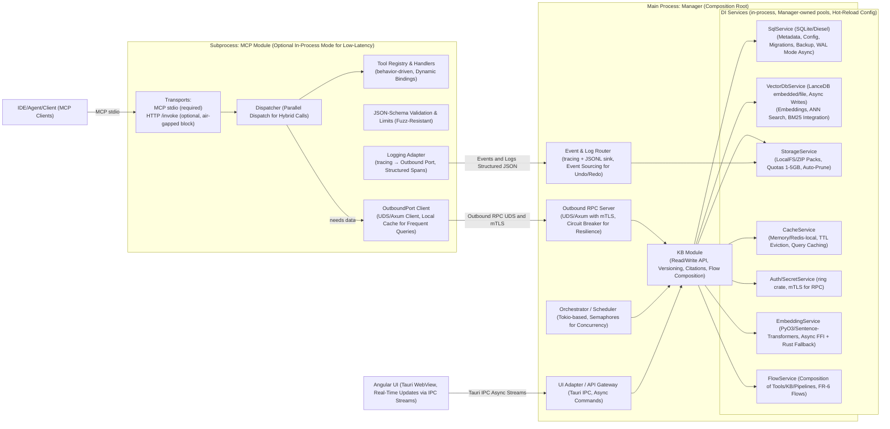
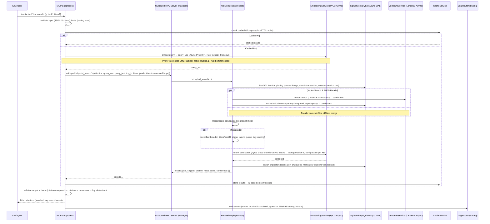
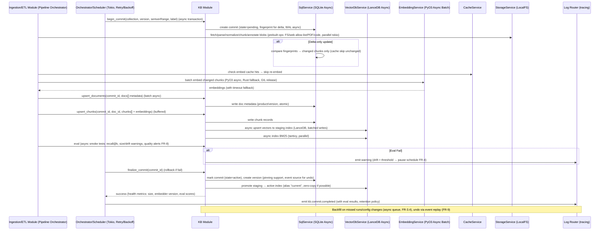
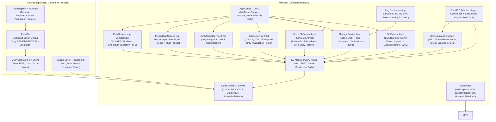

# Improved Core Design for RAG Studio

## 1. Architecture Overview & Process Boundaries

RAG Studio is a local-first, secure, high-performance desktop application built on Tauri and Rust, designed to meet both functional (FR) and non-functional (NFR) requirements in SRS/SDD. The Manager acts as the composition root, managing DI services (SQLite, LanceDB, PyO3). MCP (Multi-tool Control Plane) runs in a subprocess for sandboxing and hot-swap, communicating via Outbound RPC (UDS/Axum with mTLS). Centralized logging uses tracing, supporting real-time UI and event sourcing.

### Overview Diagram

### Key Points
- **Manager:** Composition root, initializes/injects DI services (S1-S7), manages pools (SQLite/LanceDB/PyO3), supports config hot-reload (TOML via notify crate).
- **MCP:** Isolated subprocess (stdio, seccomp/AppArmor), hot-swap (AC-1), optional in-process mode (config: low_latency=true). Communicates via UDS/Axum with mTLS.
- **Logging:** Centralized tracing-subscriber, JSONL sink, redaction filters, event sourcing for undo/redo (FR-9).
- **UI:** Angular WebView, async IPC streams for wizards/drag-drop (FR-3/9), real-time logs/dashboard (FR-8).

## 2. Retrieval Flow: MCP `doc.search` → KB (Hybrid Search with Rerank & Citations)

The retrieval flow processes RAG queries (`doc.search`), combining semantic (LanceDB ANN) and lexical (BM25/tantivy), with rerank, mandatory citations, and caching.

### Retrieval Flow Diagram

### Notes
- **Hybrid Retrieval:** Combines BM25 (tantivy) + Vector (LanceDB ANN), pre-filtering (FR-5.3), rerank (FR-5.2), mandatory citations (FR-5.4), backfill on no-results (FR-5.5).
- **Performance:** Parallel vector/BM25 (tokio::join!), local cache (MCP), async PyO3 FFI (pyo3-async) + Rust fallback (candle), atomic transactions, configurable Top-N (SRS §13.2).
- **Observability:** Tracing spans for P50/P95 latency, hit rate (FR-8).

## 3. Ingest & Commit Flow: ETL → KB (Write Path with Delta & Eval)

The ingest flow handles the ETL pipeline (fetch/parse/chunk/embed/index/eval/pack), supporting delta-only updates, versioning, and rollback/undo.

### Ingest Flow Diagram

### Notes
- **Pipeline:** Prebuilt ops (FR-3.1: fetch/parse/chunk/embed/index/eval/pack), delta-only (FR-2.3), versioning (FR-2).
- **Performance:** Async WAL (SQLite/VDB), buffered upserts, async EMB + cache skip, parallel fetch/parse (tokio), quotas auto-prune (SDD §13.3).
- **Resilience:** Rollback/undo via event sourcing (FR-9/11), eval alerts (FR-8.3).

## 4. DI & Wiring (Service Integration and Dependency Management)

Manager initializes and injects DI services into KB/Orchestrator, MCP only uses Outbound Client for data access.

### DI & Wiring Diagram

### Principles
- **DI Services:** Manager initializes S1-S7 from TOML config (hot-reload via notify), async traits (async_trait), circuit breaker (tower) for resilience.
- **MCP:** Subprocess or in-process, default-deny permissions (FS/NET/PROCESS), escalation prompts via IPC (FR-1.7).
- **Logging:** Tracing-subscriber, JSONL sink, redaction filters, event sourcing (FR-9).
- **Tauri:** Async IPC commands/streams, Angular real-time (FR-3/9).

## 5. Boundaries & Implementation Decisions

### Subprocess
- **MCP:** stdio, sandbox (seccomp/AppArmor), hot-swap (AC-1), optional in-process mode (low_latency=true).
- **Heavy Tasks:** Async PyO3 offload (>10k chunks), Rust fallback (candle/rust-bert).

### In-Process Modules
- **KB/Embedding/Flow:** Async calls (SQL/LanceDB/PyO3), circuit breaker (tower).
- **Orchestrator/Scheduler:** Tokio concurrency (semaphores FR-4.5), retry/backoff (FR-4.2), dry-run/resume (FR-3.3/11).
- **Outbound RPC Server:** Axum UDS + mTLS (rustls), middleware for auth/limits/air-gapped.
- **Log Router:** Tracing spans (P50/P95/hit rate FR-8), event sourcing (FR-9).

### DI Services (Manager-owned)
- **SqlService:** SQLite WAL async (rusqlite async), migrations/backups (FR-10), auto-vacuum (30d/1GB SDD §13.4).
- **VectorDbService:** LanceDB async writes/promote (zero-copy), BM25 (tantivy), swappable (vdb=lancedb|qdrant-local).
- **StorageService:** LocalFS quotas (1-5GB), auto-prune, ZIP checksums (ring).
- **EmbeddingService:** PyO3 async (pyo3-async), Rust fallback (candle) if timeout (>5s).
- **Auth/Secrets:** Ring encryption/redaction, mTLS cert rotation.
- **Cache:** Memory TTL (dashmap), invalidation on commits.
- **FlowService:** Compose tools/KB/pipelines, checksum validation (FR-6/AC-5).

### Tauri-Specific
- Portable <100MB (bundle PyO3/candle), tray mode (graceful shutdown), IPC streams (Angular CDK FR-3/9), cross-OS path normalization (PathBuf).

### DI Services (Manager-owned, Hot-Reloadable)
- **SqlService:** SQLite WAL async (rusqlite async), migrations/backups (FR-10); auto-vacuum for retention (30d/1GB SDD §13.4).
- **VectorDbService:** LanceDB async writes/promote (zero-copy), BM25 (tantivy); swappable (config: vdb=lancedb|qdrant-local).
- **StorageService:** LocalFS quotas (1-5GB KB SDD §13.3), auto-prune; ZIP checksums (ring).
- **EmbeddingService:** PyO3 async (pyo3-async) + cache; Rust fallback (candle) if timeout (>5s).
- **Auth/Secrets:** Ring encryption/redaction; mTLS cert rotation (auto-gen if air-gapped).
- **Cache:** Memory TTL (dashmap), invalidation on commits.
- **FlowService:** Compose parts (tools/KB/pipelines), validate checksums/compatibility (FR-6/AC-5).

### Tauri-Specific
- Portable <100MB (bundle PyO3/candle); tray mode with graceful shutdown; IPC streams for wizards (Angular CDK FR-3/9); cross-OS path normalization (PathBuf).

## 6. KB API Contract Used by MCP

- `kb.hybrid_search(collection, query_vec/text, top_k, filters: {product?, version?, semverRange?}, cache_ttl?) -> [Hit {chunk_id, score, snippet, citation, meta, confidence?}]` (FR-5)
- `kb.answer(query, filters?, model?) -> {text, citations[], confidence?}` (rag.answer, async LLM via PyO3/candle)
- `kb.get_document(doc_id, range?) -> Document {metadata, chunks?, license?}`
- `kb.resolve_citations(chunk_ids) -> [Citation {title, anchor/URL, license?, version?}]` (FR-5.4)
- `kb.stats(collection/version) -> Stats {size, versions, embedder_version, health, eval_scores?}` (FR-2.4)
- `kb.list_collections(filters?) -> [KB {name, version, pinned?, flows?}]` (FR-6)
- `kb.compose_flow(flow_id, params?) -> {results, citations[]}` (FR-6, async composition)

*API write/maintenance (begin/finalize_commit async, gc/compact, backfill queue) for ETL/Orchestrator (FR-3/4), enriched error codes (FR-8).*

## 7. Implementation Recommendations
- **MVP:** Manager + KB + MCP subprocess (AC-1-3), SQLite/Diesel + LanceDB + PyO3/candle, benchmark retrieval (<100ms) with criterion.
- **Tauri:** Async commands (tauri::command), tray mode (tauri-plugin-system-tray), cross-OS testing (PathBuf).
- **Performance:** Tokio semaphores, bincode UDS, cache TTL (dashmap), async PyO3 (pyo3-async).
- **Security/Testing:** Fuzz RPC (cargo-fuzz), audit PyO3, block outbound reqwest (air-gapped).
- **Next Steps:** Prototype retrieval/ingest flows (cargo bench), validate eval metrics (recall@k), implement FlowService (FR-6).