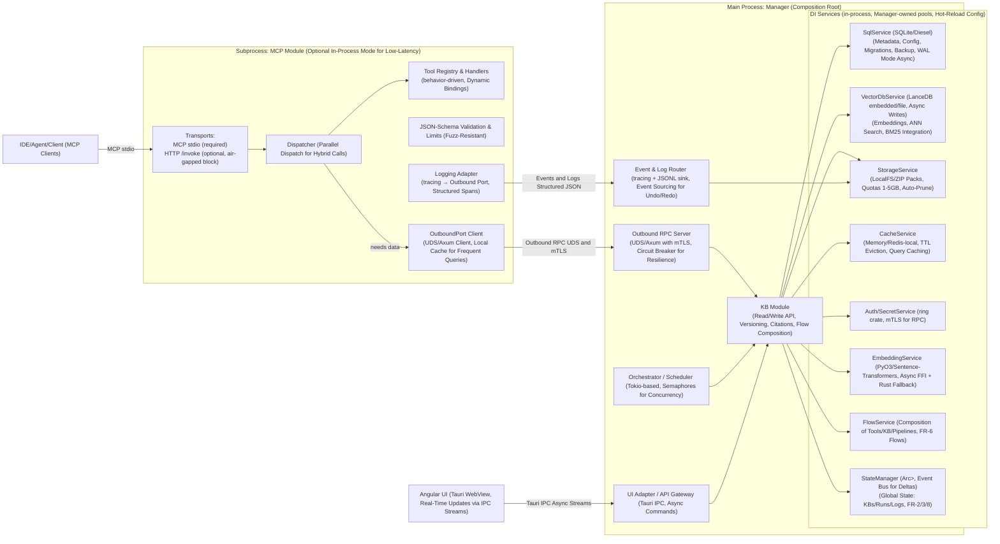
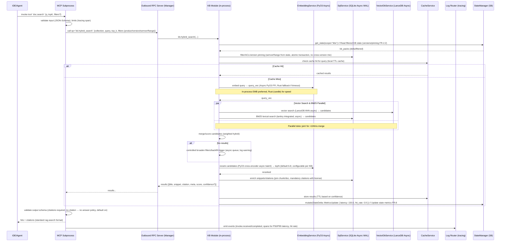
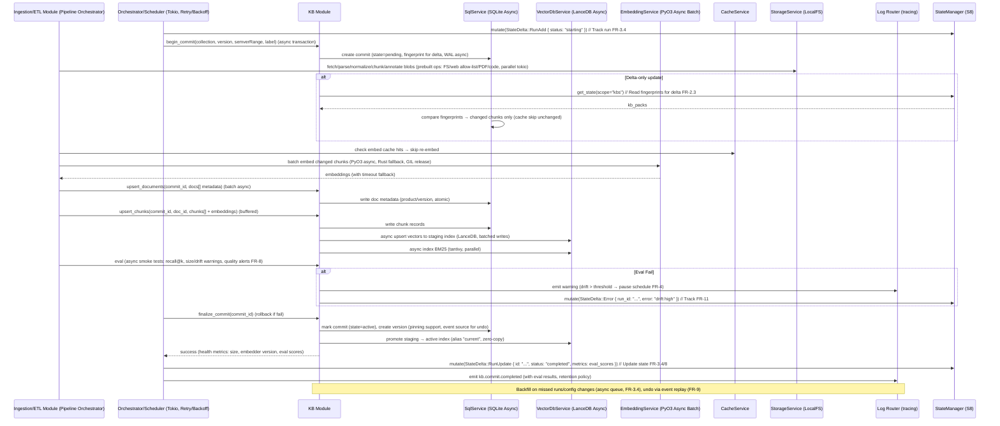
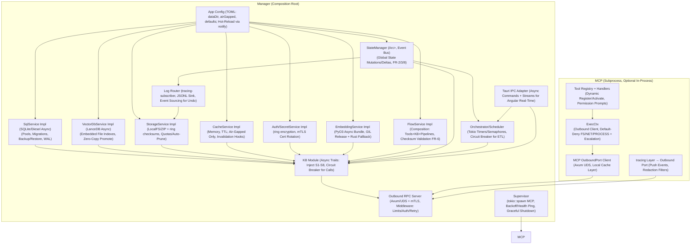
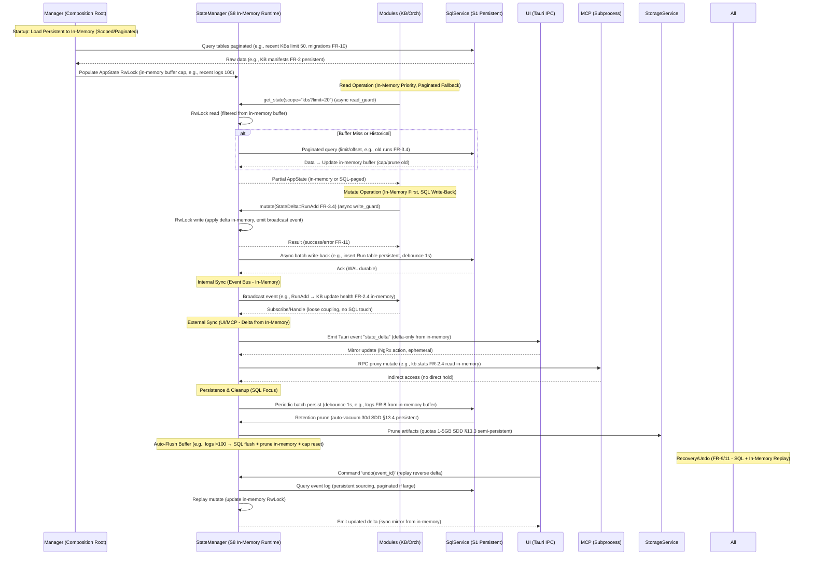

# Core Design for RAG Studio

RAG Studio is a local-first, secure, high-performance desktop application built on Tauri and Rust to meet both functional (FR) and non-functional (NFR) requirements in SRS/SDD. The Manager acts as the composition root, managing DI services (SQLite, LanceDB, PyO3, StateManager). MCP (Multi-tool Control Plane) runs in a subprocess for sandboxing and hot-swap, communicating via Outbound RPC (UDS/Axum with mTLS). Centralized logging uses tracing, supporting real-time UI and event sourcing. State management is handled by StateManager (S8), the single source of truth for global state, with in-memory buffer cap and pagination for large data.

## 1. Architecture Overview and Process Boundaries

### Overview Diagram

### Key Points
- **Manager:** Composition root, initializes/injects DI services (S1-S8), manages pools (SQLite/LanceDB/PyO3/StateManager), supports config hot-reload (TOML via notify crate).
- **MCP:** Isolated subprocess (stdio, seccomp/AppArmor), hot-swap (AC-1), optional in-process mode (config: low_latency=true). Communicates via UDS/Axum with mTLS; accesses state indirectly via RPC to StateManager.
- **State Management:** StateManager (S8) is the centralized service for global state (AppState struct based on SDD §4.1), using Arc<RwLock<AppState>> for thread-safe access and broadcast channels for internal events. Modules read/write via injected StateManager; deltas are emitted for UI/MCP sync.
- **Logging:** Centralized tracing-subscriber, JSONL sink, redaction filters, event sourcing for undo/redo (FR-9).
- **UI:** Angular WebView, async IPC streams for wizards/drag-drop (FR-3/9), real-time logs/dashboard (FR-8).

## 2. Retrieval Flow: MCP `doc.search` → KB (Hybrid Search with Rerank & Citations)

The retrieval flow processes RAG queries (`doc.search`), combining semantic (LanceDB ANN) and lexical (BM25/tantivy), with rerank, mandatory citations, and caching.

### Retrieval Flow Diagram

### Notes
- **Hybrid Retrieval:** Combines BM25 (tantivy) + Vector (LanceDB ANN), pre-filtering (FR-5.3), rerank (FR-5.2), mandatory citations (FR-5.4), backfill on no-results (FR-5.5).
- **State Integration:** KB Module reads from StateManager for KB state (e.g., versions FR-2.2); mutates metrics post-retrieval (FR-8 P50/P95). Delta updates ensure efficiency.
- **Performance:** Parallel vector/BM25 (tokio::join!), local cache (MCP), async PyO3 FFI (pyo3-async) + Rust fallback (candle), atomic transactions, configurable Top-N (SRS §13.2).
- **Observability:** Tracing spans for P50/P95 latency, hit rate (FR-8); state mutations logged via event bus.

## 3. Ingest & Commit Flow: ETL → KB (Write Path with Delta & Eval)

The ingest flow handles the ETL pipeline (fetch/parse/chunk/embed/index/eval/pack), supporting delta-only updates, versioning, and rollback/undo.

### Ingest Flow Diagram

### Notes
- **Pipeline:** Prebuilt ops (FR-3.1: fetch/parse/chunk/embed/index/eval/pack), delta-only (FR-2.3), versioning (FR-2).
- **State Integration:** Orchestrator/KB read/write via StateManager (e.g., track run status FR-3.4, update metrics FR-8). Mutations emit deltas for UI sync and internal events (e.g., pause schedule on eval fail FR-4).
- **Performance:** Async WAL (SQLite/VDB), buffered upserts, async EMB + cache skip, parallel fetch/parse (tokio), quotas auto-prune (SDD §13.3).
- **Resilience:** Rollback/undo via event sourcing (FR-9/11), eval alerts (FR-8.3).

## 4. DI & Wiring (Service Integration and Dependency Management)

Manager initializes and injects DI services into KB/Orchestrator, MCP only uses Outbound Client for data access.

### DI & Wiring Diagram

### Principles
- **DI Services:** Manager initializes S1-S8 from TOML config (hot-reload via notify), async traits (async_trait), circuit breaker (tower) for resilience. StateManager (S8) is injected into modules (e.g., KBMod, ORCH) for centralized access.
- **State Interaction:** Modules read via `state_mgr.get_state(scope)` (async RwLock read, filtered for efficiency); mutate via `state_mgr.mutate(delta)` (write lock, emit internal events/broadcast channel). Deltas ensure delta-only sync (e.g., RunAdd FR-3.4).
- **MCP:** Subprocess or in-process, default-deny permissions (FS/NET/PROCESS), escalation prompts via IPC (FR-1.7). MCP accesses state indirectly via RPC proxy to StateManager (e.g., kb.hybrid_search reads kb_packs).
- **Logging:** Tracing-subscriber, JSONL sink, redaction filters, event sourcing (FR-9). State mutations trigger log emits (e.g., via broadcast subscribe).
- **Tauri:** Async IPC commands/streams, Angular real-time (FR-3/9). State deltas pushed via events (e.g., "state_delta") for UI mirror.

## 5. Boundaries & Implementation Decisions

### Subprocess
- **MCP:** stdio, sandbox (seccomp/AppArmor), hot-swap (AC-1), optional in-process mode (low_latency=true). State access via RPC to StateManager (no direct hold).
- **Heavy Tasks:** Async PyO3 offload (>10k chunks), Rust fallback (candle/rust-bert).

### In-Process Modules
- **KB/Embedding/Flow:** Async calls (SQL/LanceDB/PyO3), circuit breaker (tower). Interact with StateManager for KB state read (e.g., versions FR-2.2) and mutate (e.g., health update FR-2.4).
- **Orchestrator/Scheduler:** Tokio concurrency (semaphores FR-4.5), retry/backoff (FR-4.2), dry-run/resume (FR-3.3/11). Mutate runs/schedules via StateManager (e.g., RunAdd FR-3.4), subscribe events for triggers (e.g., backfill FR-3.4).
- **Outbound RPC Server:** Axum UDS + mTLS (rustls), middleware for auth/limits/air-gapped. Proxies state queries/mutations (e.g., MCP calls → StateManager read/write).
- **Log Router:** Tracing spans (P50/P95/hit rate FR-8), event sourcing (FR-9). Subscribes StateManager events for log/metrics (e.g., commit.completed FR-3).

### DI Services (Manager-owned, Hot-Reloadable)
- **SqlService:** SQLite WAL async (rusqlite async), migrations/backups (FR-10); auto-vacuum for retention (30d/1GB SDD §13.4). Persists AppState components (e.g., runs FR-3.4).
- **VectorDbService:** LanceDB async writes/promote (zero-copy), BM25 (tantivy); swappable (config: vdb=lancedb|qdrant-local). StateManager caches index metadata.
- **StorageService:** LocalFS quotas (1-5GB KB SDD §13.3), auto-prune; ZIP checksums (ring). Stores packs/artifacts; StateManager tracks sizes.
- **EmbeddingService:** PyO3 async (pyo3-async) + cache; Rust fallback (candle) if timeout (>5s). StateManager logs embedder version (FR-2.4).
- **Auth/Secrets:** Ring encryption/redaction; mTLS cert rotation (auto-gen if air-gapped). Secures state mutations (e.g., permissions FR-1.7).
- **Cache:** Memory TTL (dashmap), invalidation on commits. Layers StateManager reads (e.g., frequent KB queries FR-2.5).
- **FlowService:** Compose tools/KB/pipelines, checksum validation (FR-6/AC-5). Mutates flows in StateManager (e.g., FlowAdd).
- **StateManager:** Arc<RwLock<AppState>> for global state (SDD §4.1), broadcast channel for events. Read: async filtered get; Write: mutate delta + emit (internal/UI/MCP). Event sourcing for undo (FR-9), persistence via SqlService.

### Tauri-Specific
- Portable <100MB (bundle PyO3/candle); tray mode with graceful shutdown; IPC streams for wizards (Angular CDK FR-3/9); cross-OS path normalization (PathBuf). State deltas via events/streams for real-time UI sync.

## 6. KB API Contract Used by MCP

- `kb.hybrid_search(collection, query_vec/text, top_k, filters: {product?, version?, semverRange?}, cache_ttl?) -> [Hit {chunk_id, score, snippet, citation, meta, confidence?}]` (FR-5)
- `kb.answer(query, filters?, model?) -> {text, citations[], confidence?}` (rag.answer, async LLM via PyO3/candle)
- `kb.get_document(doc_id, range?) -> Document {metadata, chunks?, license?}`
- `kb.resolve_citations(chunk_ids) -> [Citation {title, anchor/URL, license?, version?}]` (FR-5.4)
- `kb.stats(collection/version) -> Stats {size, versions, embedder_version, health, eval_scores?}` (FR-2.4)
- `kb.list_collections(filters?) -> [KB {name, version, pinned?, flows?}]` (FR-6)
- `kb.compose_flow(flow_id, params?) -> {results, citations[]}` (FR-6, async composition)

*API write/maintenance (begin/finalize_commit async, gc/compact, backfill queue) for ETL/Orchestrator (FR-3/4), enriched error codes (FR-8). APIs proxy through StateManager for state reads/writes (e.g., versions from AppState).*

## 7. State Scopes: Quantity, Content, Location, and Storage

State is divided into three scopes to balance persistence (backend SQL/in-memory), reactivity (shared), and UX (local). In-memory buffers are capped (e.g., recent logs ~100 entries), with pagination for historical data and automatic pruning.

### Table 1: Overview of Scopes and Storage

| Scope Name              | Number of Fields/Key Elements | What's in Scope (Based on SDD §4.1 & SRS FR) | Location (Backend/Frontend) | Storage (SQL Persistent vs. In-Memory Runtime) | Reason for Division & Sync Flow |
|-------------------------|------------------------------|---------------------------------------------|-----------------------------|------------------------------------------------|-----------------------------|
| **Global Backend State** (Source of Truth) | 8-10 fields (lean AppState struct, capped buffers) | - Tools (FR-1: active endpoints/bindings). - KB Packs (FR-2: current versions/manifests/health; IDs for historical). - Pipelines (FR-3: active specs/templates; IDs for runs history). - Schedules (FR-4: active cron/rrule/status). - Flows (FR-6: active compositions/checksums). - Settings (FR-10: dataDir/airGapped/profiles). - Recent Logs/Metrics (FR-8: buffer ~100 spans/latency/hit rate/recall@k). - Loading/Errors (FR-11: transient status/diagnostics). | Backend (Rust: StateManager S8) | **SQL Persistent**: Metadata/history (e.g., KB versions FR-2, runs IDs FR-3.4, logs aggregated). **In-Memory Runtime**: Active/need-to-know (Arc<RwLock>, ring buffer for logs; cap ~10MB, auto-flush/prune). | Persistent for durability/backup (FR-10); In-memory for fast operations (e.g., loading FR-11). Sync: Load SQL → In-Memory (on-demand pagination); Mutate → Delta emit + SQL write-back (batch 1s). |
| **Shared Mirrored State** (Real-Time Sync) | 5-7 fields (subset normalized, paginated subsets) | - KB Packs (FR-2: active list/versions/pinned, paginated by search FR-9). - Runs/Pipelines (FR-3: active runs/metrics; paginated history). - Schedules/Flows (FR-4/6: status/compositions). - Metrics/Recent Logs (FR-8: P50/P95/hit rate, buffer ~50 recent logs). - Errors (FR-11: recent for UI alerts). | Both (Backend owns; Frontend mirrors via NgRx Store) | **SQL Persistent**: Aggregated/historical (e.g., eval scores FR-3.1.8, paged logs). **In-Memory Runtime**: Recent/active (e.g., current metrics FR-8; frontend mirror ephemeral, paginated loads). | Persistent for trends; In-memory for real-time (e.g., hit rate FR-8). Sync: Backend delta push (Tauri events) → Frontend NgRx update; Pull scoped/paginated (commands e.g., "logs?page=1"). |
| **Local Frontend State** (UI-Reactive) | 4-6 signals/computed (ephemeral) | - UI Filters/Search (FR-9: search term, filtered KBs/runs). - Temp Data (FR-9: wizard steps, drag-drop buffers for pipelines FR-3). - Selected Items (e.g., selected KB ID for detail view FR-2.5). - Optimistic Temp (FR-11: pending mutations before backend confirm). | Frontend Only (Angular 20: Signals for reactivity) | **SQL Persistent**: None (ephemeral). **In-Memory Runtime**: Signals (in-memory, auto-reset). | UI-reactive only (e.g., search FR-9); No persistence required. Sync: Computed from shared (signals); Optimistic mutate → Backend confirm/rollback. |

### Table 2: Storage & Synchronization Process Between Scopes (Flow)

| Flow Step | Description | Involved Components | Storage Mechanism (SQL vs. In-Memory) | Example (SRS/FR) |
|-----------|-------------|---------------------|---------------------------------------|------------------|
| **Initialization (Load)** | Load persistent data into in-memory state on startup. | Manager → SqlService (S1) → StateManager (S8). | SQL read (Diesel query, paginated) → Populate AppState RwLock (in-memory buffer cap). | Load recent KB packs/versions (FR-2) from metadata tables → In-memory global (cap 50 active). |
| **Read Operation** | Modules/UI read state (scoped/filtered/paginated). | Modules/UI → StateManager (read_guard async). | In-memory RwLock read (fast); Cache (S4) layer; Fallback to SQL if miss (with limit/offset). | KB Module get KB health (FR-2.4) → Read kb_packs from in-memory; Paginate logs (FR-8) from SQL. |
| **Mutation/Write** | Change state (e.g., add KB FR-2). | Business logic (e.g., KB Module) → StateManager.mutate(delta). | In-memory RwLock write (exclusive) → Async write-back to SQL (batch/debounce 1s). | Run pipeline (FR-3) → Mutate RunAdd in-memory (buffer cap) → Persist history to SQL. |
| **Delta Sync (Internal)** | Share changes between modules. | StateManager emits broadcast event (tokio::sync). | Event bus (channel subscribe); No immediate persistence (in-memory only). | Orchestrator completes run → Emit RunAdd (in-memory) → KB Module subscribes to update health (FR-2.4). |
| **Delta Sync (External)** | Push to UI/MCP. | StateManager → Tauri IPC (events/streams). | Delta emit (StateDelta enum, serde_json); In-memory source → Shared mirror. | Mutate metrics (FR-8) → Emit "state_delta" (in-memory) → UI NgRx update (ephemeral). |
| **Persistence & Cleanup** | Persist and prune. | StateManager → SqlService (S1) + StorageService (S3). | Async batch write to SQL (WAL); Auto-prune quotas (S3, cap buffer in-memory). | Logs retention (FR-8) → In-memory buffer (cap 100) → SQL persist → Prune old >30d (SDD §13.4). |
| **Recovery/Undo (FR-9/11)** | Rollback or replay. | StateManager event sourcing (replay deltas). | Replay from SQL logs/events → Re-mutate in-memory (with buffer cap). | Eval fail (FR-3.1.8) → Reverse delta (in-memory) → Persist error to SQL. |

## 8. State Structure Diagram

AppState structure diagram (backend global/in-memory), with storage mapping (SQL persistent vs. in-memory runtime) and scopes.

- **Explanation**: AppState in-memory (runtime, cap buffer) loads scoped/paginated from SQL (persistent) on init; Mutations write-back async. Artifacts in LocalFS (semi-persistent, e.g., packs FR-6). Shared/local frontend is ephemeral (in-memory mirror/signals).

## 9. State Flow Diagram (Lifecycle & Sync with Storage)

State flow diagram from init to mutate/persist, emphasizing SQL vs. in-memory transitions.

### Flow Notes
- **Lifecycle**: Load (SQL persistent, paginated → In-Memory runtime buffer) → Read (In-Memory priority, fallback SQL paginated) → Mutate (Write in-memory + SQL async write-back) → Sync (Delta emit from in-memory) → Persist/Cleanup (SQL batch/prune + in-memory auto-flush).
- **Internal**: Modules inject StateManager (DI Diagram 4), broadcast for notify (in-memory only, fast).
- **External**: UI pulls scoped/paginated (commands), pushes delta (events); MCP RPC proxy (read in-memory).
- **Resilience**: Async write-back (non-blocking), event sourcing (SQL logs for replay FR-9), error mutate (track in in-memory + persist FR-11).
- **Efficiency**: Scoped read (e.g., only "kbs" FR-2.5, in-memory), delta emit (<1KB), cache (S4) for 80% reads; Buffer cap/auto-flush (e.g., logs >100 → SQL) avoids GBs overhead.

## 10. State Structure Diagram

AppState structure diagram (backend global/in-memory), with storage mapping (SQL persistent vs. in-memory runtime) and scopes.

```mermaid
graph TD
  AppState["AppState RwLock (Global Backend S8 - In-Memory Runtime)"]
  AppState --> Tools["Tools Vec<Tool> FR-1"]
  AppState --> KBPacks["KB Packs Vec<KB> FR-2 Active Only"]
  AppState --> Pipelines["Pipelines Vec<Pipeline> FR-3 Active Specs"]
  AppState --> Schedules["Schedules Vec<Schedule> FR-4 Active"]
  AppState --> Flows["Flows Vec<Flow> FR-6 Active"]
  AppState --> Settings["Settings FR-10"]
  AppState --> RecentLogs["Recent Logs VecDeque<LogEntry> FR-8 Buffer Cap 100"]
  AppState --> Metrics["Metrics HashMap FR-8 Current"]
  AppState --> Loading["Loading HashMap FR-11 Transient"]
  AppState --> Errors["Errors Vec FR-11 Recent"]

  subgraph SQL["SQL Database (Persistent S1)"]
    Tools -.->|"Metadata/History"| ToolsSQL["Tools Table"]
    KBPacks -.->|"Manifests/Versions"| KBPacksSQL["KB Table"]
    Pipelines -.->|"Specs/Runs History"| PipelinesSQL["Pipeline/Run Tables FR-3.4 Paginated"]
    Schedules -.->|"Cron/Status"| SchedulesSQL["Schedule Table"]
    Flows -.->|"Compositions"| FlowsSQL["Flow Table FR-6"]
    Settings -.->|"Configs"| SettingsSQL["Settings Table FR-10"]
    RecentLogs -.->|"Historical Full"| LogsSQL["Logs Table Retention/Paginated"]
    Metrics -.->|"Aggregated Trends"| MetricsSQL["Metrics Table FR-8"]
    Errors -.->|"Diagnostics History"| ErrorsSQL["Errors Table FR-11 Paginated"]
  end

  subgraph LocalFS["LocalFS (S3 Artifacts - Semi-Persistent)"]
    KBPacks -.->|"Packs/Index"| PacksFiles["ZIP Packs FR-6"]
    Pipelines -.->|"Artifacts"| ArtifactsFiles["Run Artifacts FR-3"]
    RecentLogs -.->|"JSONL Sink Full"| LogsFiles["Full Logs FR-8 Pruned"]
  end

  subgraph Shared["Shared Mirrored (NgRx Store Frontend - Ephemeral)"]
    KBPacks -.->|"Delta Sync"| NgRxKBs["EntityState<KB> normalized Active"]
    Pipelines -.->|"Delta"| NgRxRuns["EntityState<Run> FR-3.4 Recent"]
    RecentLogs -.->|"Stream"| NgRxLogs["LogEntry[] Recent Buffer"]
    Metrics -.->|"Event"| NgRxMetrics["HashMap P50/P95"]
    Errors -.->|"Push"| NgRxErrors["string[] Alerts"]
  end

  subgraph Local["Local Frontend (Signals - Ephemeral)"]
    NgRxKBs -.->|"Selector"| FilteredKBs["computed signal KB[] filtered FR-9"]
    NgRxLogs -.->|"Subscribe"| SearchFilter["signal string search term"]
    NgRxErrors -.->|"Effect"| TempData["signal any wizard temp FR-9"]
    NgRxRuns -.->|"Optimistic"| SelectedRun["signal Run selected ID"]
  end

  %% Sync Arrows
  AppState -.->|"Async Write-Back Batch"| SQL
  AppState -.->|"Emit Deltas"| Modules["Modules e.g., KB/Orch"]
  AppState -.->|"Tauri Events/Streams"| Shared
  Shared -.->|"Computed/Effects"| Local
  Local -.->|"Dispatch Mutate"| AppState
```

- **Explanation**: AppState in-memory (runtime, cap buffer) load scoped/paginated từ SQL (persistent) on init; Mutations write-back async. Artifacts ở LocalFS (semi-persistent, e.g., packs FR-6). Shared/local frontend ephemeral (in-memory mirror/signals).

## 11. Implementation and Recommendations

- **MVP:** Manager + KB + MCP subprocess (AC-1-3), SQLite/Diesel + LanceDB + PyO3/candle + StateManager, benchmark retrieval (<100ms) with criterion.
- **Tauri:** Async commands (tauri::command), tray mode (tauri-plugin-system-tray), cross-OS testing (PathBuf).
- **Performance:** Tokio semaphores, bincode UDS, cache TTL (dashmap), async PyO3 (pyo3-async). StateManager deltas for low-overhead sync.
- **Security/Testing:** Fuzz RPC (cargo-fuzz), audit PyO3/StateManager mutations, block outbound reqwest (air-gapped).
- **Next Steps:** Prototype retrieval/ingest flows (cargo bench), validate eval metrics (recall@k), implement FlowService (FR-6), test state consistency (e.g., concurrent mutate FR-11).