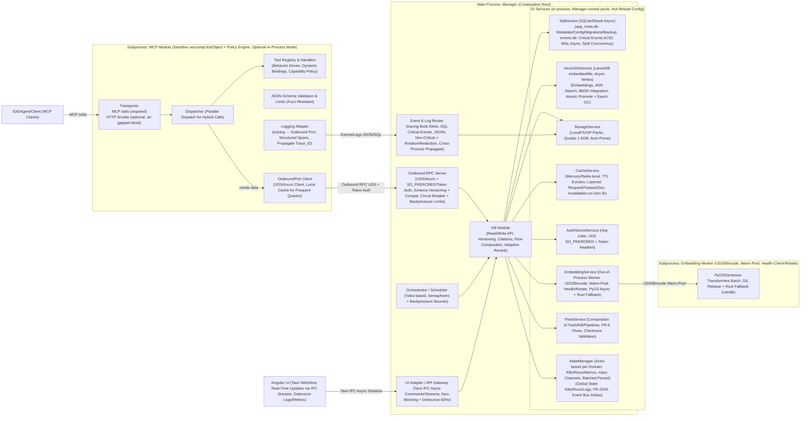
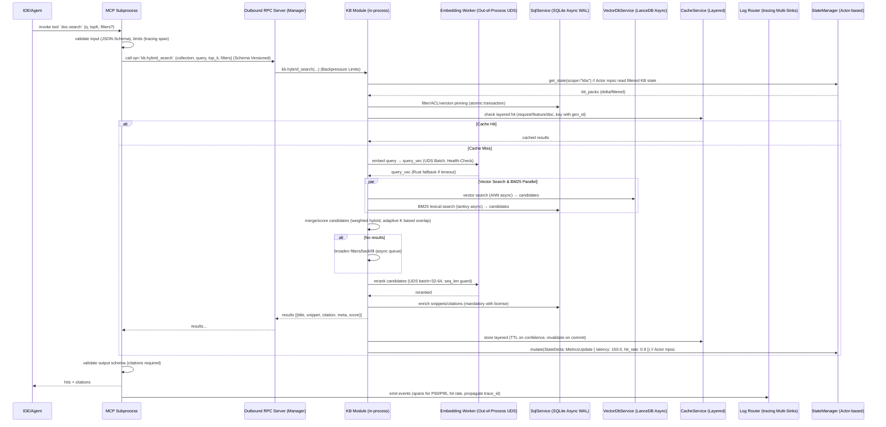
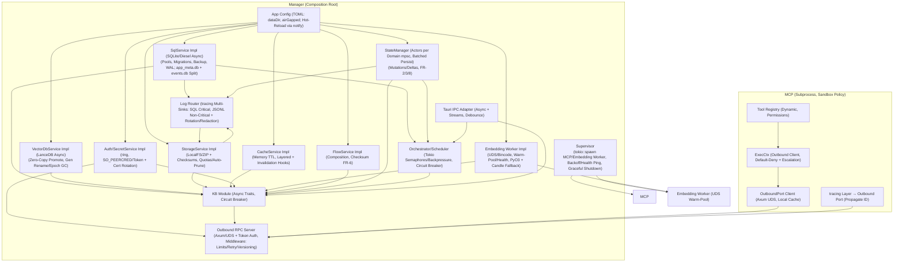
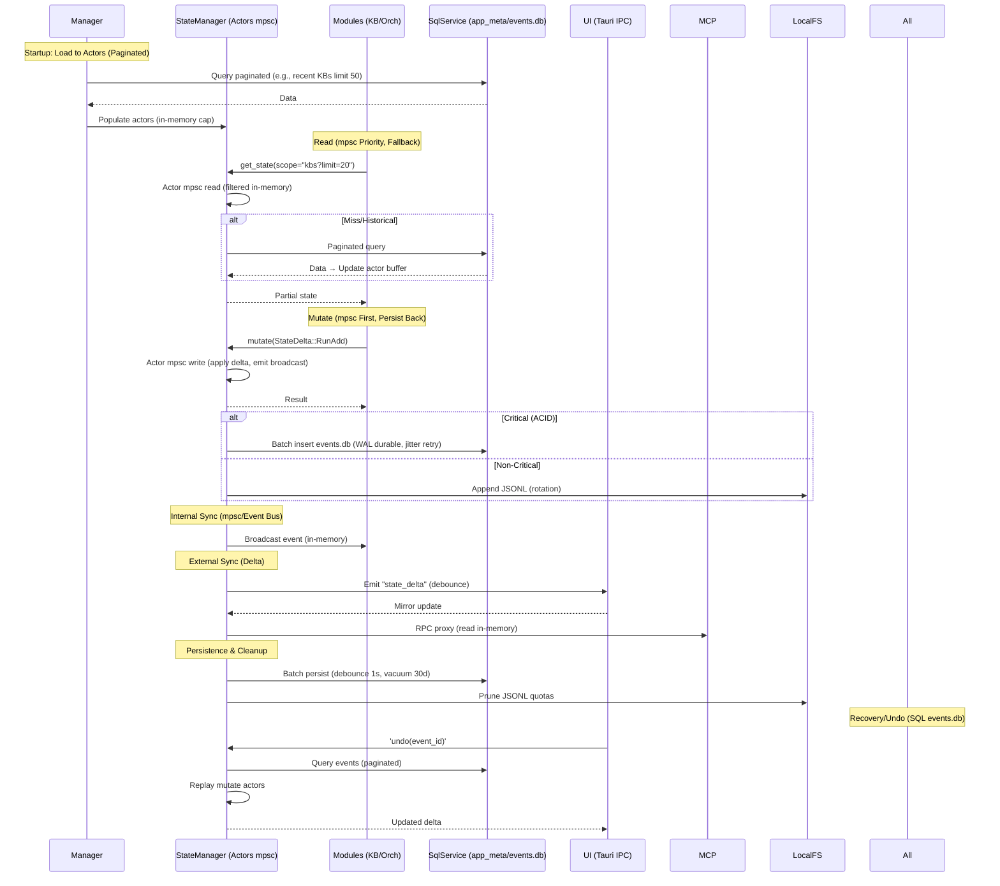

# Core Design for RAG Studio

RAG Studio is a local-first, secure, high-performance desktop application built on Tauri v2 and Rust, meeting functional (FR) and non-functional (NFR) requirements. The design follows a pragmatic MVP-first approach, balancing architectural integrity with rapid delivery.

## Recommended Project Structure

The workspace layout below is recommended for the project. It follows Tauri v2 conventions (frontend in `src/`, Rust backend in `src-tauri/`) and groups shared logic and subprocesses into workspace crates for fast, testable builds and clear separation of responsibilities.

```
rag-studio/
├── Cargo.toml                    # Workspace root: [workspace] members = ["src-tauri", "core", "mcp", "embedding-worker"]
├── package.json                  # Angular deps and scripts (e.g., ng build)
├── angular.json                  # Angular CLI config (projects, builds)
├── src/                          # Angular frontend (WebView content)
│   ├── app/                      # Core app module
│   │   ├── pages/                # Main pages: dashboard, tools, kb, pipelines, etc.
│   │   ├── shared/               # Shared modules
│   │   │   └── components/       # Components: atomic, semantic, composite
│   │   └── store/                # NgRx state mirror (actions, reducers, effects)
│   └── main.ts                   # Angular bootstrap
├── src-tauri/                    # Tauri Rust backend (binary crate)
│   ├── Cargo.toml                # Depends on tauri, tokio, core, etc.
│   ├── tauri.conf.json           # Tauri config: app ID, bundle, dev server
│   └── src/                      # Rust code for Manager and IPC
│       ├── lib.rs                # Composition root init (Manager, Builder)
│       ├── main.rs               # Minimal entry: fn main() { lib::run(); }
│       ├── manager.rs            # Manager: inject services, hold AppState
│       └── ipc/                  # Tauri commands and streams by domain
├── core/                         # Shared library crate (utils, services, logic)
│   ├── Cargo.toml                # Lib crate
│   └── src/
│       ├── lib.rs                # Re-export shared types and helpers
│       ├── state.rs              # AppState: shared patterns for MVP
│       ├── kb_module.rs          # Hybrid search, ingest/commit logic
│       └── services/             # Traits + implementations for DI (sql, vector, embedding)
├── mcp/                          # MCP subprocess (binary crate)
│   ├── Cargo.toml                # Depends on serde_json, core, etc.
│   └── src/
│       ├── main.rs               # Stdio JSON protocol loop for MVP
│       └── tools/                # Tool implementations (doc_search, etc.)
└── embedding-worker/             # Embedding subprocess (binary crate)
  ├── Cargo.toml                # Depends on pyo3 (or candle), serde_json
  └── src/
    ├── main.rs               # Batch embedding worker (stdin/stdout JSON for MVP)
    └── batch.rs              # Batch processing logic
```

Rationale:
- Keeps frontend and desktop backend aligned with Tauri v2 conventions (`src/` and `src-tauri/`).
- Uses a Cargo workspace to allow fast, parallel Rust builds and well-scoped crates for testing.
- Separates long-running subprocesses (`mcp`, `embedding-worker`) into dedicated crates for isolation and easier CI/testing.
- `core/` hosts shared types and service traits to make DI and unit testing straightforward.
- Stdio JSON for subprocesses is simple to debug for MVP; upgrade paths (UDS/bincode, actor-based state) are documented elsewhere in this design.


## MVP Architecture Approach

The design prioritizes **pragmatic complexity** - starting simple but future-proofing key foundations:

- **State Management**: Start with Arc<RwLock<AppState>> for MVP, upgrade to full actor system post-MVP
- **Subprocess Communication**: Begin with JSON over stdin/stdout, upgrade to UDS/bincode for performance-critical paths
- **Logging**: JSONL-based tracing for MVP, add SQL critical events for production
- **Services**: Async traits with DI for testability and swappable implementations

The Manager serves as the composition root, managing dependency injection services. MCP and Embedding Worker run in subprocesses for isolation. State management uses a simplified shared state pattern for MVP with clear upgrade path to actor-based system.

## 1. Architecture Overview and Process Boundaries

### Overview Diagram



### Key Points
- **Manager**: Composition root following Tauri v2 structure (src-tauri/ binary). Initializes/injects DI services with async traits. Manages subprocess lifecycle and IPC coordination.
- **MCP**: Isolated subprocess using stdio MCP protocol for simplicity. Basic sandbox (process isolation), communicates via JSON messages. Upgrade to UDS/full sandbox post-MVP.
- **Embedding Worker**: Out-of-process PyO3 worker. Start with JSON over stdin/stdout, upgrade to UDS/bincode for performance. Handles embedding/reranking to isolate GIL and crashes.
- **State Management**: Simplified Arc<RwLock<AppState>> for MVP with clear interfaces. Services inject shared state. Real-time updates via Tauri events with debounce.
- **Logging**: JSONL-based tracing-subscriber for MVP. Structured logging with rotation. Add SQL critical events layer post-MVP for event sourcing.
- **UI**: Angular 20+ with Tauri v2 IPC. Signal-based reactivity, real-time streams for metrics/logs, non-blocking operations with proper error handling.

## 2. Retrieval Flow: MCP `doc.search` → KB (Hybrid Search with Rerank & Citations)

The retrieval flow processes RAG queries, combining semantic (LanceDB ANN) and lexical (BM25/tantivy), with adaptive rerank, mandatory citations, and layered caching. It includes adaptive candidate sets, backpressure, tracing histograms, and Embedding Worker integration.

### Retrieval Flow Diagram



### Notes
- **Hybrid Retrieval**: BM25 + Vector, pre-filtering (FR-5.3), adaptive rerank (FR-5.2), mandatory citations (FR-5.4), backfill (FR-5.5).
- **State Integration**: Actor-based reads/mutates for efficiency; deltas for UI sync.
- **Performance**: Parallel joins, layered cache, UDS Embedding Worker, configurable Top-N. Backpressure via semaphores/limits.
- **Observability**: Tracing histograms for latencies/hit rate; critical events to SQL, non-critical to JSONL.

## 3. Ingest & Commit Flow: ETL → KB (Write Path with Delta & Eval)

The ingest flow handles ETL, supporting delta-only, versioning, rollback. It includes atomic promote, eval gate with drift, backpressure, and Embedding Worker.

### Ingest Flow Diagram

```mermaid
sequenceDiagram
  participant ETL as Ingestion/ETL Module
  participant ORCH as Orchestrator/Scheduler (Tokio, Retry/Backoff + Bounds)
  participant KB as KB Module
  participant SQL as SqlService (SQLite Async)
  participant VDB as VectorDbService (LanceDB Async, Gen Promote)
  participant EMB as Embedding Worker (UDS Batch)
  participant CACHE as CacheService (Layered)
  participant STORE as StorageService (LocalFS)
  participant LOG as Log Router (tracing Multi-Sinks)
  participant STATE as StateManager (Actor-based)

  ORCH->>STATE: mutate(StateDelta::RunAdd { status: "starting" })  // Actor mpsc
  ORCH->>KB: begin_commit(collection, version, label) (async transaction)
  KB->>SQL: create commit (pending, fingerprint, WAL async)
  ETL->>STORE: fetch/parse/chunk/annotate (parallel tokio)
  alt Delta-only
    KB->>STATE: get_state(scope="kbs")  // Actor read
    SQL->>SQL: compare fingerprints → changed only
  end
  ETL->>CACHE: check embed hits → skip (feature layer)
  ETL->>EMB: batch embed changed (UDS, GIL release, fallback)
  EMB-->>ETL: embeddings
  ETL->>KB: upsert_documents/commit_id (batch async)
  KB->>SQL: write metadata (atomic)
  ETL->>KB: upsert_chunks (buffered)
  KB->>SQL: write chunks
  KB->>VDB: upsert vectors staging (batched)
  KB->>VDB: index BM25 (parallel)
  ETL->>KB: eval (recall@k, drift detector mean/cov)
  alt Eval Fail/Drift High
    KB->>LOG: warning (pause schedule FR-4)
    KB->>STATE: mutate(StateDelta::Error { error: "drift high" })
  end
  ORCH->>KB: finalize_commit (rollback if fail, eval gate block promote)
  KB->>SQL: mark active, create version (event source undo)
  KB->>VDB: atomic promote staging → active (gen rename/symlink, epoch GC)
  KB-->>ORCH: success (metrics: size, eval scores)
  ORCH->>STATE: mutate(StateDelta::RunUpdate { status: "completed", metrics })
  ORCH->>LOG: emit kb.commit.completed (SQL critical if undo-related, JSONL else; histograms)
```

### Notes
- **Pipeline**: Prebuilt ops (FR-3.1), delta-only (FR-2.3), versioning (FR-2), eval gate with drift.
- **State Integration**: Actor mpsc for mutates, track runs (FR-3.4), update metrics (FR-8).
- **Performance**: Async WAL, buffered upserts, backpressure, quotas prune (SDD §13.3).
- **Resilience**: Rollback/undo via SQL event sourcing (FR-9/11), eval alerts (FR-8.3).

## 4. DI & Wiring (Service Integration and Dependency Management)

Manager initializes/injects DI services into modules; MCP uses RPC for state. It includes Embedding Worker DI, StateManager actors, cache layering, and logging multi-sinks.

### DI & Wiring Diagram



### Principles
- **DI Services**: Initialized from TOML (hot-reload), async traits, circuit breaker (tower). StateManager actors injected for shared access.
- **State Interaction**: Actor mpsc for reads (filtered), mutates (delta + emit). Deltas for sync (internal/UI/MCP).
- **MCP**: Default-deny permissions with policy engine, escalation prompts (FR-1.7). RPC proxies to StateManager with versioning.
- **Logging**: Multi-sinks (SQL critical events ACID, JSONL non-critical with redaction/rotation). Subscribes StateManager for metrics (histograms).
- **Tauri**: Portable <100MB, tray mode, IPC streams with debounce/non-blocking. State deltas pushed via events.

## 5. Boundaries & Implementation Decisions

### Subprocess
- **MCP**: Stdio, sandbox (seccomp/AppArmor/JobObject + policy engine), hot-swap. State access via RPC (no direct).
- **Embedding Worker**: UDS/bincode, warm-pool, health ping/rotate. Offload heavy PyO3 tasks (>10k chunks), Rust fallback.
- **Heavy Tasks**: Async offload with backpressure.

### In-Process Modules
- **KB/Embedding/Flow**: Async calls, circuit breaker. Interact with State actors for reads/mutates (e.g., health FR-2.4).
- **Orchestrator/Scheduler**: Tokio semaphores/backpressure, retry (FR-4.2), dry-run/resume (FR-3.3/11). Mutates via State actors, subscribes events (e.g., backfill FR-3.4).
- **Outbound RPC Server**: Axum UDS + token auth, middleware (limits, versioning). Proxies state with backpressure.
- **Log Router**: Tracing multi-sinks (SQL critical, JSONL non-critical), event sourcing (FR-9). Subscribes State for logs/metrics (commit.completed FR-3).

### DI Services (Manager-owned, Hot-Reloadable)
- **SqlService**: SQLite WAL async, migrations/backups (FR-10); split dbs (app_meta/events, synchronous FULL for events, NORMAL for others, busy_timeout + jitter). Persists AppState (e.g., runs FR-3.4), critical events ACID.
- **VectorDbService**: LanceDB async, BM25 (tantivy); atomic gen promote/epoch GC. Swappable (config).
- **StorageService**: LocalFS quotas (1-5GB), auto-prune; ZIP checksums.
- **EmbeddingService**: UDS worker, PyO3 async + cache; Rust fallback (>5s timeout).
- **Auth/Secrets**: Ring encryption; token headers, mTLS fallback.
- **Cache**: Memory TTL (dashmap), layered invalidation on commits/gen.
- **FlowService**: Compose tools/KB, checksum (FR-6/AC-5). Mutates flows in State actors.
- **StateManager**: Actors (mpsc per domain), broadcast for events. Read: async filtered; Write: mutate delta + emit. Persistence via SqlService (critical to events.db).

### Tauri-Specific
- Portable <100MB (bundle PyO3/candle); tray mode; IPC streams (wizards FR-3/9); cross-OS (PathBuf). State deltas via events/streams, debounce.

## 6. KB API Contract Used by MCP

- `kb.hybrid_search(collection, query, top_k, filters, cache_ttl?) -> [Hit {chunk_id, score, snippet, citation, meta}]` (Adaptive K, FR-5)
- `kb.answer(query, filters?, model?) -> {text, citations[], confidence?}` (Async LLM via Worker)
- `kb.get_document(doc_id, range?) -> Document {metadata, chunks?, license?}`
- `kb.resolve_citations(chunk_ids) -> [Citation {title, anchor/URL, license?, version?}]` (FR-5.4)
- `kb.stats(collection/version) -> Stats {size, versions, embedder_version, health, eval_scores?}` (FR-2.4)
- `kb.list_collections(filters?) -> [KB {name, version, pinned?, flows?}]` (FR-6)
- `kb.compose_flow(flow_id, params?) -> {results, citations[]}` (FR-6)

*APIs use simplified shared state for MVP, with service interfaces for testability. Schema versioning via serde tags.*

## 7. State Management: MVP Simplified Approach

State management follows a pragmatic MVP approach with clear upgrade path to full actor system post-MVP.

### Table 1: Overview of Scopes and Storage

| Scope Name              | Number of Fields/Key Elements | What's in Scope (FR) | Location | Storage (SQL vs. In-Memory) | Reason & Sync Flow |
|-------------------------|------------------------------|----------------------|----------|-----------------------------|--------------------|
| **Global Backend State** | 8-10 fields (lean AppState, caps) | Tools (FR-1), KB Packs (FR-2), Pipelines (FR-3), Schedules (FR-4), Flows (FR-6), Settings (FR-10), Recent Logs/Metrics (FR-8 buffer ~100), Loading/Errors (FR-11). | Backend (StateManager Actors) | **SQL Persistent**: Metadata/history (app_meta.db), critical events (events.db ACID). **In-Memory Runtime**: Active (mpsc actors, ring buffer; cap ~10MB, auto-flush). | Durability/backup (FR-10); fast ops (FR-11). Sync: Load SQL → In-Memory (paginated); Mutate → Delta + SQL batch (1s). |
| **Shared Mirrored State** | 5-7 fields (subset paginated) | KB Packs (FR-2), Runs (FR-3.4), Schedules/Flows (FR-4/6), Metrics/Logs (FR-8 ~50), Errors (FR-11). | Both (Backend owns; Frontend NgRx) | **SQL Persistent**: Aggregated (eval scores FR-3.1.8). **In-Memory Runtime**: Recent (frontend ephemeral). | Trends persistent; real-time in-memory. Sync: Delta push (Tauri events) → NgRx; Pull paginated. |
| **Local Frontend State** | 4-6 signals (ephemeral) | UI Filters/Search (FR-9), Temp Data (FR-9 wizards), Selected Items (FR-2.5), Optimistic (FR-11). | Frontend (Angular Signals) | **In-Memory Runtime**: Signals (auto-reset). | UI-reactive only. Sync: Computed from shared; Optimistic → Backend confirm. |

### Table 2: Storage & Synchronization Process

| Flow Step | Description | Components | Storage | Example (FR) |
|-----------|-------------|------------|---------|--------------|
| **Initialization** | Load persistent to in-memory. | Manager → SqlService → State Actors. | SQL read paginated → Populate actors. | Load KB versions (FR-2) → In-memory cap 50. |
| **Read** | Scoped/filtered/paginated. | Modules/UI → State Actors mpsc. | In-memory priority; SQL fallback. | Get KB health (FR-2.4) → Actor read; Paginate logs (FR-8). |
| **Mutation** | Change state. | Logic → State.mutate(delta). | Actor mpsc write → Async SQL batch (events.db if critical). | RunAdd (FR-3.4) → In-memory → Persist. |
| **Delta Sync (Internal)** | Share changes. | State emits broadcast. | Event bus (in-memory). | RunAdd → KB health update (FR-2.4). |
| **Delta Sync (External)** | Push UI/MCP. | State → Tauri events/streams (debounce). | Delta from in-memory → Mirror. | Metrics (FR-8) → NgRx update. |
| **Persistence & Cleanup** | Persist/prune. | State → SqlService + Storage. | Batch to SQL (WAL); Prune quotas. | Logs retention (FR-8) → SQL critical, JSONL non-critical prune >30d. |
| **Recovery/Undo** | Rollback/replay. | State replay from SQL events.db. | Query events → Re-mutate actors. | Eval fail (FR-3.1.8) → Reverse delta. |

## 8. State Structure Diagram

AppState structure with storage mapping; actors per domain, multi-sinks logging.

```mermaid
graph TD
  AppState["AppState Actors (Global Backend - In-Memory Runtime)"]
  AppState --> Tools["Tools Actor FR-1"]
  AppState --> KBPacks["KB Packs Actor FR-2"]
  AppState --> Pipelines["Pipelines Actor FR-3"]
  AppState --> Schedules["Schedules Actor FR-4"]
  AppState --> Flows["Flows Actor FR-6"]
  AppState --> Settings["Settings FR-10"]
  AppState --> RecentLogs["Recent Logs Buffer Cap 100 FR-8"]
  AppState --> Metrics["Metrics Actor HashMap FR-8"]
  AppState --> Loading["Loading FR-11"]
  AppState --> Errors["Errors FR-11"]

  subgraph SQL["SQL Database (Persistent)"]
    Tools -.-> ToolsSQL["Tools Table (app_meta.db)"]
    KBPacks -.-> KBPacksSQL["KB Table"]
    Pipelines -.-> PipelinesSQL["Pipeline/Run Tables FR-3.4"]
    Schedules -.-> SchedulesSQL["Schedule Table"]
    Flows -.-> FlowsSQL["Flow Table"]
    Settings -.-> SettingsSQL["Settings Table"]
    RecentLogs -.-> LogsSQL["Critical Events Table (events.db ACID)"]
    Metrics -.-> MetricsSQL["Aggregated (app_meta.db)"]
    Errors -.-> ErrorsSQL["Diagnostics (events.db)"]
  end

  subgraph LocalFS["LocalFS (Semi-Persistent)"]
    KBPacks -.-> PacksFiles["ZIP Packs FR-6"]
    Pipelines -.-> ArtifactsFiles["Run Artifacts FR-3"]
    RecentLogs -.-> LogsFiles["Non-Critical JSONL + Rotation FR-8"]
  end

  subgraph Shared["Shared Mirrored (NgRx Ephemeral)"]
    KBPacks -.-> NgRxKBs["EntityState<KB>"]
    Pipelines -.-> NgRxRuns["EntityState<Run>"]
    RecentLogs -.-> NgRxLogs["LogEntry[] Buffer"]
    Metrics -.-> NgRxMetrics["HashMap P50/P95"]
    Errors -.-> NgRxErrors["Alerts"]
  end

  subgraph Local["Local Frontend (Signals Ephemeral)"]
    NgRxKBs -.-> FilteredKBs["Computed KB[] FR-9"]
    NgRxLogs -.-> SearchFilter["Search Term"]
    NgRxErrors -.-> TempData["Wizard Temp FR-9"]
    NgRxRuns -.-> SelectedRun["Selected ID"]
  end

  %% Sync
  AppState -.->|"Async Batch (Critical ACID)"| SQL
  AppState -.->|"mpsc Batched (Non-Critical)"| LocalFS
  AppState -.->|"Emit Deltas"| Modules["Modules e.g., KB/Orch"]
  AppState -.->|"Tauri Events/Streams Debounce"| Shared
  Shared -.->|"Computed"| Local
  Local -.->|"Dispatch Mutate"| AppState
```



- **Explanation**: Actors in-memory load from SQL (paginated); mutations batch to SQL (critical) or JSONL (non-critical). Artifacts in LocalFS. Shared/local ephemeral.

## 9. State Flow Diagram (Lifecycle & Sync with Storage)

State flow from init to mutate/persist; actor mpsc, multi-sinks.



### Flow Notes
- **Lifecycle**: Load (SQL → Actors in-memory) → Read (mpsc priority) → Mutate (write + persist multi-sink) → Sync (delta emit) → Persist/Cleanup (batch/prune).
- **Internal**: Modules inject StateManager, broadcast for notify (in-memory).
- **External**: UI pulls paginated, pushes delta (debounce); MCP RPC proxy.
- **Resilience**: Async back, event sourcing from SQL events.db (FR-9), error mutate (FR-11).
- **Efficiency**: Scoped reads, delta <1KB, cache (S4) 80% hits; buffer auto-flush.

## 10. Implementation Strategy

### MVP Implementation (Phase 1)
- **Foundation**: Tauri v2 structure with Manager composition root, simplified shared state, JSON subprocess communication
- **Core Services**: SQLite/Diesel + LanceDB with async traits for DI and testability
- **Performance Target**: Benchmark retrieval <100ms with criterion, focus on core RAG flows first
- **Testing**: Start with unit tests per service, integration tests for end-to-end flows

### Post-MVP Optimization (Phase 2+)
- **State Upgrade**: Migrate to full actor-based StateManager with mpsc channels and event sourcing
- **Communication**: Upgrade to UDS/bincode for performance-critical embedding operations
- **Advanced Features**: Full sandbox, circuit breakers, layered caching with generation invalidation
- **Monitoring**: P50/P95 metrics, distributed tracing, comprehensive logging

### Development Approach
- **Start Simple**: Proven patterns (Arc<RwLock>, async traits, Tauri v2 structure)
- **Future-Proof**: Clear interfaces and upgrade paths for complex features
- **Performance**: Profile early, optimize bottlenecks incrementally
- **Security**: Basic process isolation for MVP, comprehensive sandbox post-MVP