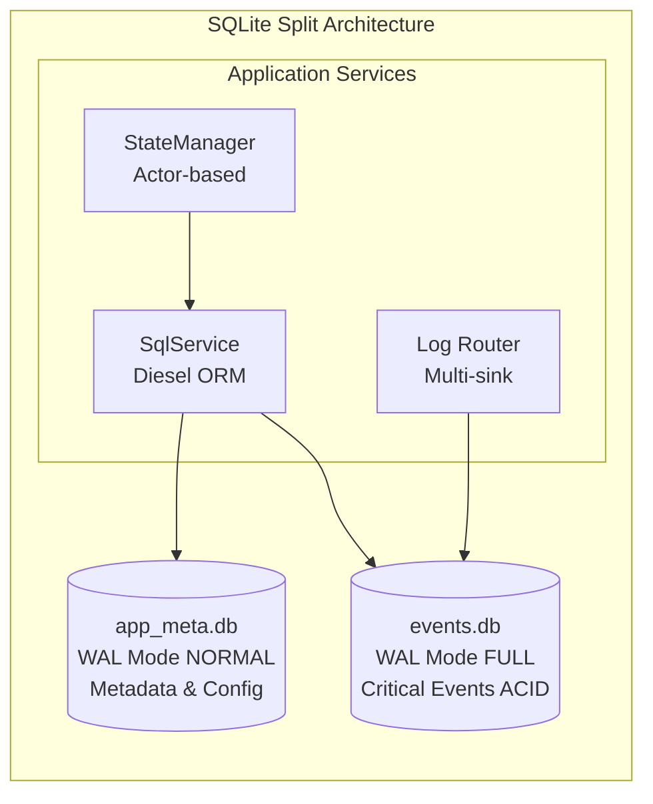

# SQLite Setup Specification (Phase 1.1.1)

**Version:** 1.0
**Date:** September 15, 2025
**Status:** Implementation Ready
**Component:** Database & Storage Layer - SQLite Setup
**Priority:** CRITICAL

## Overview

This specification defines the SQLite database setup for RAG Studio's Phase 1.1.1 implementation. The system uses a split database architecture with separate databases for application metadata and critical events, implementing async WAL mode for optimal performance and ACID compliance for event sourcing.

## Architecture

### Split Database Design



## Database Specifications

### app_meta.db (Application Metadata)

**Purpose:** Store application configuration, KB metadata, pipeline definitions, and operational state
**WAL Mode:** NORMAL (balance performance/durability)
**Concurrency:** Read-heavy with periodic writes

#### Schema Design

```sql
-- Configuration and Settings
CREATE TABLE settings (
    id INTEGER PRIMARY KEY,
    key TEXT NOT NULL UNIQUE,
    value TEXT NOT NULL,
    schema_version INTEGER NOT NULL DEFAULT 1,
    created_at DATETIME DEFAULT CURRENT_TIMESTAMP,
    updated_at DATETIME DEFAULT CURRENT_TIMESTAMP
);

-- Knowledge Base Metadata
CREATE TABLE knowledge_bases (
    id TEXT PRIMARY KEY,
    name TEXT NOT NULL,
    version INTEGER NOT NULL DEFAULT 1,
    status TEXT NOT NULL CHECK (status IN ('active', 'inactive', 'building', 'error')),
    embedder_model TEXT NOT NULL,
    chunk_size INTEGER NOT NULL DEFAULT 512,
    chunk_overlap INTEGER NOT NULL DEFAULT 50,
    description TEXT,
    metadata JSON,
    health_score REAL DEFAULT 1.0,
    created_at DATETIME DEFAULT CURRENT_TIMESTAMP,
    updated_at DATETIME DEFAULT CURRENT_TIMESTAMP,
    pinned_version INTEGER,
    UNIQUE(name, version)
);

-- Document Metadata
CREATE TABLE documents (
    id TEXT PRIMARY KEY,
    kb_id TEXT NOT NULL,
    title TEXT NOT NULL,
    source_path TEXT NOT NULL,
    content_hash TEXT NOT NULL,
    license_info TEXT,
    metadata JSON,
    chunk_count INTEGER DEFAULT 0,
    size_bytes INTEGER DEFAULT 0,
    created_at DATETIME DEFAULT CURRENT_TIMESTAMP,
    updated_at DATETIME DEFAULT CURRENT_TIMESTAMP,
    FOREIGN KEY (kb_id) REFERENCES knowledge_bases(id) ON DELETE CASCADE
);

-- Document Chunks Metadata
CREATE TABLE document_chunks (
    id TEXT PRIMARY KEY,
    document_id TEXT NOT NULL,
    kb_id TEXT NOT NULL,
    chunk_index INTEGER NOT NULL,
    content TEXT NOT NULL,
    content_hash TEXT NOT NULL,
    token_count INTEGER,
    metadata JSON,
    created_at DATETIME DEFAULT CURRENT_TIMESTAMP,
    FOREIGN KEY (document_id) REFERENCES documents(id) ON DELETE CASCADE,
    FOREIGN KEY (kb_id) REFERENCES knowledge_bases(id) ON DELETE CASCADE,
    UNIQUE(document_id, chunk_index)
);

-- Pipeline Definitions
CREATE TABLE pipelines (
    id TEXT PRIMARY KEY,
    name TEXT NOT NULL UNIQUE,
    description TEXT,
    config JSON NOT NULL,
    status TEXT NOT NULL CHECK (status IN ('active', 'inactive', 'draft')),
    created_at DATETIME DEFAULT CURRENT_TIMESTAMP,
    updated_at DATETIME DEFAULT CURRENT_TIMESTAMP
);

-- Pipeline Run Tracking
CREATE TABLE pipeline_runs (
    id TEXT PRIMARY KEY,
    pipeline_id TEXT NOT NULL,
    kb_id TEXT,
    status TEXT NOT NULL CHECK (status IN ('pending', 'running', 'completed', 'failed', 'cancelled')),
    started_at DATETIME,
    completed_at DATETIME,
    error_message TEXT,
    metrics JSON,
    artifacts JSON,
    FOREIGN KEY (pipeline_id) REFERENCES pipelines(id),
    FOREIGN KEY (kb_id) REFERENCES knowledge_bases(id)
);

-- Tool Registry
CREATE TABLE tools (
    id TEXT PRIMARY KEY,
    name TEXT NOT NULL UNIQUE,
    type TEXT NOT NULL,
    config JSON NOT NULL,
    schema JSON NOT NULL,
    enabled BOOLEAN DEFAULT TRUE,
    created_at DATETIME DEFAULT CURRENT_TIMESTAMP,
    updated_at DATETIME DEFAULT CURRENT_TIMESTAMP
);

-- Schedule Definitions
CREATE TABLE schedules (
    id TEXT PRIMARY KEY,
    name TEXT NOT NULL UNIQUE,
    cron_expression TEXT NOT NULL,
    pipeline_id TEXT NOT NULL,
    enabled BOOLEAN DEFAULT TRUE,
    last_run DATETIME,
    next_run DATETIME,
    created_at DATETIME DEFAULT CURRENT_TIMESTAMP,
    updated_at DATETIME DEFAULT CURRENT_TIMESTAMP,
    FOREIGN KEY (pipeline_id) REFERENCES pipelines(id)
);

-- Flow Definitions
CREATE TABLE flows (
    id TEXT PRIMARY KEY,
    name TEXT NOT NULL UNIQUE,
    description TEXT,
    definition JSON NOT NULL,
    enabled BOOLEAN DEFAULT TRUE,
    created_at DATETIME DEFAULT CURRENT_TIMESTAMP,
    updated_at DATETIME DEFAULT CURRENT_TIMESTAMP
);

-- Database Schema Versioning
CREATE TABLE schema_migrations (
    version INTEGER PRIMARY KEY,
    applied_at DATETIME DEFAULT CURRENT_TIMESTAMP,
    description TEXT
);

-- Indexes for Performance
CREATE INDEX idx_documents_kb_id ON documents(kb_id);
CREATE INDEX idx_documents_hash ON documents(content_hash);
CREATE INDEX idx_chunks_document_id ON document_chunks(document_id);
CREATE INDEX idx_chunks_kb_id ON document_chunks(kb_id);
CREATE INDEX idx_chunks_hash ON document_chunks(content_hash);
CREATE INDEX idx_pipeline_runs_pipeline_id ON pipeline_runs(pipeline_id);
CREATE INDEX idx_pipeline_runs_status ON pipeline_runs(status);
CREATE INDEX idx_pipeline_runs_started_at ON pipeline_runs(started_at);
CREATE INDEX idx_schedules_next_run ON schedules(next_run);
CREATE INDEX idx_kb_status ON knowledge_bases(status);
CREATE INDEX idx_kb_name_version ON knowledge_bases(name, version);
```

### events.db (Critical Events)

**Purpose:** Store critical ACID events for event sourcing, undo/redo functionality, and audit trails
**WAL Mode:** FULL (maximum durability)
**Concurrency:** Write-heavy with append-only pattern

#### Schema Design

```sql
-- Critical Event Log
CREATE TABLE events (
    id INTEGER PRIMARY KEY AUTOINCREMENT,
    event_id TEXT NOT NULL UNIQUE,
    event_type TEXT NOT NULL,
    aggregate_id TEXT NOT NULL,
    aggregate_type TEXT NOT NULL,
    sequence_number INTEGER NOT NULL,
    event_data JSON NOT NULL,
    metadata JSON,
    trace_id TEXT,
    user_id TEXT,
    timestamp DATETIME DEFAULT CURRENT_TIMESTAMP,
    checksum TEXT NOT NULL
);

-- Aggregate Snapshots for Performance
CREATE TABLE aggregate_snapshots (
    aggregate_id TEXT PRIMARY KEY,
    aggregate_type TEXT NOT NULL,
    sequence_number INTEGER NOT NULL,
    snapshot_data JSON NOT NULL,
    created_at DATETIME DEFAULT CURRENT_TIMESTAMP
);

-- Event Processing Checkpoints
CREATE TABLE event_checkpoints (
    processor_name TEXT PRIMARY KEY,
    last_processed_sequence INTEGER NOT NULL DEFAULT 0,
    updated_at DATETIME DEFAULT CURRENT_TIMESTAMP
);

-- Indexes for Event Sourcing
CREATE INDEX idx_events_aggregate ON events(aggregate_id, aggregate_type, sequence_number);
CREATE INDEX idx_events_type ON events(event_type);
CREATE INDEX idx_events_timestamp ON events(timestamp);
CREATE INDEX idx_events_trace_id ON events(trace_id);
CREATE UNIQUE INDEX idx_events_sequence ON events(aggregate_id, aggregate_type, sequence_number);
```

## Configuration Parameters

### Connection Pool Settings

```rust
// SqlService Configuration
pub struct SqlConfig {
    // app_meta.db settings
    pub app_db_path: PathBuf,
    pub app_pool_size: u32,           // Default: 10
    pub app_connection_timeout: Duration, // Default: 30s
    pub app_wal_mode: WalMode,        // NORMAL

    // events.db settings
    pub events_db_path: PathBuf,
    pub events_pool_size: u32,        // Default: 5
    pub events_connection_timeout: Duration, // Default: 10s
    pub events_wal_mode: WalMode,     // FULL

    // Common settings
    pub busy_timeout: Duration,       // Default: 5s
    pub journal_size_limit: i64,      // Default: 64MB
    pub checkpoint_interval: Duration, // Default: 10s
    pub vacuum_interval: Duration,    // Default: 24h
    pub backup_enabled: bool,         // Default: true
    pub backup_interval: Duration,    // Default: 1h
}

pub enum WalMode {
    Normal,  // app_meta.db - balance performance/durability
    Full,    // events.db - maximum durability
}
```

### Performance Optimizations

```sql
-- WAL Mode Configuration
PRAGMA journal_mode = WAL;
PRAGMA synchronous = NORMAL; -- app_meta.db
PRAGMA synchronous = FULL;   -- events.db

-- Performance Settings
PRAGMA cache_size = -64000;  -- 64MB cache
PRAGMA temp_store = MEMORY;
PRAGMA mmap_size = 134217728; -- 128MB mmap
PRAGMA busy_timeout = 5000;   -- 5s with jitter
PRAGMA wal_autocheckpoint = 1000;

-- Concurrency Settings
PRAGMA read_uncommitted = false;
PRAGMA foreign_keys = true;
PRAGMA recursive_triggers = false;
```

## Implementation Requirements

### Diesel ORM Integration

```rust
// Database Models
#[derive(Queryable, Insertable, Identifiable)]
#[diesel(table_name = knowledge_bases)]
pub struct KnowledgeBase {
    pub id: String,
    pub name: String,
    pub version: i32,
    pub status: String,
    pub embedder_model: String,
    pub chunk_size: i32,
    pub chunk_overlap: i32,
    pub description: Option<String>,
    pub metadata: Option<String>, // JSON
    pub health_score: f64,
    pub created_at: NaiveDateTime,
    pub updated_at: NaiveDateTime,
    pub pinned_version: Option<i32>,
}

#[derive(Queryable, Insertable)]
#[diesel(table_name = events)]
pub struct Event {
    pub event_id: String,
    pub event_type: String,
    pub aggregate_id: String,
    pub aggregate_type: String,
    pub sequence_number: i32,
    pub event_data: String, // JSON
    pub metadata: Option<String>, // JSON
    pub trace_id: Option<String>,
    pub user_id: Option<String>,
    pub timestamp: NaiveDateTime,
    pub checksum: String,
}
```

### Connection Management

```rust
use diesel::prelude::*;
use diesel::r2d2::{self, ConnectionManager, Pool};

pub struct SqlService {
    app_pool: Pool<ConnectionManager<SqliteConnection>>,
    events_pool: Pool<ConnectionManager<SqliteConnection>>,
    config: SqlConfig,
}

impl SqlService {
    pub async fn new(config: SqlConfig) -> Result<Self, SqlError> {
        let app_manager = ConnectionManager::<SqliteConnection>::new(&config.app_db_path);
        let events_manager = ConnectionManager::<SqliteConnection>::new(&config.events_db_path);

        let app_pool = Pool::builder()
            .max_size(config.app_pool_size)
            .connection_timeout(config.app_connection_timeout)
            .build(app_manager)?;

        let events_pool = Pool::builder()
            .max_size(config.events_pool_size)
            .connection_timeout(config.events_connection_timeout)
            .build(events_manager)?;

        Ok(Self {
            app_pool,
            events_pool,
            config,
        })
    }

    pub async fn get_app_connection(&self) -> Result<PooledConnection<ConnectionManager<SqliteConnection>>, r2d2::Error> {
        self.app_pool.get()
    }

    pub async fn get_events_connection(&self) -> Result<PooledConnection<ConnectionManager<SqliteConnection>>, r2d2::Error> {
        self.events_pool.get()
    }
}
```

## Migration System Integration

### Migration Framework

```rust
use diesel_migrations::{embed_migrations, EmbeddedMigrations, MigrationHarness};

pub const APP_MIGRATIONS: EmbeddedMigrations = embed_migrations!("migrations/app_meta/");
pub const EVENTS_MIGRATIONS: EmbeddedMigrations = embed_migrations!("migrations/events/");

impl SqlService {
    pub async fn run_migrations(&self) -> Result<(), Box<dyn std::error::Error>> {
        // Run app_meta.db migrations
        let mut app_conn = self.get_app_connection().await?;
        app_conn.run_pending_migrations(APP_MIGRATIONS)?;

        // Run events.db migrations
        let mut events_conn = self.get_events_connection().await?;
        events_conn.run_pending_migrations(EVENTS_MIGRATIONS)?;

        Ok(())
    }
}
```

## Backup & Recovery

### Backup Strategy

```rust
impl SqlService {
    pub async fn backup_databases(&self) -> Result<(), SqlError> {
        let timestamp = Utc::now().format("%Y%m%d_%H%M%S");

        // Backup app_meta.db
        let app_backup_path = format!("backups/app_meta_{}.db", timestamp);
        self.backup_database(&self.config.app_db_path, &app_backup_path).await?;

        // Backup events.db
        let events_backup_path = format!("backups/events_{}.db", timestamp);
        self.backup_database(&self.config.events_db_path, &events_backup_path).await?;

        Ok(())
    }

    async fn backup_database(&self, source: &Path, dest: &str) -> Result<(), SqlError> {
        // SQLite VACUUM INTO for consistent backup
        let conn = Connection::open(source)?;
        conn.execute(&format!("VACUUM INTO '{}'", dest), [])?;
        Ok(())
    }
}
```

## Performance Monitoring

### Health Metrics

```rust
#[derive(Debug, Clone)]
pub struct DatabaseHealthMetrics {
    pub app_db_size: u64,
    pub events_db_size: u64,
    pub app_pool_active: u32,
    pub events_pool_active: u32,
    pub wal_checkpoint_age: Duration,
    pub vacuum_last_run: DateTime<Utc>,
    pub backup_last_run: DateTime<Utc>,
}

impl SqlService {
    pub async fn health_check(&self) -> DatabaseHealthMetrics {
        // Implementation for gathering health metrics
    }
}
```

## Error Handling

### Error Types

```rust
#[derive(Debug, thiserror::Error)]
pub enum SqlError {
    #[error("Database connection failed: {0}")]
    ConnectionFailed(#[from] r2d2::Error),

    #[error("Migration failed: {0}")]
    MigrationFailed(String),

    #[error("Query execution failed: {0}")]
    QueryFailed(#[from] diesel::result::Error),

    #[error("Backup operation failed: {0}")]
    BackupFailed(String),

    #[error("Transaction failed: {0}")]
    TransactionFailed(String),
}
```

## Testing Strategy

### Unit Tests

```rust
#[cfg(test)]
mod tests {
    use super::*;
    use tempfile::TempDir;

    #[tokio::test]
    async fn test_database_setup() {
        let temp_dir = TempDir::new().unwrap();
        let config = SqlConfig::test_config(temp_dir.path());

        let sql_service = SqlService::new(config).await.unwrap();
        sql_service.run_migrations().await.unwrap();

        // Verify tables exist
        let conn = sql_service.get_app_connection().await.unwrap();
        // Test queries...
    }

    #[tokio::test]
    async fn test_event_storage() {
        // Test event sourcing functionality
    }
}
```

## Success Criteria

- [x] Split database architecture implemented (app_meta.db + events.db)
- [x] Async WAL mode configured with appropriate durability settings
- [x] Diesel ORM integration with proper connection pooling
- [x] Migration system for schema versioning
- [x] Backup and restore functionality
- [x] Performance optimization (busy_timeout, jitter, checkpoints)
- [x] Error handling and health monitoring
- [x] Event sourcing support for undo/redo functionality
- [x] ACID compliance for critical events
- [x] Comprehensive test coverage

## Dependencies

```toml
[dependencies]
diesel = { version = "2.1", features = ["sqlite", "chrono", "r2d2"] }
diesel_migrations = "2.1"
r2d2 = "0.8"
chrono = { version = "0.4", features = ["serde"] }
tokio = { version = "1.0", features = ["full"] }
thiserror = "1.0"
serde = { version = "1.0", features = ["derive"] }
serde_json = "1.0"
tracing = "0.1"
```

## Integration Points

- **StateManager**: Actor-based state management with SQL persistence
- **Log Router**: Multi-sink logging with events.db for critical events
- **Migration System**: Forward/backward compatible schema changes
- **Backup Service**: Automated backup scheduling via StorageService
- **Performance Monitoring**: Health metrics integration with metrics collection