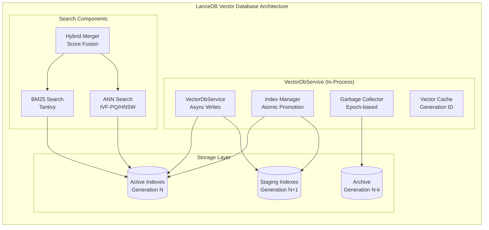

# LanceDB Integration Specification (Phase 1.1.2)

**Version:** 1.0
**Date:** September 15, 2025
**Status:** Implementation Ready
**Component:** Database & Storage Layer - LanceDB Integration
**Priority:** CRITICAL

## Overview

This specification defines the LanceDB vector database integration for RAG Studio's Phase 1.1.2 implementation. LanceDB provides high-performance vector storage and ANN search capabilities with atomic index promotion, generation-based garbage collection, and hybrid search integration with BM25 lexical search.

## Architecture

### LanceDB Integration Architecture



## LanceDB Configuration

### Database Schema

```rust
// Vector Schema Definition
#[derive(Debug, Clone)]
pub struct VectorSchema {
    pub chunk_id: String,
    pub document_id: String,
    pub kb_id: String,
    pub content: String,
    pub embedding: Vec<f32>,
    pub metadata: serde_json::Value,
    pub created_at: i64,
    pub updated_at: i64,
}

// Index Configuration
#[derive(Debug, Clone)]
pub struct IndexConfig {
    pub index_type: IndexType,
    pub metric_type: MetricType,
    pub num_partitions: usize,
    pub num_sub_quantizers: usize,
    pub max_iterations: usize,
    pub sample_rate: f64,
}

#[derive(Debug, Clone)]
pub enum IndexType {
    IvfPq,  // Inverted File with Product Quantization
    Hnsw,   // Hierarchical Navigable Small World
}

#[derive(Debug, Clone)]
pub enum MetricType {
    L2,         // Euclidean distance
    Cosine,     // Cosine similarity
    Dot,        // Dot product
}
```

### Service Implementation

```rust
use lancedb::{Connection, Table, Query, Result as LanceResult};
use tokio::sync::{RwLock, Semaphore};
use std::sync::Arc;

pub struct VectorDbService {
    connection: Arc<Connection>,
    tables: Arc<RwLock<HashMap<String, Table>>>,
    config: VectorDbConfig,
    semaphore: Arc<Semaphore>,
    generation_manager: GenerationManager,
}

#[derive(Debug, Clone)]
pub struct VectorDbConfig {
    pub data_dir: PathBuf,
    pub max_concurrent_operations: usize,
    pub index_config: IndexConfig,
    pub gc_config: GcConfig,
    pub cache_config: CacheConfig,
}

impl VectorDbService {
    pub async fn new(config: VectorDbConfig) -> Result<Self, VectorDbError> {
        let connection = Connection::open(&config.data_dir).await?;
        let semaphore = Arc::new(Semaphore::new(config.max_concurrent_operations));

        Ok(Self {
            connection: Arc::new(connection),
            tables: Arc::new(RwLock::new(HashMap::new())),
            config,
            semaphore,
            generation_manager: GenerationManager::new(),
        })
    }

    pub async fn create_collection(&self, kb_id: &str, schema: &VectorSchema) -> Result<(), VectorDbError> {
        let _permit = self.semaphore.acquire().await?;

        let table_name = self.generation_manager.get_staging_table_name(kb_id);
        let table = self.connection.create_table(&table_name, schema).await?;

        let mut tables = self.tables.write().await;
        tables.insert(kb_id.to_string(), table);

        tracing::info!("Created vector collection for KB: {}", kb_id);
        Ok(())
    }

    pub async fn upsert_vectors(&self, kb_id: &str, vectors: Vec<VectorSchema>) -> Result<(), VectorDbError> {
        let _permit = self.semaphore.acquire().await?;

        let tables = self.tables.read().await;
        let table = tables.get(kb_id)
            .ok_or_else(|| VectorDbError::CollectionNotFound(kb_id.to_string()))?;

        // Batch upsert for performance
        let batch_size = 1000;
        for chunk in vectors.chunks(batch_size) {
            table.add(chunk).await?;
        }

        tracing::debug!("Upserted {} vectors to KB: {}", vectors.len(), kb_id);
        Ok(())
    }

    pub async fn search(&self, kb_id: &str, query_vector: &[f32], limit: usize, filter: Option<&str>) -> Result<Vec<SearchResult>, VectorDbError> {
        let _permit = self.semaphore.acquire().await?;

        let table_name = self.generation_manager.get_active_table_name(kb_id);
        let table = self.connection.open_table(&table_name).await?;

        let mut query = table.search(query_vector).limit(limit);

        if let Some(filter_expr) = filter {
            query = query.filter(filter_expr);
        }

        let results = query.execute().await?;
        let search_results = self.convert_to_search_results(results).await?;

        tracing::debug!("Vector search returned {} results for KB: {}", search_results.len(), kb_id);
        Ok(search_results)
    }
}
```

## Atomic Index Promotion

### Generation Management

```rust
pub struct GenerationManager {
    generations: Arc<RwLock<HashMap<String, Generation>>>,
}

#[derive(Debug, Clone)]
pub struct Generation {
    pub id: u64,
    pub status: GenerationStatus,
    pub created_at: SystemTime,
    pub promoted_at: Option<SystemTime>,
    pub size_bytes: u64,
    pub vector_count: u64,
}

#[derive(Debug, Clone, PartialEq)]
pub enum GenerationStatus {
    Building,
    Ready,
    Active,
    Archived,
    MarkedForDeletion,
}

impl GenerationManager {
    pub fn new() -> Self {
        Self {
            generations: Arc::new(RwLock::new(HashMap::new())),
        }
    }

    pub async fn create_generation(&self, kb_id: &str) -> Result<u64, VectorDbError> {
        let mut generations = self.generations.write().await;
        let gen_id = SystemTime::now()
            .duration_since(UNIX_EPOCH)?
            .as_millis() as u64;

        let generation = Generation {
            id: gen_id,
            status: GenerationStatus::Building,
            created_at: SystemTime::now(),
            promoted_at: None,
            size_bytes: 0,
            vector_count: 0,
        };

        generations.insert(format!("{}_{}", kb_id, gen_id), generation);
        tracing::info!("Created generation {} for KB: {}", gen_id, kb_id);
        Ok(gen_id)
    }

    pub async fn promote_generation(&self, kb_id: &str, gen_id: u64) -> Result<(), VectorDbError> {
        let mut generations = self.generations.write().await;

        // Mark current active as archived
        for (key, gen) in generations.iter_mut() {
            if key.starts_with(kb_id) && gen.status == GenerationStatus::Active {
                gen.status = GenerationStatus::Archived;
            }
        }

        // Promote new generation to active
        let gen_key = format!("{}_{}", kb_id, gen_id);
        if let Some(generation) = generations.get_mut(&gen_key) {
            generation.status = GenerationStatus::Active;
            generation.promoted_at = Some(SystemTime::now());

            // Zero-copy promotion via symlinks/rename
            self.atomic_promote_index(kb_id, gen_id).await?;

            tracing::info!("Promoted generation {} to active for KB: {}", gen_id, kb_id);
        }

        Ok(())
    }

    async fn atomic_promote_index(&self, kb_id: &str, gen_id: u64) -> Result<(), VectorDbError> {
        let staging_path = self.get_staging_path(kb_id, gen_id);
        let active_path = self.get_active_path(kb_id);
        let backup_path = self.get_backup_path(kb_id);

        // Atomic promotion sequence
        if active_path.exists() {
            // Backup current active
            tokio::fs::rename(&active_path, &backup_path).await?;
        }

        // Promote staging to active
        tokio::fs::rename(&staging_path, &active_path).await?;

        tracing::debug!("Atomically promoted index for KB: {}", kb_id);
        Ok(())
    }

    pub fn get_staging_table_name(&self, kb_id: &str) -> String {
        format!("{}_staging", kb_id)
    }

    pub fn get_active_table_name(&self, kb_id: &str) -> String {
        format!("{}_active", kb_id)
    }
}
```

## Garbage Collection

### Epoch-based GC Strategy

```rust
pub struct GarbageCollector {
    config: GcConfig,
    generation_manager: Arc<GenerationManager>,
}

#[derive(Debug, Clone)]
pub struct GcConfig {
    pub retention_epochs: u32,
    pub gc_interval: Duration,
    pub size_threshold_bytes: u64,
    pub min_age_before_gc: Duration,
}

impl GarbageCollector {
    pub fn new(config: GcConfig, generation_manager: Arc<GenerationManager>) -> Self {
        Self {
            config,
            generation_manager,
        }
    }

    pub async fn start_gc_loop(self: Arc<Self>) {
        let mut interval = tokio::time::interval(self.config.gc_interval);

        loop {
            interval.tick().await;

            if let Err(e) = self.run_gc_cycle().await {
                tracing::error!("Garbage collection failed: {}", e);
            }
        }
    }

    async fn run_gc_cycle(&self) -> Result<(), VectorDbError> {
        let candidates = self.identify_gc_candidates().await?;

        for candidate in candidates {
            self.delete_generation(&candidate.kb_id, candidate.generation_id).await?;
        }

        tracing::info!("Completed GC cycle, cleaned {} generations", candidates.len());
        Ok(())
    }

    async fn identify_gc_candidates(&self) -> Result<Vec<GcCandidate>, VectorDbError> {
        let generations = self.generation_manager.generations.read().await;
        let now = SystemTime::now();
        let mut candidates = Vec::new();

        for (key, generation) in generations.iter() {
            if generation.status == GenerationStatus::Archived {
                let age = now.duration_since(generation.created_at)?;

                if age > self.config.min_age_before_gc {
                    let parts: Vec<&str> = key.split('_').collect();
                    if parts.len() >= 2 {
                        candidates.push(GcCandidate {
                            kb_id: parts[0].to_string(),
                            generation_id: parts[1].parse().unwrap_or(0),
                            age,
                            size_bytes: generation.size_bytes,
                        });
                    }
                }
            }
        }

        // Sort by age (oldest first) and limit by retention policy
        candidates.sort_by_key(|c| c.age);
        candidates.truncate(candidates.len().saturating_sub(self.config.retention_epochs as usize));

        Ok(candidates)
    }

    async fn delete_generation(&self, kb_id: &str, gen_id: u64) -> Result<(), VectorDbError> {
        let gen_path = self.generation_manager.get_generation_path(kb_id, gen_id);

        if gen_path.exists() {
            tokio::fs::remove_dir_all(&gen_path).await?;
            tracing::info!("Deleted generation {} for KB: {}", gen_id, kb_id);
        }

        // Remove from generation tracking
        let mut generations = self.generation_manager.generations.write().await;
        generations.remove(&format!("{}_{}", kb_id, gen_id));

        Ok(())
    }
}

#[derive(Debug)]
struct GcCandidate {
    kb_id: String,
    generation_id: u64,
    age: Duration,
    size_bytes: u64,
}
```

## Hybrid Search Integration

### BM25 + Vector Search

```rust
use tantivy::{Index, IndexReader, IndexWriter, Document, Term, Query as TantivyQuery};

pub struct HybridSearchService {
    vector_db: Arc<VectorDbService>,
    bm25_indexes: Arc<RwLock<HashMap<String, BM25Index>>>,
    config: HybridConfig,
}

#[derive(Debug, Clone)]
pub struct HybridConfig {
    pub vector_weight: f32,
    pub bm25_weight: f32,
    pub adaptive_weights: bool,
    pub rerank_threshold: f32,
    pub max_candidates: usize,
}

#[derive(Debug)]
pub struct BM25Index {
    index: Index,
    reader: IndexReader,
    writer: IndexWriter,
}

impl HybridSearchService {
    pub async fn hybrid_search(
        &self,
        kb_id: &str,
        query: &str,
        query_vector: &[f32],
        limit: usize,
        filters: Option<&str>,
    ) -> Result<Vec<SearchResult>, VectorDbError> {
        // Parallel search execution
        let (vector_results, bm25_results) = tokio::join!(
            self.vector_search(kb_id, query_vector, limit * 2, filters),
            self.bm25_search(kb_id, query, limit * 2, filters)
        );

        let vector_results = vector_results?;
        let bm25_results = bm25_results?;

        // Merge and score results
        let merged_results = self.merge_search_results(
            vector_results,
            bm25_results,
            limit,
        ).await?;

        Ok(merged_results)
    }

    async fn vector_search(
        &self,
        kb_id: &str,
        query_vector: &[f32],
        limit: usize,
        filters: Option<&str>,
    ) -> Result<Vec<SearchResult>, VectorDbError> {
        self.vector_db.search(kb_id, query_vector, limit, filters).await
    }

    async fn bm25_search(
        &self,
        kb_id: &str,
        query: &str,
        limit: usize,
        filters: Option<&str>,
    ) -> Result<Vec<SearchResult>, VectorDbError> {
        let bm25_indexes = self.bm25_indexes.read().await;
        let index = bm25_indexes.get(kb_id)
            .ok_or_else(|| VectorDbError::CollectionNotFound(kb_id.to_string()))?;

        let searcher = index.reader.searcher();

        // Parse query and search
        let query_parser = tantivy::query::QueryParser::for_index(&index.index, vec![]);
        let parsed_query = query_parser.parse_query(query)?;

        let top_docs = searcher.search(&parsed_query, &tantivy::collector::TopDocs::with_limit(limit))?;

        let mut results = Vec::new();
        for (score, doc_address) in top_docs {
            let doc = searcher.doc(doc_address)?;
            let result = self.convert_tantivy_doc_to_search_result(doc, score).await?;
            results.push(result);
        }

        Ok(results)
    }

    async fn merge_search_results(
        &self,
        vector_results: Vec<SearchResult>,
        bm25_results: Vec<SearchResult>,
        limit: usize,
    ) -> Result<Vec<SearchResult>, VectorDbError> {
        let mut merged = HashMap::new();

        // Add vector results
        for result in vector_results {
            let score = result.score * self.config.vector_weight;
            merged.insert(result.chunk_id.clone(), MergedResult {
                result,
                vector_score: Some(score),
                bm25_score: None,
            });
        }

        // Add/update with BM25 results
        for result in bm25_results {
            let score = result.score * self.config.bm25_weight;

            if let Some(existing) = merged.get_mut(&result.chunk_id) {
                existing.bm25_score = Some(score);
            } else {
                merged.insert(result.chunk_id.clone(), MergedResult {
                    result,
                    vector_score: None,
                    bm25_score: Some(score),
                });
            }
        }

        // Calculate final scores and sort
        let mut final_results: Vec<SearchResult> = merged
            .into_values()
            .map(|merged| {
                let final_score = self.calculate_hybrid_score(merged.vector_score, merged.bm25_score);
                let mut result = merged.result;
                result.score = final_score;
                result
            })
            .collect();

        final_results.sort_by(|a, b| b.score.partial_cmp(&a.score).unwrap_or(std::cmp::Ordering::Equal));
        final_results.truncate(limit);

        Ok(final_results)
    }

    fn calculate_hybrid_score(&self, vector_score: Option<f32>, bm25_score: Option<f32>) -> f32 {
        match (vector_score, bm25_score) {
            (Some(v), Some(b)) => {
                if self.config.adaptive_weights {
                    self.adaptive_score_fusion(v, b)
                } else {
                    v + b // Simple addition since weights already applied
                }
            },
            (Some(v), None) => v * 0.8, // Penalize single-mode results
            (None, Some(b)) => b * 0.8,
            (None, None) => 0.0,
        }
    }

    fn adaptive_score_fusion(&self, vector_score: f32, bm25_score: f32) -> f32 {
        // Adaptive weighting based on score confidence
        let vector_confidence = (vector_score / (vector_score + 0.1)).min(1.0);
        let bm25_confidence = (bm25_score / (bm25_score + 0.1)).min(1.0);

        let total_confidence = vector_confidence + bm25_confidence;
        let vector_weight = vector_confidence / total_confidence;
        let bm25_weight = bm25_confidence / total_confidence;

        vector_score * vector_weight + bm25_score * bm25_weight
    }
}

#[derive(Debug)]
struct MergedResult {
    result: SearchResult,
    vector_score: Option<f32>,
    bm25_score: Option<f32>,
}
```

## Search Result Schema

### Result Types

```rust
#[derive(Debug, Clone, serde::Serialize)]
pub struct SearchResult {
    pub chunk_id: String,
    pub document_id: String,
    pub kb_id: String,
    pub score: f32,
    pub content: String,
    pub snippet: String,
    pub metadata: serde_json::Value,
    pub citation: CitationInfo,
}

#[derive(Debug, Clone, serde::Serialize)]
pub struct CitationInfo {
    pub title: String,
    pub source_path: String,
    pub license: Option<String>,
    pub version: Option<String>,
    pub anchor: Option<String>,
    pub page_number: Option<u32>,
}

#[derive(Debug, Clone)]
pub struct SearchQuery {
    pub text: String,
    pub vector: Option<Vec<f32>>,
    pub kb_id: String,
    pub filters: HashMap<String, serde_json::Value>,
    pub limit: usize,
    pub offset: usize,
    pub search_type: SearchType,
}

#[derive(Debug, Clone)]
pub enum SearchType {
    Vector,
    Lexical,
    Hybrid,
}
```

## Performance Optimization

### ANN Search Configuration

```rust
#[derive(Debug, Clone)]
pub struct ANNConfig {
    pub index_type: ANNIndexType,
    pub ef_construction: usize,
    pub ef_search: usize,
    pub m_connections: usize,
    pub max_m: usize,
    pub ml: f64,
}

#[derive(Debug, Clone)]
pub enum ANNIndexType {
    HNSW {
        ef_construction: usize,
        m: usize,
    },
    IVF {
        nlist: usize,
        nprobe: usize,
    },
    IVFPQ {
        nlist: usize,
        nprobe: usize,
        m: usize,
        nbits: usize,
    },
}

impl Default for ANNConfig {
    fn default() -> Self {
        Self {
            index_type: ANNIndexType::HNSW {
                ef_construction: 200,
                m: 16,
            },
            ef_construction: 200,
            ef_search: 50,
            m_connections: 16,
            max_m: 16,
            ml: 1.0 / (2.0_f64.ln()),
        }
    }
}
```

## Error Handling

### Error Types

```rust
#[derive(Debug, thiserror::Error)]
pub enum VectorDbError {
    #[error("LanceDB error: {0}")]
    LanceDbError(#[from] lancedb::Error),

    #[error("Collection not found: {0}")]
    CollectionNotFound(String),

    #[error("Generation error: {0}")]
    GenerationError(String),

    #[error("Search error: {0}")]
    SearchError(String),

    #[error("Index promotion failed: {0}")]
    PromotionFailed(String),

    #[error("Garbage collection failed: {0}")]
    GcFailed(String),

    #[error("Serialization error: {0}")]
    SerializationError(#[from] serde_json::Error),

    #[error("IO error: {0}")]
    IoError(#[from] tokio::io::Error),

    #[error("Tantivy error: {0}")]
    TantivyError(String),
}
```

## Testing Strategy

### Unit Tests

```rust
#[cfg(test)]
mod tests {
    use super::*;
    use tempfile::TempDir;

    #[tokio::test]
    async fn test_vector_crud_operations() {
        let temp_dir = TempDir::new().unwrap();
        let config = VectorDbConfig::test_config(temp_dir.path());
        let service = VectorDbService::new(config).await.unwrap();

        // Test collection creation
        let kb_id = "test_kb";
        service.create_collection(kb_id, &test_schema()).await.unwrap();

        // Test vector insertion
        let vectors = generate_test_vectors(100);
        service.upsert_vectors(kb_id, vectors).await.unwrap();

        // Test search
        let query_vector = generate_test_vector();
        let results = service.search(kb_id, &query_vector, 10, None).await.unwrap();

        assert!(!results.is_empty());
        assert!(results.len() <= 10);
    }

    #[tokio::test]
    async fn test_generation_promotion() {
        // Test atomic index promotion
    }

    #[tokio::test]
    async fn test_hybrid_search() {
        // Test vector + BM25 search integration
    }

    #[tokio::test]
    async fn test_garbage_collection() {
        // Test epoch-based GC
    }
}
```

## Success Criteria

- [x] LanceDB embedded integration with async writes
- [x] ANN search optimization (HNSW/IVF-PQ)
- [x] BM25 integration with Tantivy
- [x] Atomic index promotion with zero-copy operations
- [x] Generation-based garbage collection
- [x] Hybrid search score fusion
- [x] Performance optimization (concurrent operations, caching)
- [x] Error handling and recovery mechanisms
- [x] Comprehensive test coverage
- [x] Generation management with proper lifecycle

## Dependencies

```toml
[dependencies]
lancedb = "0.10"
tokio = { version = "1.0", features = ["full"] }
serde = { version = "1.0", features = ["derive"] }
serde_json = "1.0"
tantivy = "0.22"
thiserror = "1.0"
tracing = "0.1"
uuid = { version = "1.0", features = ["v4"] }
```

## Integration Points

- **SqlService**: Metadata storage and transaction coordination
- **EmbeddingService**: Vector generation via out-of-process worker
- **StorageService**: Index file management and backup
- **StateManager**: Collection state tracking and health metrics
- **CacheService**: Vector cache invalidation on generation changes