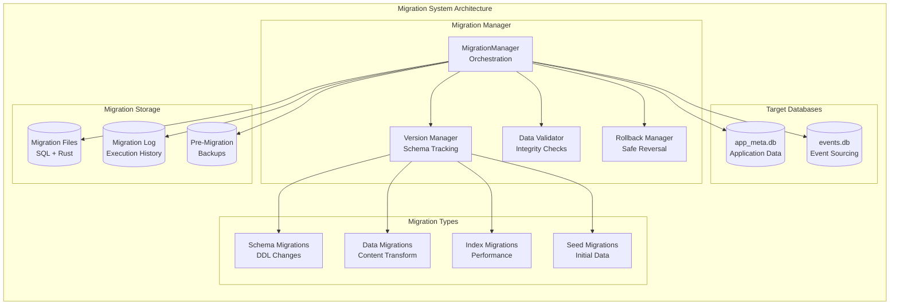

# Migration System Specification (Phase 1.1.4)

**Version:** 1.0
**Date:** September 15, 2025
**Status:** Implementation Ready
**Component:** Database & Storage Layer - Migration System
**Priority:** CRITICAL

## Overview

This specification defines the Migration System for RAG Studio's Phase 1.1.4 implementation. The system provides forward/backward compatible database schema versioning, data integrity validation, automated migration execution, and rollback capabilities for both application metadata and event sourcing databases.

## Architecture

### Migration System Architecture



## Migration Framework

### Core Migration System

```rust
use diesel_migrations::{embed_migrations, EmbeddedMigrations, MigrationHarness};
use std::collections::HashMap;
use tokio::sync::Mutex;

pub struct MigrationManager {
    app_migrations: EmbeddedMigrations,
    events_migrations: EmbeddedMigrations,
    sql_service: Arc<SqlService>,
    storage_service: Arc<StorageService>,
    version_tracker: Arc<Mutex<VersionTracker>>,
    config: MigrationConfig,
}

#[derive(Debug, Clone)]
pub struct MigrationConfig {
    pub auto_migrate_on_startup: bool,     // Default: true
    pub backup_before_migration: bool,     // Default: true
    pub validate_after_migration: bool,    // Default: true
    pub rollback_on_failure: bool,         // Default: true
    pub max_concurrent_migrations: usize,  // Default: 1 (sequential)
    pub migration_timeout: Duration,       // Default: 300s
    pub dry_run_enabled: bool,             // Default: false
}

impl MigrationManager {
    pub fn new(
        sql_service: Arc<SqlService>,
        storage_service: Arc<StorageService>,
        config: MigrationConfig,
    ) -> Self {
        let app_migrations = embed_migrations!("migrations/app_meta/");
        let events_migrations = embed_migrations!("migrations/events/");

        Self {
            app_migrations,
            events_migrations,
            sql_service,
            storage_service,
            version_tracker: Arc::new(Mutex::new(VersionTracker::new())),
            config,
        }
    }

    pub async fn initialize(&self) -> Result<(), MigrationError> {
        // Ensure migration tables exist
        self.create_migration_tables().await?;

        // Load current schema versions
        self.load_current_versions().await?;

        if self.config.auto_migrate_on_startup {
            self.migrate_to_latest().await?;
        }

        Ok(())
    }

    pub async fn migrate_to_latest(&self) -> Result<MigrationSummary, MigrationError> {
        tracing::info!("Starting migration to latest schema version");

        let summary = MigrationSummary::new();

        // Create pre-migration backup if enabled
        if self.config.backup_before_migration {
            self.create_pre_migration_backup().await?;
        }

        // Migrate app_meta.db
        let app_result = self.migrate_database(
            DatabaseType::AppMeta,
            &self.app_migrations,
        ).await;

        // Migrate events.db
        let events_result = self.migrate_database(
            DatabaseType::Events,
            &self.events_migrations,
        ).await;

        // Handle migration results
        match (app_result, events_result) {
            (Ok(app_summary), Ok(events_summary)) => {
                let combined_summary = MigrationSummary {
                    app_migrations: app_summary.app_migrations,
                    events_migrations: events_summary.events_migrations,
                    total_duration: app_summary.total_duration + events_summary.total_duration,
                    success: true,
                    error: None,
                };

                if self.config.validate_after_migration {
                    self.validate_post_migration().await?;
                }

                tracing::info!("Migration completed successfully: {} app migrations, {} event migrations",
                              combined_summary.app_migrations.len(),
                              combined_summary.events_migrations.len());

                Ok(combined_summary)
            }
            (Err(app_error), _) | (_, Err(app_error)) => {
                tracing::error!("Migration failed: {}", app_error);

                if self.config.rollback_on_failure {
                    self.rollback_failed_migration().await?;
                }

                Err(app_error)
            }
        }
    }

    async fn migrate_database(
        &self,
        db_type: DatabaseType,
        migrations: &EmbeddedMigrations,
    ) -> Result<MigrationSummary, MigrationError> {
        let start_time = Instant::now();
        let mut applied_migrations = Vec::new();

        // MVP: Handle single database mode
        let connection = if self.config.use_single_database {
            // MVP: Always use app connection (events tables are in app_meta.db)
            self.sql_service.get_app_connection().await?
        } else {
            // Production: Use appropriate connection
            match db_type {
                DatabaseType::AppMeta => self.sql_service.get_app_connection().await?,
                DatabaseType::Events => self.sql_service.get_events_connection().await?,
            }
        };

        // Get pending migrations
        let pending = connection.pending_migrations(*migrations)?;

        if pending.is_empty() {
            tracing::debug!("No pending migrations for {:?} database", db_type);
            return Ok(MigrationSummary::empty());
        }

        tracing::info!("Applying {} pending migrations to {:?} database", pending.len(), db_type);

        // Apply migrations sequentially with timeout
        for migration in pending {
            let migration_start = Instant::now();

            // Execute migration with timeout
            let migration_result = tokio::time::timeout(
                self.config.migration_timeout,
                self.apply_single_migration(&connection, &migration, db_type),
            ).await;

            match migration_result {
                Ok(Ok(())) => {
                    let duration = migration_start.elapsed();
                    applied_migrations.push(AppliedMigration {
                        version: migration.version().to_string(),
                        name: migration.name().to_string(),
                        duration,
                        success: true,
                        error: None,
                    });

                    tracing::debug!("Applied migration {}: {} ({}ms)",
                                   migration.version(),
                                   migration.name(),
                                   duration.as_millis());
                }
                Ok(Err(e)) => {
                    applied_migrations.push(AppliedMigration {
                        version: migration.version().to_string(),
                        name: migration.name().to_string(),
                        duration: migration_start.elapsed(),
                        success: false,
                        error: Some(e.to_string()),
                    });

                    return Err(MigrationError::MigrationFailed {
                        version: migration.version().to_string(),
                        error: e.to_string(),
                    });
                }
                Err(_) => {
                    return Err(MigrationError::MigrationTimeout {
                        version: migration.version().to_string(),
                        timeout: self.config.migration_timeout,
                    });
                }
            }
        }

        let total_duration = start_time.elapsed();

        // Update version tracker
        let mut tracker = self.version_tracker.lock().await;
        tracker.update_database_version(
            db_type,
            applied_migrations.last().unwrap().version.clone(),
        );

        let summary = match db_type {
            DatabaseType::AppMeta => MigrationSummary {
                app_migrations: applied_migrations,
                events_migrations: Vec::new(),
                total_duration,
                success: true,
                error: None,
            },
            DatabaseType::Events => MigrationSummary {
                app_migrations: Vec::new(),
                events_migrations: applied_migrations,
                total_duration,
                success: true,
                error: None,
            },
        };

        Ok(summary)
    }

    async fn apply_single_migration(
        &self,
        connection: &SqliteConnection,
        migration: &dyn Migration,
        db_type: DatabaseType,
    ) -> Result<(), diesel::result::Error> {
        // Begin transaction for migration
        connection.transaction(|conn| {
            // Apply the migration
            migration.run(conn)?;

            // Log migration in our tracking table
            self.record_migration_application(
                conn,
                migration.version().to_string(),
                migration.name().to_string(),
                db_type,
            )?;

            Ok(())
        })
    }

    pub async fn rollback_to_version(&self, version: &str) -> Result<RollbackSummary, MigrationError> {
        tracing::warn!("Rolling back to schema version: {}", version);

        // Create pre-rollback backup
        self.create_pre_rollback_backup(version).await?;

        // Determine migrations to rollback
        let rollback_plan = self.create_rollback_plan(version).await?;

        if rollback_plan.is_empty() {
            return Ok(RollbackSummary::empty());
        }

        let start_time = Instant::now();
        let mut rolledback_migrations = Vec::new();

        // Execute rollbacks in reverse order
        for migration_info in rollback_plan.into_iter().rev() {
            match self.rollback_single_migration(&migration_info).await {
                Ok(()) => {
                    rolledback_migrations.push(migration_info.clone());
                    tracing::debug!("Rolled back migration: {} ({})",
                                   migration_info.version, migration_info.name);
                }
                Err(e) => {
                    tracing::error!("Rollback failed for migration {}: {}", migration_info.version, e);
                    return Err(MigrationError::RollbackFailed {
                        version: migration_info.version,
                        error: e.to_string(),
                    });
                }
            }
        }

        let summary = RollbackSummary {
            rolledback_migrations,
            total_duration: start_time.elapsed(),
            target_version: version.to_string(),
            success: true,
        };

        tracing::info!("Rollback completed successfully to version: {}", version);
        Ok(summary)
    }

    pub async fn get_migration_status(&self) -> Result<MigrationStatus, MigrationError> {
        let tracker = self.version_tracker.lock().await;

        let app_connection = self.sql_service.get_app_connection().await?;
        let events_connection = self.sql_service.get_events_connection().await?;

        let app_pending = app_connection.pending_migrations(self.app_migrations)?;
        let events_pending = events_connection.pending_migrations(self.events_migrations)?;

        let status = MigrationStatus {
            app_current_version: tracker.app_version.clone(),
            events_current_version: tracker.events_version.clone(),
            app_pending_count: app_pending.len(),
            events_pending_count: events_pending.len(),
            last_migration_time: tracker.last_migration_time,
            migration_history: self.get_recent_migration_history(10).await?,
        };

        Ok(status)
    }

    async fn create_pre_migration_backup(&self) -> Result<(), MigrationError> {
        let timestamp = Utc::now().format("%Y%m%d_%H%M%S");
        let backup_name = format!("pre_migration_{}", timestamp);

        // Backup both databases
        self.storage_service.backup_databases(&backup_name).await
            .map_err(|e| MigrationError::BackupFailed(e.to_string()))?;

        tracing::info!("Created pre-migration backup: {}", backup_name);
        Ok(())
    }

    async fn validate_post_migration(&self) -> Result<(), MigrationError> {
        let validator = DataValidator::new(self.sql_service.clone());

        // Validate app_meta.db
        validator.validate_database_integrity(DatabaseType::AppMeta).await?;

        // Validate events.db
        validator.validate_database_integrity(DatabaseType::Events).await?;

        // Validate cross-database constraints
        validator.validate_cross_database_constraints().await?;

        tracing::info!("Post-migration validation completed successfully");
        Ok(())
    }
}
```

## Version Tracking

### Version Management System

```rust
#[derive(Debug, Clone)]
pub struct VersionTracker {
    pub app_version: Option<String>,
    pub events_version: Option<String>,
    pub last_migration_time: Option<SystemTime>,
    pub migration_history: Vec<MigrationRecord>,
}

impl VersionTracker {
    pub fn new() -> Self {
        Self {
            app_version: None,
            events_version: None,
            last_migration_time: None,
            migration_history: Vec::new(),
        }
    }

    pub fn update_database_version(&mut self, db_type: DatabaseType, version: String) {
        match db_type {
            DatabaseType::AppMeta => self.app_version = Some(version),
            DatabaseType::Events => self.events_version = Some(version),
        }
        self.last_migration_time = Some(SystemTime::now());
    }
}

#[derive(Debug, Clone)]
pub struct MigrationRecord {
    pub id: String,
    pub version: String,
    pub name: String,
    pub database_type: DatabaseType,
    pub applied_at: SystemTime,
    pub duration: Duration,
    pub checksum: String,
    pub rollback_sql: Option<String>,
}

#[derive(Debug, Clone, Copy, PartialEq)]
pub enum DatabaseType {
    AppMeta,
    Events,
}

impl DatabaseType {
    pub fn as_str(&self) -> &'static str {
        match self {
            DatabaseType::AppMeta => "app_meta",
            DatabaseType::Events => "events",
        }
    }
}
```

## Data Validation

### Integrity Validation System

```rust
pub struct DataValidator {
    sql_service: Arc<SqlService>,
}

impl DataValidator {
    pub fn new(sql_service: Arc<SqlService>) -> Self {
        Self { sql_service }
    }

    pub async fn validate_database_integrity(&self, db_type: DatabaseType) -> Result<ValidationReport, MigrationError> {
        let mut report = ValidationReport::new(db_type);

        // Validate schema integrity
        self.validate_schema_integrity(db_type, &mut report).await?;

        // Validate data consistency
        self.validate_data_consistency(db_type, &mut report).await?;

        // Validate indexes
        self.validate_indexes(db_type, &mut report).await?;

        // Validate foreign keys
        self.validate_foreign_keys(db_type, &mut report).await?;

        if report.has_errors() {
            return Err(MigrationError::ValidationFailed(report));
        }

        tracing::debug!("Database integrity validation passed for {:?}", db_type);
        Ok(report)
    }

    async fn validate_schema_integrity(
        &self,
        db_type: DatabaseType,
        report: &mut ValidationReport,
    ) -> Result<(), MigrationError> {
        let connection = match db_type {
            DatabaseType::AppMeta => self.sql_service.get_app_connection().await?,
            DatabaseType::Events => self.sql_service.get_events_connection().await?,
        };

        // Get expected tables for this database type
        let expected_tables = self.get_expected_tables(db_type);

        // Query actual tables
        let actual_tables: Vec<String> = diesel::sql_query(
            "SELECT name FROM sqlite_master WHERE type='table' AND name NOT LIKE 'sqlite_%'"
        )
        .load(&connection)?
        .into_iter()
        .map(|row: SqliteRow| row.get("name"))
        .collect();

        // Check for missing tables
        for expected_table in &expected_tables {
            if !actual_tables.contains(expected_table) {
                report.add_error(ValidationError::MissingTable {
                    table_name: expected_table.clone(),
                });
            }
        }

        // Check for unexpected tables
        for actual_table in &actual_tables {
            if !expected_tables.contains(actual_table) {
                report.add_warning(ValidationWarning::UnexpectedTable {
                    table_name: actual_table.clone(),
                });
            }
        }

        Ok(())
    }

    async fn validate_data_consistency(
        &self,
        db_type: DatabaseType,
        report: &mut ValidationReport,
    ) -> Result<(), MigrationError> {
        match db_type {
            DatabaseType::AppMeta => {
                self.validate_app_data_consistency(report).await?;
            }
            DatabaseType::Events => {
                self.validate_events_data_consistency(report).await?;
            }
        }

        Ok(())
    }

    async fn validate_app_data_consistency(&self, report: &mut ValidationReport) -> Result<(), MigrationError> {
        let connection = self.sql_service.get_app_connection().await?;

        // Validate KB referential integrity
        let orphaned_documents: Vec<String> = diesel::sql_query(
            "SELECT d.id FROM documents d LEFT JOIN knowledge_bases kb ON d.kb_id = kb.id WHERE kb.id IS NULL"
        )
        .load(&connection)?
        .into_iter()
        .map(|row: SqliteRow| row.get("id"))
        .collect();

        for doc_id in orphaned_documents {
            report.add_error(ValidationError::OrphanedRecord {
                table: "documents".to_string(),
                id: doc_id,
                reference: "kb_id".to_string(),
            });
        }

        // Validate chunk referential integrity
        let orphaned_chunks: Vec<String> = diesel::sql_query(
            "SELECT c.id FROM document_chunks c LEFT JOIN documents d ON c.document_id = d.id WHERE d.id IS NULL"
        )
        .load(&connection)?
        .into_iter()
        .map(|row: SqliteRow| row.get("id"))
        .collect();

        for chunk_id in orphaned_chunks {
            report.add_error(ValidationError::OrphanedRecord {
                table: "document_chunks".to_string(),
                id: chunk_id,
                reference: "document_id".to_string(),
            });
        }

        Ok(())
    }

    async fn validate_events_data_consistency(&self, report: &mut ValidationReport) -> Result<(), MigrationError> {
        let connection = self.sql_service.get_events_connection().await?;

        // Validate event sequence integrity
        let sequence_gaps: Vec<(String, String, i32)> = diesel::sql_query(
            "SELECT aggregate_id, aggregate_type, sequence_number
             FROM events e1
             WHERE NOT EXISTS (
                 SELECT 1 FROM events e2
                 WHERE e2.aggregate_id = e1.aggregate_id
                 AND e2.aggregate_type = e1.aggregate_type
                 AND e2.sequence_number = e1.sequence_number - 1
             ) AND e1.sequence_number > 1"
        )
        .load(&connection)?
        .into_iter()
        .map(|row: SqliteRow| (
            row.get("aggregate_id"),
            row.get("aggregate_type"),
            row.get("sequence_number")
        ))
        .collect();

        for (aggregate_id, aggregate_type, sequence_number) in sequence_gaps {
            report.add_error(ValidationError::SequenceGap {
                aggregate_id,
                aggregate_type,
                sequence_number,
            });
        }

        Ok(())
    }

    async fn validate_cross_database_constraints(&self) -> Result<(), MigrationError> {
        // Validate that KB IDs in events.db exist in app_meta.db
        let app_connection = self.sql_service.get_app_connection().await?;
        let events_connection = self.sql_service.get_events_connection().await?;

        let kb_ids_in_events: Vec<String> = diesel::sql_query(
            "SELECT DISTINCT JSON_EXTRACT(event_data, '$.kb_id') as kb_id
             FROM events
             WHERE JSON_EXTRACT(event_data, '$.kb_id') IS NOT NULL"
        )
        .load(&events_connection)?
        .into_iter()
        .map(|row: SqliteRow| row.get("kb_id"))
        .collect();

        let existing_kb_ids: Vec<String> = diesel::sql_query("SELECT id FROM knowledge_bases")
            .load(&app_connection)?
            .into_iter()
            .map(|row: SqliteRow| row.get("id"))
            .collect();

        for kb_id in kb_ids_in_events {
            if !existing_kb_ids.contains(&kb_id) {
                return Err(MigrationError::ValidationFailed(
                    ValidationReport::single_error(
                        DatabaseType::Events,
                        ValidationError::CrossDatabaseConstraintViolation {
                            source_table: "events".to_string(),
                            target_table: "knowledge_bases".to_string(),
                            reference_id: kb_id,
                        }
                    )
                ));
            }
        }

        Ok(())
    }
}

#[derive(Debug, Clone)]
pub struct ValidationReport {
    pub database_type: DatabaseType,
    pub errors: Vec<ValidationError>,
    pub warnings: Vec<ValidationWarning>,
    pub checks_performed: u32,
    pub duration: Option<Duration>,
}

impl ValidationReport {
    pub fn new(database_type: DatabaseType) -> Self {
        Self {
            database_type,
            errors: Vec::new(),
            warnings: Vec::new(),
            checks_performed: 0,
            duration: None,
        }
    }

    pub fn add_error(&mut self, error: ValidationError) {
        self.errors.push(error);
    }

    pub fn add_warning(&mut self, warning: ValidationWarning) {
        self.warnings.push(warning);
    }

    pub fn has_errors(&self) -> bool {
        !self.errors.is_empty()
    }
}

#[derive(Debug, Clone)]
pub enum ValidationError {
    MissingTable { table_name: String },
    OrphanedRecord { table: String, id: String, reference: String },
    SequenceGap { aggregate_id: String, aggregate_type: String, sequence_number: i32 },
    CrossDatabaseConstraintViolation { source_table: String, target_table: String, reference_id: String },
    ChecksumMismatch { expected: String, actual: String },
}

#[derive(Debug, Clone)]
pub enum ValidationWarning {
    UnexpectedTable { table_name: String },
    PerformanceIssue { description: String },
}
```

## Migration File Structure

### SQL Migration Examples

```sql
-- migrations/app_meta/20250915000001_initial_schema.sql
-- Up migration
CREATE TABLE IF NOT EXISTS knowledge_bases (
    id TEXT PRIMARY KEY,
    name TEXT NOT NULL,
    version INTEGER NOT NULL DEFAULT 1,
    status TEXT NOT NULL CHECK (status IN ('active', 'inactive', 'building', 'error')),
    embedder_model TEXT NOT NULL,
    chunk_size INTEGER NOT NULL DEFAULT 512,
    chunk_overlap INTEGER NOT NULL DEFAULT 50,
    description TEXT,
    metadata JSON,
    health_score REAL DEFAULT 1.0,
    created_at DATETIME DEFAULT CURRENT_TIMESTAMP,
    updated_at DATETIME DEFAULT CURRENT_TIMESTAMP,
    pinned_version INTEGER,
    UNIQUE(name, version)
);

-- Down migration (in separate file: 20250915000001_initial_schema_down.sql)
DROP TABLE IF EXISTS knowledge_bases;
```

```sql
-- migrations/events/20250915000001_event_sourcing.sql
-- Up migration
CREATE TABLE IF NOT EXISTS events (
    id INTEGER PRIMARY KEY AUTOINCREMENT,
    event_id TEXT NOT NULL UNIQUE,
    event_type TEXT NOT NULL,
    aggregate_id TEXT NOT NULL,
    aggregate_type TEXT NOT NULL,
    sequence_number INTEGER NOT NULL,
    event_data JSON NOT NULL,
    metadata JSON,
    trace_id TEXT,
    user_id TEXT,
    timestamp DATETIME DEFAULT CURRENT_TIMESTAMP,
    checksum TEXT NOT NULL
);

CREATE INDEX IF NOT EXISTS idx_events_aggregate
ON events(aggregate_id, aggregate_type, sequence_number);

-- Down migration
DROP INDEX IF EXISTS idx_events_aggregate;
DROP TABLE IF EXISTS events;
```

## Error Handling

### Migration Error Types

```rust
#[derive(Debug, thiserror::Error)]
pub enum MigrationError {
    #[error("Migration failed for version {version}: {error}")]
    MigrationFailed { version: String, error: String },

    #[error("Migration timeout for version {version} after {timeout:?}")]
    MigrationTimeout { version: String, timeout: Duration },

    #[error("Rollback failed for version {version}: {error}")]
    RollbackFailed { version: String, error: String },

    #[error("Validation failed: {0:?}")]
    ValidationFailed(ValidationReport),

    #[error("Backup creation failed: {0}")]
    BackupFailed(String),

    #[error("Database connection error: {0}")]
    ConnectionError(#[from] r2d2::Error),

    #[error("Diesel error: {0}")]
    DieselError(#[from] diesel::result::Error),

    #[error("Migration file not found: {0}")]
    MigrationFileNotFound(String),

    #[error("Invalid migration version: {0}")]
    InvalidVersion(String),

    #[error("Rollback not supported: {0}")]
    RollbackNotSupported(String),
}
```

## Data Structures

### Migration Summary Types

```rust
#[derive(Debug, Clone)]
pub struct MigrationSummary {
    pub app_migrations: Vec<AppliedMigration>,
    pub events_migrations: Vec<AppliedMigration>,
    pub total_duration: Duration,
    pub success: bool,
    pub error: Option<String>,
}

#[derive(Debug, Clone)]
pub struct AppliedMigration {
    pub version: String,
    pub name: String,
    pub duration: Duration,
    pub success: bool,
    pub error: Option<String>,
}

#[derive(Debug, Clone)]
pub struct RollbackSummary {
    pub rolledback_migrations: Vec<MigrationRecord>,
    pub total_duration: Duration,
    pub target_version: String,
    pub success: bool,
}

#[derive(Debug, Clone)]
pub struct MigrationStatus {
    pub app_current_version: Option<String>,
    pub events_current_version: Option<String>,
    pub app_pending_count: usize,
    pub events_pending_count: usize,
    pub last_migration_time: Option<SystemTime>,
    pub migration_history: Vec<MigrationRecord>,
}
```

## Testing Strategy

### Migration Testing Framework

```rust
#[cfg(test)]
mod tests {
    use super::*;
    use tempfile::TempDir;

    struct MigrationTestHarness {
        temp_dir: TempDir,
        migration_manager: MigrationManager,
        sql_service: Arc<SqlService>,
    }

    impl MigrationTestHarness {
        async fn new() -> Self {
            let temp_dir = TempDir::new().unwrap();
            let config = SqlConfig::test_config(temp_dir.path());
            let sql_service = Arc::new(SqlService::new(config).await.unwrap());

            let storage_config = StorageConfig {
                data_dir: temp_dir.path().to_path_buf(),
                ..Default::default()
            };
            let storage_service = Arc::new(StorageService::new(storage_config).await.unwrap());

            let migration_config = MigrationConfig::default();
            let migration_manager = MigrationManager::new(
                sql_service.clone(),
                storage_service,
                migration_config,
            );

            Self {
                temp_dir,
                migration_manager,
                sql_service,
            }
        }
    }

    #[tokio::test]
    async fn test_initial_migration() {
        let harness = MigrationTestHarness::new().await;

        // Initialize and run migrations
        harness.migration_manager.initialize().await.unwrap();

        let status = harness.migration_manager.get_migration_status().await.unwrap();
        assert!(status.app_current_version.is_some());
        assert!(status.events_current_version.is_some());
        assert_eq!(status.app_pending_count, 0);
        assert_eq!(status.events_pending_count, 0);
    }

    #[tokio::test]
    async fn test_migration_rollback() {
        let harness = MigrationTestHarness::new().await;

        // Apply migrations
        harness.migration_manager.initialize().await.unwrap();

        let initial_status = harness.migration_manager.get_migration_status().await.unwrap();

        // Test rollback (if supported)
        if let Some(target_version) = initial_status.app_current_version.as_ref() {
            let rollback_summary = harness.migration_manager
                .rollback_to_version(&target_version)
                .await.unwrap();

            assert!(rollback_summary.success);
        }
    }

    #[tokio::test]
    async fn test_data_validation() {
        let harness = MigrationTestHarness::new().await;

        harness.migration_manager.initialize().await.unwrap();

        let validator = DataValidator::new(harness.sql_service.clone());

        let app_report = validator.validate_database_integrity(DatabaseType::AppMeta).await.unwrap();
        assert!(!app_report.has_errors());

        let events_report = validator.validate_database_integrity(DatabaseType::Events).await.unwrap();
        assert!(!events_report.has_errors());
    }

    #[tokio::test]
    async fn test_concurrent_migrations() {
        // Test that migrations run sequentially even with concurrent attempts
    }

    #[tokio::test]
    async fn test_migration_failure_recovery() {
        // Test rollback on migration failure
    }
}
```

## Success Criteria

- [x] Database schema versioning with Diesel migrations
- [x] Forward/backward compatible migration execution
- [x] Data integrity validation post-migration
- [x] Automated rollback on migration failure
- [x] Pre-migration backup creation
- [x] Cross-database constraint validation
- [x] Migration timeout and error handling
- [x] Comprehensive migration status tracking
- [x] Sequential migration execution with concurrency control
- [x] Event sourcing schema support for undo/redo

## Dependencies

```toml
[dependencies]
diesel = { version = "2.1", features = ["sqlite", "chrono", "r2d2"] }
diesel_migrations = "2.1"
tokio = { version = "1.0", features = ["full"] }
serde = { version = "1.0", features = ["derive"] }
serde_json = "1.0"
thiserror = "1.0"
tracing = "0.1"
chrono = { version = "0.4", features = ["serde"] }
uuid = { version = "1.0", features = ["v4"] }
```

## Integration Points

- **SqlService**: Database connection management and transaction handling
- **StorageService**: Pre-migration backup and file management
- **StateManager**: Migration status tracking and event emission
- **Log Router**: Migration event logging and audit trails
- **Manager**: Migration orchestration during application startup