# Real-time Updates Specification (1.2.4)

**Version:** 1.0
**Date:** September 16, 2025
**Status:** Draft
**Phase:** 1.2 - State Management (Simplified MVP)

## Overview

This specification defines the real-time updates system for RAG Studio's MVP implementation. The design uses Tauri events for frontend state sync with debounced updates, direct state change notifications, and NgRx store integration for reactive UI updates.

## Architecture Decision

### MVP Approach: Tauri Events with Debounced Updates
- **Pattern**: Direct Tauri event emission from backend to frontend with debouncing
- **Rationale**: Simple, built into Tauri framework, sufficient for MVP real-time requirements
- **Upgrade Path**: Clear migration to WebSocket/SSE for advanced use cases post-MVP
- **Trade-offs**: Less flexible than WebSocket but much simpler and more reliable

## Real-time Updates Architecture

### Overview Diagram

```mermaid
sequenceDiagram
    participant BE as Backend (AppStateManager)
    participant TauriEvt as Tauri Event System
    participant NgRx as NgRx Store (Frontend)
    participant UI as Angular Components

    Note over BE: State Change Occurs
    BE->>BE: AppStateManager.write() with StateEvent
    BE->>TauriEvt: emit(event_name, payload) with debounce
    TauriEvt->>NgRx: listen() → dispatch action
    NgRx->>NgRx: Update entity state
    NgRx->>UI: State selectors trigger change detection
    UI->>UI: Re-render with new data

    Note over BE: Batch Updates (30s window)
    BE->>BE: Collect multiple StateEvents
    BE->>TauriEvt: emit_batch() debounced
    TauriEvt->>NgRx: Batch update actions
    NgRx->>UI: Single change detection cycle
```



## Backend Event System

### Tauri Event Emitter Service

```rust
use tauri::{App, AppHandle, Manager, Window};
use tokio::sync::broadcast;
use std::collections::HashMap;
use std::time::{Duration, Instant};
use tokio::time::interval;

#[derive(Debug, Clone, serde::Serialize)]
pub struct StateUpdatePayload {
    pub event_type: String,
    pub component: String,
    pub data: serde_json::Value,
    pub timestamp: chrono::DateTime<chrono::Utc>,
}

#[derive(Debug, Clone, serde::Serialize)]
pub struct BatchUpdatePayload {
    pub updates: Vec<StateUpdatePayload>,
    pub batch_id: String,
    pub timestamp: chrono::DateTime<chrono::Utc>,
}

pub struct TauriEventService {
    app_handle: AppHandle,
    debounce_config: DebounceConfig,
    pending_updates: Arc<RwLock<HashMap<String, StateUpdatePayload>>>,
    last_emit: Arc<RwLock<Instant>>,
}

#[derive(Debug, Clone)]
pub struct DebounceConfig {
    pub delay: Duration,
    pub max_batch_size: usize,
    pub force_emit_interval: Duration,
}

impl Default for DebounceConfig {
    fn default() -> Self {
        Self {
            delay: Duration::from_millis(100),    // 100ms debounce
            max_batch_size: 50,                   // Max 50 updates per batch
            force_emit_interval: Duration::from_secs(5), // Force emit every 5 seconds
        }
    }
}

impl TauriEventService {
    pub fn new(app_handle: AppHandle, config: DebounceConfig) -> Self {
        let service = Self {
            app_handle,
            debounce_config: config,
            pending_updates: Arc::new(RwLock::new(HashMap::new())),
            last_emit: Arc::new(RwLock::new(Instant::now())),
        };

        service.start_debounce_task();
        service
    }

    /// Emit a state update event (debounced)
    pub fn emit_state_update(&self, event: StateEvent) {
        let payload = StateUpdatePayload {
            event_type: event.event_type(),
            component: event.component(),
            data: event.to_json_value(),
            timestamp: chrono::Utc::now(),
        };

        // Add to pending updates (overwrites previous update for same key)
        let key = format!("{}:{}", payload.component, payload.event_type);
        {
            let mut pending = self.pending_updates.write().unwrap();
            pending.insert(key, payload);
        }

        // Check if we should force emit due to batch size
        {
            let pending = self.pending_updates.read().unwrap();
            if pending.len() >= self.debounce_config.max_batch_size {
                drop(pending);
                self.force_emit_batch();
            }
        }
    }

    /// Emit a single event immediately (bypasses debouncing)
    pub fn emit_immediate(&self, event: StateEvent) {
        let payload = StateUpdatePayload {
            event_type: event.event_type(),
            component: event.component(),
            data: event.to_json_value(),
            timestamp: chrono::Utc::now(),
        };

        let event_name = format!("state_update:{}", payload.component);
        if let Err(e) = self.app_handle.emit_all(&event_name, &payload) {
            eprintln!("Failed to emit immediate event: {}", e);
        }
    }

    /// Force emit all pending updates immediately
    pub fn force_emit_batch(&self) {
        let updates = {
            let mut pending = self.pending_updates.write().unwrap();
            if pending.is_empty() {
                return;
            }

            let updates: Vec<StateUpdatePayload> = pending.drain().collect();
            updates
        };

        let batch_payload = BatchUpdatePayload {
            updates,
            batch_id: uuid::Uuid::new_v4().to_string(),
            timestamp: chrono::Utc::now(),
        };

        if let Err(e) = self.app_handle.emit_all("state_batch_update", &batch_payload) {
            eprintln!("Failed to emit batch update: {}", e);
        }

        *self.last_emit.write().unwrap() = Instant::now();
    }

    /// Start background task for debounced emission
    fn start_debounce_task(&self) {
        let pending_updates = self.pending_updates.clone();
        let last_emit = self.last_emit.clone();
        let app_handle = self.app_handle.clone();
        let config = self.debounce_config.clone();

        tokio::spawn(async move {
            let mut interval = interval(config.delay);

            loop {
                interval.tick().await;

                let should_emit = {
                    let pending = pending_updates.read().unwrap();
                    let last_emit_time = *last_emit.read().unwrap();

                    !pending.is_empty() && (
                        last_emit_time.elapsed() >= config.force_emit_interval ||
                        pending.len() >= config.max_batch_size
                    )
                };

                if should_emit {
                    let updates = {
                        let mut pending = pending_updates.write().unwrap();
                        pending.drain().collect::<Vec<_>>()
                    };

                    if !updates.is_empty() {
                        let batch_payload = BatchUpdatePayload {
                            updates: updates.into_iter().map(|(_, update)| update).collect(),
                            batch_id: uuid::Uuid::new_v4().to_string(),
                            timestamp: chrono::Utc::now(),
                        };

                        if let Err(e) = app_handle.emit_all("state_batch_update", &batch_payload) {
                            eprintln!("Failed to emit debounced batch: {}", e);
                        }

                        *last_emit.write().unwrap() = Instant::now();
                    }
                }
            }
        });
    }

    /// Emit progress updates for long-running operations
    pub fn emit_progress(&self, operation_id: &str, progress: ProgressUpdate) {
        let payload = serde_json::json!({
            "operation_id": operation_id,
            "progress": progress,
            "timestamp": chrono::Utc::now()
        });

        if let Err(e) = self.app_handle.emit_all("progress_update", &payload) {
            eprintln!("Failed to emit progress update: {}", e);
        }
    }

    /// Emit error notifications
    pub fn emit_error(&self, error: &AppError) {
        let payload = serde_json::json!({
            "error": error,
            "timestamp": chrono::Utc::now()
        });

        if let Err(e) = self.app_handle.emit_all("error_notification", &payload) {
            eprintln!("Failed to emit error notification: {}", e);
        }
    }

    /// Emit log entries in real-time
    pub fn emit_log(&self, log_entry: &LogEntry) {
        // Only emit warnings and errors in real-time to avoid spam
        if matches!(log_entry.level, LogLevel::Warn | LogLevel::Error) {
            let payload = serde_json::json!({
                "log": log_entry,
                "timestamp": chrono::Utc::now()
            });

            if let Err(e) = self.app_handle.emit_all("log_update", &payload) {
                eprintln!("Failed to emit log update: {}", e);
            }
        }
    }
}

#[derive(Debug, Clone, serde::Serialize)]
pub struct ProgressUpdate {
    pub stage: String,
    pub current: u64,
    pub total: u64,
    pub percentage: f64,
    pub message: Option<String>,
    pub eta_seconds: Option<u64>,
}

impl ProgressUpdate {
    pub fn new(stage: String, current: u64, total: u64) -> Self {
        let percentage = if total > 0 {
            (current as f64 / total as f64) * 100.0
        } else {
            0.0
        };

        Self {
            stage,
            current,
            total,
            percentage,
            message: None,
            eta_seconds: None,
        }
    }

    pub fn with_message(mut self, message: String) -> Self {
        self.message = Some(message);
        self
    }

    pub fn with_eta(mut self, eta_seconds: u64) -> Self {
        self.eta_seconds = Some(eta_seconds);
        self
    }
}
```

### StateEvent Extensions

```rust
impl StateEvent {
    pub fn event_type(&self) -> String {
        match self {
            StateEvent::KbAdded(_) => "kb_added".to_string(),
            StateEvent::KbUpdated(_) => "kb_updated".to_string(),
            StateEvent::KbDeleted(_) => "kb_deleted".to_string(),
            StateEvent::RunAdded(_) => "run_added".to_string(),
            StateEvent::RunUpdated(_) => "run_updated".to_string(),
            StateEvent::ToolAdded(_) => "tool_added".to_string(),
            StateEvent::ToolUpdated(_) => "tool_updated".to_string(),
            StateEvent::FlowAdded(_) => "flow_added".to_string(),
            StateEvent::FlowUpdated(_) => "flow_updated".to_string(),
            StateEvent::LogAdded(_) => "log_added".to_string(),
            StateEvent::MetricUpdated(_) => "metric_updated".to_string(),
            StateEvent::LoadingChanged(_) => "loading_changed".to_string(),
            StateEvent::ErrorOccurred(_) => "error_occurred".to_string(),
            StateEvent::ErrorCleared(_) => "error_cleared".to_string(),
            StateEvent::SettingsUpdated => "settings_updated".to_string(),
        }
    }

    pub fn component(&self) -> String {
        match self {
            StateEvent::KbAdded(_) | StateEvent::KbUpdated(_) | StateEvent::KbDeleted(_) => "kb".to_string(),
            StateEvent::RunAdded(_) | StateEvent::RunUpdated(_) => "pipelines".to_string(),
            StateEvent::ToolAdded(_) | StateEvent::ToolUpdated(_) => "tools".to_string(),
            StateEvent::FlowAdded(_) | StateEvent::FlowUpdated(_) => "flows".to_string(),
            StateEvent::LogAdded(_) => "logs".to_string(),
            StateEvent::MetricUpdated(_) => "metrics".to_string(),
            StateEvent::LoadingChanged(_) => "system".to_string(),
            StateEvent::ErrorOccurred(_) | StateEvent::ErrorCleared(_) => "system".to_string(),
            StateEvent::SettingsUpdated => "settings".to_string(),
        }
    }

    pub fn to_json_value(&self) -> serde_json::Value {
        match self {
            StateEvent::KbAdded(id) | StateEvent::KbUpdated(id) | StateEvent::KbDeleted(id) => {
                serde_json::json!({"kb_id": id})
            }
            StateEvent::RunAdded(id) | StateEvent::RunUpdated(id) => {
                serde_json::json!({"run_id": id})
            }
            StateEvent::ToolAdded(id) | StateEvent::ToolUpdated(id) => {
                serde_json::json!({"tool_id": id})
            }
            StateEvent::FlowAdded(id) | StateEvent::FlowUpdated(id) => {
                serde_json::json!({"flow_id": id})
            }
            StateEvent::LogAdded(id) => {
                serde_json::json!({"log_id": id})
            }
            StateEvent::MetricUpdated(name) => {
                serde_json::json!({"metric_name": name})
            }
            StateEvent::LoadingChanged(component) => {
                serde_json::json!({"component": component})
            }
            StateEvent::ErrorOccurred(component) | StateEvent::ErrorCleared(component) => {
                serde_json::json!({"component": component})
            }
            StateEvent::SettingsUpdated => {
                serde_json::json!({})
            }
        }
    }
}
```

## Frontend Event Handling

### Angular Event Service

```typescript
import { Injectable, signal, computed, inject } from '@angular/core';
import { Store } from '@ngrx/store';
import { listen } from '@tauri-apps/api/event';
import { appWindow } from '@tauri-apps/api/window';

interface StateUpdatePayload {
  event_type: string;
  component: string;
  data: any;
  timestamp: string;
}

interface BatchUpdatePayload {
  updates: StateUpdatePayload[];
  batch_id: string;
  timestamp: string;
}

interface ProgressUpdate {
  stage: string;
  current: number;
  total: number;
  percentage: number;
  message?: string;
  eta_seconds?: number;
}

interface ProgressUpdatePayload {
  operation_id: string;
  progress: ProgressUpdate;
  timestamp: string;
}

@Injectable({
  providedIn: 'root'
})
export class TauriEventService {
  private store = inject(Store);
  private unlisteners: (() => void)[] = [];

  // Connection state
  readonly connectionState = signal<'connected' | 'disconnected' | 'reconnecting'>('connected');

  // Progress tracking
  readonly activeOperations = signal<Map<string, ProgressUpdate>>(new Map());

  // Real-time status
  readonly lastUpdateTime = signal<Date>(new Date());
  readonly updateCount = signal<number>(0);

  // Computed values
  readonly isConnected = computed(() => this.connectionState() === 'connected');
  readonly hasActiveOperations = computed(() => this.activeOperations().size > 0);

  async initialize(): Promise<void> {
    try {
      await this.setupEventListeners();
      this.connectionState.set('connected');
      console.log('Tauri event service initialized');
    } catch (error) {
      console.error('Failed to initialize Tauri event service:', error);
      this.connectionState.set('disconnected');
      // Attempt to reconnect
      this.scheduleReconnect();
    }
  }

  private async setupEventListeners(): Promise<void> {
    // Listen for batch state updates
    const batchUnlisten = await listen<BatchUpdatePayload>('state_batch_update', (event) => {
      this.handleBatchUpdate(event.payload);
    });
    this.unlisteners.push(batchUnlisten);

    // Listen for individual component updates
    const componentEvents = ['kb', 'pipelines', 'tools', 'flows', 'logs', 'metrics', 'system', 'settings'];

    for (const component of componentEvents) {
      const unlisten = await listen<StateUpdatePayload>(`state_update:${component}`, (event) => {
        this.handleSingleUpdate(event.payload);
      });
      this.unlisteners.push(unlisten);
    }

    // Listen for progress updates
    const progressUnlisten = await listen<ProgressUpdatePayload>('progress_update', (event) => {
      this.handleProgressUpdate(event.payload);
    });
    this.unlisteners.push(progressUnlisten);

    // Listen for error notifications
    const errorUnlisten = await listen<any>('error_notification', (event) => {
      this.handleErrorNotification(event.payload);
    });
    this.unlisteners.push(errorUnlisten);

    // Listen for log updates
    const logUnlisten = await listen<any>('log_update', (event) => {
      this.handleLogUpdate(event.payload);
    });
    this.unlisteners.push(logUnlisten);
  }

  private handleBatchUpdate(payload: BatchUpdatePayload): void {
    console.log(`Processing batch update: ${payload.batch_id} with ${payload.updates.length} updates`);

    // Process updates in order
    for (const update of payload.updates) {
      this.processStateUpdate(update);
    }

    this.updateConnectionMetrics(payload.updates.length);
  }

  private handleSingleUpdate(payload: StateUpdatePayload): void {
    console.log(`Processing single update: ${payload.component}:${payload.event_type}`);
    this.processStateUpdate(payload);
    this.updateConnectionMetrics(1);
  }

  private processStateUpdate(update: StateUpdatePayload): void {
    // Dispatch appropriate NgRx action based on component and event type
    switch (update.component) {
      case 'kb':
        this.handleKbUpdate(update);
        break;
      case 'pipelines':
        this.handlePipelineUpdate(update);
        break;
      case 'tools':
        this.handleToolUpdate(update);
        break;
      case 'flows':
        this.handleFlowUpdate(update);
        break;
      case 'logs':
        this.handleLogUpdate(update);
        break;
      case 'metrics':
        this.handleMetricUpdate(update);
        break;
      case 'system':
        this.handleSystemUpdate(update);
        break;
      case 'settings':
        this.handleSettingsUpdate(update);
        break;
      default:
        console.warn(`Unknown component: ${update.component}`);
    }
  }

  private handleKbUpdate(update: StateUpdatePayload): void {
    const { event_type, data } = update;

    switch (event_type) {
      case 'kb_added':
        this.store.dispatch({ type: '[KB] Fetch KB Success', payload: { kb_id: data.kb_id } });
        break;
      case 'kb_updated':
        this.store.dispatch({ type: '[KB] Update KB Success', payload: { kb_id: data.kb_id } });
        break;
      case 'kb_deleted':
        this.store.dispatch({ type: '[KB] Delete KB Success', payload: { kb_id: data.kb_id } });
        break;
    }
  }

  private handlePipelineUpdate(update: StateUpdatePayload): void {
    const { event_type, data } = update;

    switch (event_type) {
      case 'run_added':
        this.store.dispatch({ type: '[Pipeline] Run Started', payload: { run_id: data.run_id } });
        break;
      case 'run_updated':
        this.store.dispatch({ type: '[Pipeline] Run Status Changed', payload: { run_id: data.run_id } });
        break;
    }
  }

  private handleToolUpdate(update: StateUpdatePayload): void {
    const { event_type, data } = update;

    switch (event_type) {
      case 'tool_added':
        this.store.dispatch({ type: '[Tool] Add Tool Success', payload: { tool_id: data.tool_id } });
        break;
      case 'tool_updated':
        this.store.dispatch({ type: '[Tool] Update Tool Success', payload: { tool_id: data.tool_id } });
        break;
    }
  }

  private handleFlowUpdate(update: StateUpdatePayload): void {
    const { event_type, data } = update;

    switch (event_type) {
      case 'flow_added':
        this.store.dispatch({ type: '[Flow] Add Flow Success', payload: { flow_id: data.flow_id } });
        break;
      case 'flow_updated':
        this.store.dispatch({ type: '[Flow] Update Flow Success', payload: { flow_id: data.flow_id } });
        break;
    }
  }

  private handleLogUpdate(update: StateUpdatePayload): void {
    // Add new log entries to the logs slice
    this.store.dispatch({ type: '[Log] Add Log Entry', payload: update.data });
  }

  private handleMetricUpdate(update: StateUpdatePayload): void {
    // Update metrics in store
    this.store.dispatch({
      type: '[Metrics] Update Metric',
      payload: {
        name: update.data.metric_name,
        timestamp: update.timestamp
      }
    });
  }

  private handleSystemUpdate(update: StateUpdatePayload): void {
    const { event_type, data } = update;

    switch (event_type) {
      case 'loading_changed':
        this.store.dispatch({
          type: '[System] Loading State Changed',
          payload: { component: data.component }
        });
        break;
      case 'error_occurred':
        this.store.dispatch({
          type: '[System] Error Occurred',
          payload: { component: data.component }
        });
        break;
      case 'error_cleared':
        this.store.dispatch({
          type: '[System] Error Cleared',
          payload: { component: data.component }
        });
        break;
    }
  }

  private handleSettingsUpdate(update: StateUpdatePayload): void {
    // Refresh settings from backend
    this.store.dispatch({ type: '[Settings] Load Settings' });
  }

  private handleProgressUpdate(payload: ProgressUpdatePayload): void {
    const operations = new Map(this.activeOperations());
    operations.set(payload.operation_id, payload.progress);
    this.activeOperations.set(operations);

    // Remove completed operations
    if (payload.progress.percentage >= 100) {
      setTimeout(() => {
        const updatedOperations = new Map(this.activeOperations());
        updatedOperations.delete(payload.operation_id);
        this.activeOperations.set(updatedOperations);
      }, 5000); // Keep completed operations for 5 seconds
    }
  }

  private handleErrorNotification(payload: any): void {
    // Show toast notification for errors
    this.store.dispatch({
      type: '[Notification] Show Error',
      payload: {
        error: payload.error,
        timestamp: payload.timestamp
      }
    });
  }

  private updateConnectionMetrics(updateCount: number): void {
    this.lastUpdateTime.set(new Date());
    this.updateCount.update(count => count + updateCount);
  }

  private scheduleReconnect(): void {
    this.connectionState.set('reconnecting');

    setTimeout(async () => {
      try {
        await this.initialize();
      } catch (error) {
        console.error('Reconnection failed:', error);
        this.scheduleReconnect(); // Try again
      }
    }, 5000); // Retry every 5 seconds
  }

  async destroy(): Promise<void> {
    // Cleanup all event listeners
    for (const unlisten of this.unlisteners) {
      unlisten();
    }
    this.unlisteners = [];
    this.connectionState.set('disconnected');
  }
}
```

### NgRx Integration

```typescript
// State slice for real-time updates
export interface RealTimeState {
  connectionStatus: 'connected' | 'disconnected' | 'reconnecting';
  lastUpdate: string | null;
  activeOperations: Record<string, ProgressUpdate>;
  pendingUpdates: number;
}

export const initialRealTimeState: RealTimeState = {
  connectionStatus: 'connected',
  lastUpdate: null,
  activeOperations: {},
  pendingUpdates: 0,
};

// Actions
export const realTimeActions = {
  connectionStatusChanged: createAction(
    '[RealTime] Connection Status Changed',
    props<{ status: RealTimeState['connectionStatus'] }>()
  ),

  updateReceived: createAction(
    '[RealTime] Update Received',
    props<{ timestamp: string; count: number }>()
  ),

  progressUpdated: createAction(
    '[RealTime] Progress Updated',
    props<{ operationId: string; progress: ProgressUpdate }>()
  ),

  progressCompleted: createAction(
    '[RealTime] Progress Completed',
    props<{ operationId: string }>()
  ),
};

// Reducer
export const realTimeReducer = createReducer(
  initialRealTimeState,
  on(realTimeActions.connectionStatusChanged, (state, { status }) => ({
    ...state,
    connectionStatus: status,
  })),

  on(realTimeActions.updateReceived, (state, { timestamp, count }) => ({
    ...state,
    lastUpdate: timestamp,
    pendingUpdates: state.pendingUpdates + count,
  })),

  on(realTimeActions.progressUpdated, (state, { operationId, progress }) => ({
    ...state,
    activeOperations: {
      ...state.activeOperations,
      [operationId]: progress,
    },
  })),

  on(realTimeActions.progressCompleted, (state, { operationId }) => {
    const { [operationId]: removed, ...remaining } = state.activeOperations;
    return {
      ...state,
      activeOperations: remaining,
    };
  }),
);

// Selectors
export const selectRealTimeState = createFeatureSelector<RealTimeState>('realTime');

export const selectConnectionStatus = createSelector(
  selectRealTimeState,
  (state) => state.connectionStatus
);

export const selectIsConnected = createSelector(
  selectConnectionStatus,
  (status) => status === 'connected'
);

export const selectActiveOperations = createSelector(
  selectRealTimeState,
  (state) => state.activeOperations
);

export const selectHasActiveOperations = createSelector(
  selectActiveOperations,
  (operations) => Object.keys(operations).length > 0
);
```

## UI Components for Real-time Updates

### Connection Status Component

```typescript
import { Component, computed, inject } from '@angular/core';
import { Store } from '@ngrx/store';
import { selectConnectionStatus, selectLastUpdate } from '../store/real-time.selectors';

@Component({
  selector: 'app-connection-status',
  standalone: true,
  template: `
    <div class="connection-status" [class]="statusClass()">
      <rag-icon [name]="statusIcon()" size="sm"></rag-icon>
      <span class="status-text">{{ statusText() }}</span>
      @if (lastUpdate(); as update) {
        <span class="last-update">Last update: {{ formatTime(update) }}</span>
      }
    </div>
  `,
  styles: [`
    .connection-status {
      display: flex;
      align-items: center;
      gap: 0.5rem;
      padding: 0.5rem;
      border-radius: var(--radius-sm);
      font-size: var(--text-sm);
      transition: all var(--transition-default);
    }

    .connected {
      background-color: var(--success-50);
      color: var(--success-700);
    }

    .disconnected {
      background-color: var(--error-50);
      color: var(--error-700);
    }

    .reconnecting {
      background-color: var(--warning-50);
      color: var(--warning-700);
    }

    .last-update {
      font-size: var(--text-xs);
      opacity: 0.7;
      margin-left: auto;
    }
  `]
})
export class ConnectionStatusComponent {
  private store = inject(Store);

  readonly status = this.store.selectSignal(selectConnectionStatus);
  readonly lastUpdate = this.store.selectSignal(selectLastUpdate);

  readonly statusClass = computed(() => this.status().toLowerCase());

  readonly statusIcon = computed(() => {
    switch (this.status()) {
      case 'connected': return 'wifi';
      case 'disconnected': return 'wifi-off';
      case 'reconnecting': return 'loader';
      default: return 'wifi';
    }
  });

  readonly statusText = computed(() => {
    switch (this.status()) {
      case 'connected': return 'Connected';
      case 'disconnected': return 'Disconnected';
      case 'reconnecting': return 'Reconnecting...';
      default: return 'Unknown';
    }
  });

  formatTime(timestamp: string): string {
    const date = new Date(timestamp);
    return date.toLocaleTimeString();
  }
}
```

### Progress Indicator Component

```typescript
import { Component, computed, inject } from '@angular/core';
import { Store } from '@ngrx/store';
import { selectActiveOperations } from '../store/real-time.selectors';

@Component({
  selector: 'app-progress-indicator',
  standalone: true,
  template: `
    @if (hasActiveOperations()) {
      <div class="progress-container">
        @for (operation of operationsList(); track operation.id) {
          <div class="progress-item">
            <div class="progress-header">
              <span class="progress-stage">{{ operation.progress.stage }}</span>
              <span class="progress-percentage">{{ operation.progress.percentage | number:'1.0-1' }}%</span>
            </div>

            <div class="progress-bar">
              <div
                class="progress-fill"
                [style.width.%]="operation.progress.percentage">
              </div>
            </div>

            @if (operation.progress.message) {
              <div class="progress-message">{{ operation.progress.message }}</div>
            }

            <div class="progress-details">
              <span>{{ operation.progress.current }} / {{ operation.progress.total }}</span>
              @if (operation.progress.eta_seconds) {
                <span class="eta">ETA: {{ formatEta(operation.progress.eta_seconds) }}</span>
              }
            </div>
          </div>
        }
      </div>
    }
  `,
  styles: [`
    .progress-container {
      position: fixed;
      top: 1rem;
      right: 1rem;
      z-index: 1000;
      max-width: 400px;
      space-y: 0.5rem;
    }

    .progress-item {
      background: var(--surface);
      border: 1px solid var(--border);
      border-radius: var(--radius-md);
      padding: 1rem;
      box-shadow: var(--shadow-lg);
    }

    .progress-header {
      display: flex;
      justify-content: space-between;
      align-items: center;
      margin-bottom: 0.5rem;
    }

    .progress-stage {
      font-weight: var(--font-medium);
    }

    .progress-percentage {
      font-size: var(--text-sm);
      color: var(--text-muted);
    }

    .progress-bar {
      width: 100%;
      height: 8px;
      background: var(--surface-variant);
      border-radius: var(--radius-full);
      overflow: hidden;
      margin-bottom: 0.5rem;
    }

    .progress-fill {
      height: 100%;
      background: var(--primary);
      transition: width 0.3s ease;
    }

    .progress-message {
      font-size: var(--text-sm);
      color: var(--text-muted);
      margin-bottom: 0.25rem;
    }

    .progress-details {
      display: flex;
      justify-content: space-between;
      font-size: var(--text-xs);
      color: var(--text-muted);
    }
  `]
})
export class ProgressIndicatorComponent {
  private store = inject(Store);

  readonly activeOperations = this.store.selectSignal(selectActiveOperations);

  readonly operationsList = computed(() => {
    const ops = this.activeOperations();
    return Object.entries(ops).map(([id, progress]) => ({ id, progress }));
  });

  readonly hasActiveOperations = computed(() => this.operationsList().length > 0);

  formatEta(seconds: number): string {
    if (seconds < 60) {
      return `${seconds}s`;
    } else if (seconds < 3600) {
      const minutes = Math.floor(seconds / 60);
      return `${minutes}m`;
    } else {
      const hours = Math.floor(seconds / 3600);
      const minutes = Math.floor((seconds % 3600) / 60);
      return `${hours}h ${minutes}m`;
    }
  }
}
```

## Integration with AppStateManager

### Enhanced AppStateManager with Events

```rust
impl AppStateManager {
    pub fn new_with_events(event_service: Arc<TauriEventService>) -> Self {
        let (event_sender, _) = broadcast::channel(1000);

        let instance = Self {
            state: Arc::new(RwLock::new(AppState::default())),
            event_sender: event_sender.clone(),
            event_service: Some(event_service),
        };

        // Start event forwarding task
        instance.start_event_forwarding(event_sender);
        instance
    }

    fn start_event_forwarding(&self, mut event_receiver: broadcast::Receiver<StateEvent>) {
        let event_service = self.event_service.clone();

        tokio::spawn(async move {
            while let Ok(event) = event_receiver.recv().await {
                if let Some(service) = &event_service {
                    service.emit_state_update(event);
                }
            }
        });
    }

    /// Emit progress for long-running operations
    pub fn emit_progress(&self, operation_id: String, progress: ProgressUpdate) {
        if let Some(service) = &self.event_service {
            service.emit_progress(&operation_id, progress);
        }
    }

    /// Emit immediate error notification
    pub fn emit_error_immediate(&self, error: &AppError) {
        if let Some(service) = &self.event_service {
            service.emit_error(error);
        }
    }

    /// Emit log in real-time
    pub fn emit_log_immediate(&self, log_entry: &LogEntry) {
        if let Some(service) = &self.event_service {
            service.emit_log(log_entry);
        }
    }
}
```

## Testing Strategy

### Backend Event Testing

```rust
#[cfg(test)]
mod tests {
    use super::*;
    use tauri::test::{mock_app, MockWindow};

    #[tokio::test]
    async fn test_event_debouncing() {
        let app = mock_app();
        let config = DebounceConfig {
            delay: Duration::from_millis(50),
            max_batch_size: 3,
            force_emit_interval: Duration::from_secs(1),
        };

        let event_service = TauriEventService::new(app.handle(), config);

        // Emit multiple events rapidly
        event_service.emit_state_update(StateEvent::KbAdded("kb1".to_string()));
        event_service.emit_state_update(StateEvent::KbAdded("kb2".to_string()));
        event_service.emit_state_update(StateEvent::KbUpdated("kb1".to_string()));

        // Should trigger batch emission due to max_batch_size
        tokio::time::sleep(Duration::from_millis(100)).await;

        // Verify events were batched (this would require capturing emitted events)
    }

    #[tokio::test]
    async fn test_progress_emission() {
        let app = mock_app();
        let event_service = TauriEventService::new(app.handle(), DebounceConfig::default());

        let progress = ProgressUpdate::new("Processing".to_string(), 50, 100);
        event_service.emit_progress("test_op", progress);

        // Verify progress event was emitted
    }

    #[tokio::test]
    async fn test_immediate_vs_debounced_emission() {
        let app = mock_app();
        let event_service = TauriEventService::new(app.handle(), DebounceConfig::default());

        // Immediate emission
        event_service.emit_immediate(StateEvent::ErrorOccurred("test".to_string()));

        // Debounced emission
        event_service.emit_state_update(StateEvent::KbUpdated("kb1".to_string()));

        // Verify timing differences
    }
}
```

### Frontend Event Testing

```typescript
// Test helper for mocking Tauri events
export class MockTauriEventService extends TauriEventService {
  private eventHandlers = new Map<string, Function[]>();

  async initialize(): Promise<void> {
    // Mock initialization
    this.connectionState.set('connected');
  }

  // Mock event emission
  mockEmitEvent<T>(eventName: string, payload: T): void {
    const handlers = this.eventHandlers.get(eventName) || [];
    handlers.forEach(handler => handler({ payload }));
  }

  // Override listen to capture handlers
  protected async listen<T>(eventName: string, handler: (event: { payload: T }) => void): Promise<void> {
    if (!this.eventHandlers.has(eventName)) {
      this.eventHandlers.set(eventName, []);
    }
    this.eventHandlers.get(eventName)!.push(handler);
  }
}

describe('TauriEventService', () => {
  let service: MockTauriEventService;
  let store: MockStore;

  beforeEach(() => {
    TestBed.configureTestingModule({
      providers: [
        provideMockStore(),
      ]
    });

    service = new MockTauriEventService();
    store = TestBed.inject(MockStore);
  });

  it('should handle batch updates correctly', async () => {
    await service.initialize();

    const batchPayload: BatchUpdatePayload = {
      updates: [
        {
          event_type: 'kb_added',
          component: 'kb',
          data: { kb_id: 'test_kb' },
          timestamp: new Date().toISOString(),
        }
      ],
      batch_id: 'test_batch',
      timestamp: new Date().toISOString(),
    };

    service.mockEmitEvent('state_batch_update', batchPayload);

    // Verify store actions were dispatched
    // This would require additional setup to capture dispatched actions
  });

  it('should track progress updates', async () => {
    await service.initialize();

    const progressPayload: ProgressUpdatePayload = {
      operation_id: 'test_op',
      progress: {
        stage: 'Processing',
        current: 50,
        total: 100,
        percentage: 50,
      },
      timestamp: new Date().toISOString(),
    };

    service.mockEmitEvent('progress_update', progressPayload);

    expect(service.activeOperations().has('test_op')).toBe(true);
  });

  it('should handle connection failures gracefully', async () => {
    // Mock connection failure
    spyOn(service as any, 'setupEventListeners').and.returnValue(Promise.reject(new Error('Connection failed')));

    await service.initialize();

    expect(service.connectionState()).toBe('disconnected');
  });
});
```

## Performance Considerations

### Event Batching Strategy
- Debounce window: 100ms for UI responsiveness
- Max batch size: 50 updates to prevent large payloads
- Force emit interval: 5 seconds to ensure eventual delivery

### Memory Management
- Automatic cleanup of completed progress operations (5 second delay)
- Limited pending updates buffer to prevent memory leaks
- Unsubscribe from all listeners on service destruction

### Network Efficiency
- Batch related updates to reduce event frequency
- Use JSON payload compression for large updates
- Skip debouncing for critical events (errors, system failures)

## Configuration

### Event Service Configuration

```toml
[events]
# Debouncing configuration
debounce_delay_ms = 100
max_batch_size = 50
force_emit_interval_seconds = 5

# Event filtering
emit_log_level = "warn"  # Only emit warn/error logs
emit_metrics = true
emit_progress = true

# Performance settings
max_pending_updates = 1000
cleanup_interval_seconds = 30
```

## Future Upgrade Path

### WebSocket/SSE Migration
The current Tauri event system provides a foundation for more advanced real-time communication:

1. **WebSocket Integration**: For advanced bi-directional communication
2. **Server-Sent Events**: For one-way real-time updates
3. **Custom Protocols**: For specialized use cases
4. **Message Queuing**: For reliable delivery guarantees

### Advanced Features
1. **Event Replay**: Replay missed events on reconnection
2. **Offline Support**: Queue events when disconnected
3. **Selective Subscriptions**: Subscribe to specific event types
4. **Event Filtering**: Client-side filtering of events

## Implementation Priority

1. **Backend Event Service** - Implement Tauri event emission with debouncing
2. **Frontend Event Handling** - Set up Angular service to receive and process events
3. **NgRx Integration** - Connect events to state management system
4. **UI Components** - Create connection status and progress indicators
5. **Progress Tracking** - Implement progress updates for long-running operations
6. **Error Notifications** - Add real-time error notification system
7. **Performance Monitoring** - Add metrics collection for event system
8. **Testing** - Comprehensive test coverage for event flow

## Success Criteria

- [ ] Real-time updates reach frontend within 200ms of backend state changes
- [ ] Event batching reduces frontend update frequency by >70%
- [ ] Progress indicators show accurate real-time progress for operations >5 seconds
- [ ] Connection status is accurately reflected in UI
- [ ] Error notifications appear immediately when critical errors occur
- [ ] System remains responsive during high-frequency update periods
- [ ] Memory usage for event system stays under 10MB
- [ ] >85% test coverage for event handling logic