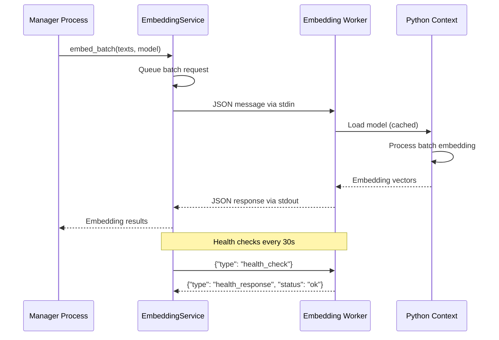

# Phase 1.3.1: Embedding Service Specification

**Document Version:** 1.0
**Date:** September 17, 2025
**Status:** MVP Implementation Phase
**Priority:** CRITICAL

## Overview

This specification defines the Embedding Service implementation for RAG Studio's MVP, providing out-of-process text embedding capabilities through a simplified JSON-based communication protocol. The service manages an embedding worker subprocess with health monitoring, batch processing, and clear upgrade paths to UDS/bincode communication.

## Scope

- Out-of-process embedding worker design and implementation
- Simplified JSON communication protocol over stdin/stdout for MVP
- Batch processing capabilities for embeddings
- Health monitoring and process lifecycle management
- Error handling and recovery mechanisms
- Manager DI service integration
- Clear upgrade path to UDS/bincode for production

## Architecture Overview

### Process Architecture

```
Main Process (Manager)
├── EmbeddingService (DI Service)
│   ├── Worker Process Management
│   ├── JSON Communication Handler
│   ├── Health Check System
│   └── Batch Queue Management
└── Embedding Worker Subprocess
    ├── Python Context (PyO3)
    ├── Model Loading & Caching
    ├── Batch Processing Engine
    └── JSON Protocol Handler
```

### Communication Flow



## Core Components

### 1. EmbeddingService (DI Service)

Main service interface managing the embedding worker process and handling communication.

#### Service Interface

```rust
#[async_trait]
pub trait EmbeddingServiceTrait: Send + Sync {
    async fn embed_text(&self, text: &str, model: &str) -> Result<Vec<f32>, EmbeddingError>;
    async fn embed_batch(&self, texts: Vec<String>, model: &str) -> Result<Vec<Vec<f32>>, EmbeddingError>;
    async fn get_models(&self) -> Result<Vec<ModelInfo>, EmbeddingError>;
    async fn health_check(&self) -> Result<HealthStatus, EmbeddingError>;
    async fn warm_up(&self, models: Vec<String>) -> Result<(), EmbeddingError>;
}
```

#### Implementation Structure

```rust
pub struct EmbeddingService {
    worker_process: Arc<RwLock<Option<Child>>>,
    stdin_sender: Arc<Mutex<Option<ChildStdin>>>,
    stdout_receiver: Arc<Mutex<Option<BufReader<ChildStdout>>>>,
    request_id_counter: AtomicU64,
    pending_requests: Arc<RwLock<HashMap<u64, PendingRequest>>>,
    health_status: Arc<RwLock<HealthStatus>>,
    config: EmbeddingConfig,
}
```

### 2. Message Protocol

```rust
#[derive(Serialize, Deserialize)]
#[serde(tag = "type")]
pub enum WorkerRequest {
    Embed {
        id: u64,
        texts: Vec<String>,
        model: String,
        batch_size: Option<usize>,
    },
    HealthCheck { id: u64 },
    LoadModel { id: u64, model: String },
    GetModels { id: u64 },
    Shutdown { id: u64 },
}

#[derive(Serialize, Deserialize)]
#[serde(tag = "type")]
pub enum WorkerResponse {
    EmbedResult {
        id: u64,
        embeddings: Vec<Vec<f32>>,
        model_info: ModelInfo,
    },
    HealthResponse {
        id: u64,
        status: String,
        memory_usage: u64,
        model_count: usize,
    },
    Error {
        id: u64,
        error: String,
        error_code: String,
    },
}
```

### 3. Configuration

```rust
#[derive(Debug, Clone, Serialize, Deserialize)]
pub struct EmbeddingConfig {
    pub python_path: PathBuf,
    pub process_timeout: Duration,
    pub request_timeout: Duration,
    pub health_check_interval: Duration,
    pub max_batch_size: usize,
    pub default_model: String,
    pub supported_models: Vec<String>,
    pub memory_limit_mb: u64,
    pub enable_gpu: bool,
}

impl Default for EmbeddingConfig {
    fn default() -> Self {
        Self {
            python_path: PathBuf::from("python"),
            process_timeout: Duration::from_secs(30),
            request_timeout: Duration::from_secs(60),
            health_check_interval: Duration::from_secs(30),
            max_batch_size: 32,
            default_model: "all-MiniLM-L6-v2".to_string(),
            supported_models: vec![
                "all-MiniLM-L6-v2".to_string(),
                "all-mpnet-base-v2".to_string(),
            ],
            memory_limit_mb: 1024,
            enable_gpu: true,
        }
    }
}
```

## Process Management

### Worker Lifecycle

```rust
impl EmbeddingService {
    async fn start_worker(&self) -> Result<(), EmbeddingError> {
        let mut child = Command::new(&self.config.python_path)
            .arg("-m")
            .arg("embedding_worker")
            .stdin(Stdio::piped())
            .stdout(Stdio::piped())
            .stderr(Stdio::piped())
            .spawn()?;

        let stdin = child.stdin.take().unwrap();
        let stdout = child.stdout.take().unwrap();

        *self.stdin_sender.lock().await = Some(stdin);
        *self.stdout_receiver.lock().await = Some(BufReader::new(stdout));
        *self.worker_process.write().await = Some(child);

        self.start_health_monitor().await;
        Ok(())
    }

    async fn restart_worker(&self) -> Result<(), EmbeddingError> {
        self.stop_worker().await?;
        tokio::time::sleep(Duration::from_millis(100)).await;
        self.start_worker().await
    }

    async fn stop_worker(&self) -> Result<(), EmbeddingError> {
        if let Some(mut child) = self.worker_process.write().await.take() {
            self.send_shutdown().await?;
            match tokio::time::timeout(Duration::from_secs(5), child.wait()).await {
                Ok(_) => {},
                Err(_) => child.kill().await?,
            }
        }
        Ok(())
    }
}
```

## Success Criteria

### MVP Requirements
1. ✅ Out-of-process embedding worker with JSON communication
2. ✅ Basic batch processing capabilities
3. ✅ Health monitoring and process restart
4. ✅ Support for Sentence-Transformers models
5. ✅ Error handling with recovery mechanisms
6. ✅ Memory management and cleanup
7. ✅ Integration with Manager DI system

### Performance Targets
- **Embedding Latency**: <2s for 32-text batches
- **Memory Usage**: <1GB worker memory limit
- **Throughput**: >100 embeddings/second
- **Availability**: 99.9% uptime with auto-recovery

## Upgrade Path

Future UDS/bincode implementation for production performance improvements while maintaining interface compatibility.