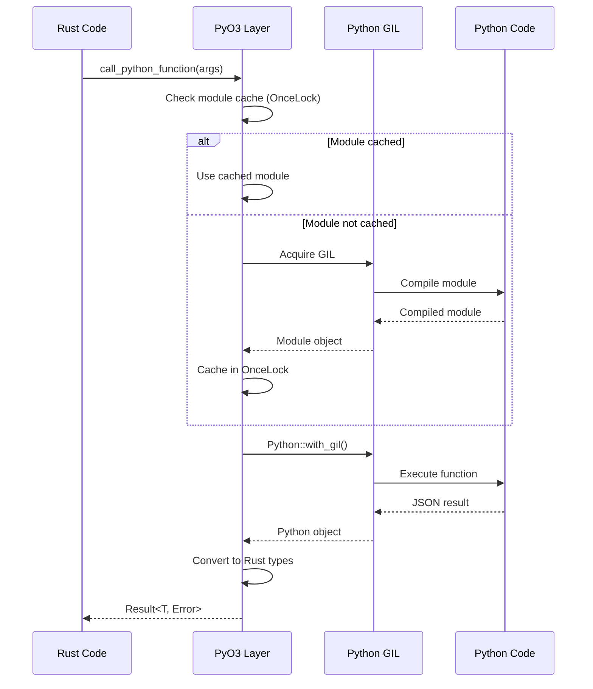

# Phase 1.3.2: PyO3 Integration Specification

**Document Version:** 1.0
**Date:** September 17, 2025
**Status:** MVP Implementation Phase
**Priority:** CRITICAL

## Overview

This specification defines the PyO3 integration layer for RAG Studio's MVP, providing seamless Rust-Python interoperability for AI/ML operations. The integration uses basic async patterns with proper GIL management, timeout-based error handling, and Rust fallback implementations where possible.

## Scope

- PyO3 integration architecture and patterns
- Python context initialization and management
- Async operation handling with GIL management
- Module compilation caching for performance
- Error propagation from Python to Rust
- Thread-safe caching using static instances
- Clear upgrade path to advanced async patterns

## Architecture Overview

### Integration Architecture

```
Rust Backend (Manager)
├── Python Integration Layer (PyO3)
│   ├── Python Context Manager
│   ├── Module Cache (OnceLock)
│   ├── Async Operation Handler
│   └── Error Propagation System
└── Python Runtime
    ├── Embedding Functions
    ├── Reranking Functions
    ├── Model Management
    └── Utility Functions
```

### Data Flow



## Core Components

### 1. Python Context Manager

Main interface for Python integration with thread-safe initialization.

```rust
use pyo3::prelude::*;
use std::sync::OnceLock;
use std::collections::HashMap;
use serde_json::Value;

pub struct PythonContext {
    cached_modules: HashMap<String, PyObject>,
    initialized: bool,
}

static PYTHON_CONTEXT: OnceLock<PythonContext> = OnceLock::new();

impl PythonContext {
    pub fn global() -> &'static PythonContext {
        PYTHON_CONTEXT.get_or_init(|| {
            Self::new().expect("Failed to initialize Python context")
        })
    }

    fn new() -> PyResult<Self> {
        Python::with_gil(|py| {
            // Initialize Python path
            let sys = py.import("sys")?;
            let path: &PyList = sys.getattr("path")?.downcast()?;

            // Add our Python modules path
            let python_path = std::env::current_dir()
                .unwrap()
                .join("src-tauri")
                .join("python");

            path.insert(0, python_path.to_string_lossy().as_ref())?;

            Ok(PythonContext {
                cached_modules: HashMap::new(),
                initialized: true,
            })
        })
    }

    pub fn is_initialized(&self) -> bool {
        self.initialized
    }
}
```

### 2. Module Cache System

Thread-safe caching of compiled Python modules to avoid repeated I/O.

```rust
use std::sync::Mutex;

pub struct CachedPythonData {
    modules: Mutex<HashMap<String, PyObject>>,
    functions: Mutex<HashMap<String, String>>, // function_name -> module_code
}

static CACHED_PYTHON_DATA: OnceLock<CachedPythonData> = OnceLock::new();

impl CachedPythonData {
    pub fn global() -> &'static CachedPythonData {
        CACHED_PYTHON_DATA.get_or_init(|| CachedPythonData {
            modules: Mutex::new(HashMap::new()),
            functions: Mutex::new(HashMap::new()),
        })
    }

    pub fn get_or_compile_module(&self, module_name: &str, code: &str) -> PyResult<PyObject> {
        Python::with_gil(|py| {
            // Check cache first
            {
                let modules = self.modules.lock().unwrap();
                if let Some(module) = modules.get(module_name) {
                    return Ok(module.clone_ref(py));
                }
            }

            // Compile and cache module
            let module = PyModule::from_code(py, code, module_name, module_name)?;
            let module_obj = module.into();

            {
                let mut modules = self.modules.lock().unwrap();
                modules.insert(module_name.to_string(), module_obj.clone_ref(py));
            }

            Ok(module_obj)
        })
    }

    pub fn get_function_code(&self, function_name: &str) -> Option<String> {
        let functions = self.functions.lock().unwrap();
        functions.get(function_name).cloned()
    }

    pub fn cache_function_code(&self, function_name: &str, code: &str) {
        let mut functions = self.functions.lock().unwrap();
        functions.insert(function_name.to_string(), code.to_string());
    }
}
```

### 3. Async Operation Handler

Handles async Python operations with proper GIL management and timeout support.

```rust
use tokio::time::{timeout, Duration};
use futures::future::BoxFuture;

pub struct AsyncPythonHandler {
    default_timeout: Duration,
}

impl AsyncPythonHandler {
    pub fn new(default_timeout: Duration) -> Self {
        Self { default_timeout }
    }

    pub async fn call_python_async<T>(
        &self,
        operation: impl FnOnce() -> PyResult<T> + Send + 'static,
    ) -> Result<T, PyO3Error>
    where
        T: Send + 'static,
    {
        let timeout_duration = self.default_timeout;

        // Spawn blocking task for Python GIL operations
        let result = tokio::task::spawn_blocking(move || {
            operation()
        });

        // Apply timeout
        match timeout(timeout_duration, result).await {
            Ok(Ok(result)) => result.map_err(PyO3Error::Python),
            Ok(Err(join_error)) => Err(PyO3Error::Runtime(join_error.to_string())),
            Err(_) => Err(PyO3Error::Timeout(timeout_duration)),
        }
    }

    pub async fn call_python_function(
        &self,
        module_name: &str,
        function_name: &str,
        args: Value,
    ) -> Result<Value, PyO3Error> {
        let module_name = module_name.to_string();
        let function_name = function_name.to_string();

        self.call_python_async(move || {
            Python::with_gil(|py| {
                // Get cached module
                let cache = CachedPythonData::global();
                let code = cache.get_function_code(&function_name)
                    .ok_or_else(|| PyErr::new::<pyo3::exceptions::PyImportError, _>(
                        format!("Function {} not found in cache", function_name)
                    ))?;

                let module = cache.get_or_compile_module(&module_name, &code)?;

                // Get function
                let function = module.getattr(py, &function_name)?;

                // Convert arguments
                let py_args = pythonize::pythonize(py, &args)
                    .map_err(|e| PyErr::new::<pyo3::exceptions::PyValueError, _>(e.to_string()))?;

                // Call function
                let result = function.call1(py, (py_args,))?;

                // Convert result back to JSON
                let json_str: String = result.extract(py)?;
                let value: Value = serde_json::from_str(&json_str)
                    .map_err(|e| PyErr::new::<pyo3::exceptions::PyValueError, _>(e.to_string()))?;

                Ok(value)
            })
        }).await
    }
}
```

### 4. Error Types and Propagation

Comprehensive error handling for Python-Rust boundary.

```rust
#[derive(Debug, thiserror::Error)]
pub enum PyO3Error {
    #[error("Python error: {0}")]
    Python(#[from] PyErr),

    #[error("Runtime error: {0}")]
    Runtime(String),

    #[error("Timeout after {0:?}")]
    Timeout(Duration),

    #[error("Serialization error: {0}")]
    Serialization(#[from] serde_json::Error),

    #[error("Module not found: {0}")]
    ModuleNotFound(String),

    #[error("Function not found: {0}")]
    FunctionNotFound(String),

    #[error("Type conversion error: {0}")]
    TypeConversion(String),

    #[error("GIL acquisition failed")]
    GilFailed,

    #[error("Context not initialized")]
    ContextNotInitialized,
}

impl From<PyO3Error> for crate::Error {
    fn from(err: PyO3Error) -> Self {
        match err {
            PyO3Error::Python(py_err) => {
                Self::PythonIntegration(format!("Python error: {}", py_err))
            }
            PyO3Error::Timeout(duration) => {
                Self::Timeout(format!("Python operation timeout after {:?}", duration))
            }
            _ => Self::PythonIntegration(err.to_string()),
        }
    }
}
```

### 5. Function Registration System

System for registering and managing Python functions.

```rust
pub struct PythonFunctionRegistry {
    functions: HashMap<String, FunctionMetadata>,
}

#[derive(Debug, Clone)]
pub struct FunctionMetadata {
    pub name: String,
    pub module: String,
    pub code: String,
    pub input_schema: Value,
    pub output_schema: Value,
    pub timeout: Duration,
}

impl PythonFunctionRegistry {
    pub fn new() -> Self {
        Self {
            functions: HashMap::new(),
        }
    }

    pub fn register_function(&mut self, metadata: FunctionMetadata) -> Result<(), PyO3Error> {
        // Validate function code by attempting compilation
        Python::with_gil(|py| {
            PyModule::from_code(py, &metadata.code, &metadata.name, &metadata.name)
                .map_err(PyO3Error::Python)?;
            Ok(())
        })?;

        // Cache the function code
        let cache = CachedPythonData::global();
        cache.cache_function_code(&metadata.name, &metadata.code);

        self.functions.insert(metadata.name.clone(), metadata);
        Ok(())
    }

    pub fn get_function(&self, name: &str) -> Option<&FunctionMetadata> {
        self.functions.get(name)
    }

    pub fn list_functions(&self) -> Vec<&FunctionMetadata> {
        self.functions.values().collect()
    }
}
```

## Python Function Examples

### 1. Embedding Function

```python
# src-tauri/python/embedding_functions.py
import json
import sys
from typing import List, Dict, Any
import numpy as np

def embed_texts(args_json: str) -> str:
    """Generate embeddings for a list of texts."""
    try:
        args = json.loads(args_json)
        texts = args.get("texts", [])
        model_name = args.get("model", "all-MiniLM-L6-v2")

        # Import here to avoid global imports
        from sentence_transformers import SentenceTransformer

        # Load model (should be cached by the calling process)
        model = SentenceTransformer(model_name)

        # Generate embeddings
        embeddings = model.encode(texts, convert_to_tensor=False)

        # Convert to list for JSON serialization
        embeddings_list = embeddings.tolist()

        result = {
            "embeddings": embeddings_list,
            "model": model_name,
            "dimensions": len(embeddings_list[0]) if embeddings_list else 0,
            "count": len(embeddings_list)
        }

        return json.dumps(result)

    except Exception as e:
        error_result = {
            "error": str(e),
            "error_type": type(e).__name__
        }
        return json.dumps(error_result)

def rerank_texts(args_json: str) -> str:
    """Rerank texts based on query relevance."""
    try:
        args = json.loads(args_json)
        query = args.get("query", "")
        texts = args.get("texts", [])
        model_name = args.get("model", "cross-encoder/ms-marco-MiniLM-L-2-v2")

        from sentence_transformers import CrossEncoder

        # Load cross-encoder model
        model = CrossEncoder(model_name)

        # Create query-text pairs
        pairs = [(query, text) for text in texts]

        # Get relevance scores
        scores = model.predict(pairs)

        # Create ranked results
        ranked_results = []
        for i, (text, score) in enumerate(zip(texts, scores)):
            ranked_results.append({
                "index": i,
                "text": text,
                "score": float(score),
            })

        # Sort by score (descending)
        ranked_results.sort(key=lambda x: x["score"], reverse=True)

        result = {
            "ranked_results": ranked_results,
            "model": model_name,
            "query": query
        }

        return json.dumps(result)

    except Exception as e:
        error_result = {
            "error": str(e),
            "error_type": type(e).__name__
        }
        return json.dumps(error_result)
```

### 2. Model Management Function

```python
# src-tauri/python/model_management.py
import json
import sys
import gc
from typing import Dict, List, Any

# Global model cache
_model_cache: Dict[str, Any] = {}

def load_model(args_json: str) -> str:
    """Load and cache a model."""
    try:
        args = json.loads(args_json)
        model_name = args.get("model_name", "")
        model_type = args.get("model_type", "embedding")  # embedding, cross-encoder
        force_reload = args.get("force_reload", False)

        # Check cache
        cache_key = f"{model_type}:{model_name}"
        if cache_key in _model_cache and not force_reload:
            return json.dumps({
                "status": "already_loaded",
                "model_name": model_name,
                "model_type": model_type,
                "cache_key": cache_key
            })

        # Load model based on type
        if model_type == "embedding":
            from sentence_transformers import SentenceTransformer
            model = SentenceTransformer(model_name)
            dimensions = model.get_sentence_embedding_dimension()
        elif model_type == "cross-encoder":
            from sentence_transformers import CrossEncoder
            model = CrossEncoder(model_name)
            dimensions = None
        else:
            raise ValueError(f"Unknown model type: {model_type}")

        # Cache the model
        _model_cache[cache_key] = model

        result = {
            "status": "loaded",
            "model_name": model_name,
            "model_type": model_type,
            "dimensions": dimensions,
            "cache_key": cache_key,
            "cached_models": list(_model_cache.keys())
        }

        return json.dumps(result)

    except Exception as e:
        error_result = {
            "error": str(e),
            "error_type": type(e).__name__
        }
        return json.dumps(error_result)

def list_models(args_json: str) -> str:
    """List cached models and their info."""
    try:
        result = {
            "cached_models": []
        }

        for cache_key, model in _model_cache.items():
            model_type, model_name = cache_key.split(":", 1)

            model_info = {
                "model_name": model_name,
                "model_type": model_type,
                "cache_key": cache_key
            }

            # Add model-specific info
            if model_type == "embedding":
                model_info["dimensions"] = model.get_sentence_embedding_dimension()

            result["cached_models"].append(model_info)

        result["total_count"] = len(_model_cache)

        return json.dumps(result)

    except Exception as e:
        error_result = {
            "error": str(e),
            "error_type": type(e).__name__
        }
        return json.dumps(error_result)

def clear_cache(args_json: str) -> str:
    """Clear model cache to free memory."""
    try:
        args = json.loads(args_json)
        specific_model = args.get("model", None)

        if specific_model:
            # Clear specific model
            if specific_model in _model_cache:
                del _model_cache[specific_model]
                cleared = [specific_model]
            else:
                cleared = []
        else:
            # Clear all models
            cleared = list(_model_cache.keys())
            _model_cache.clear()

        # Force garbage collection
        gc.collect()

        result = {
            "status": "cleared",
            "cleared_models": cleared,
            "remaining_models": list(_model_cache.keys())
        }

        return json.dumps(result)

    except Exception as e:
        error_result = {
            "error": str(e),
            "error_type": type(e).__name__
        }
        return json.dumps(error_result)
```

## Integration Patterns

### 1. Basic Function Call Pattern

```rust
use crate::python_integration::*;

pub async fn embed_texts_rust(texts: Vec<String>, model: &str) -> Result<Vec<Vec<f32>>, PyO3Error> {
    let handler = AsyncPythonHandler::new(Duration::from_secs(30));

    let args = serde_json::json!({
        "texts": texts,
        "model": model
    });

    let result = handler.call_python_function(
        "embedding_functions",
        "embed_texts",
        args
    ).await?;

    // Parse embeddings from result
    let embeddings: Vec<Vec<f32>> = result
        .get("embeddings")
        .and_then(|v| serde_json::from_value(v.clone()).ok())
        .ok_or_else(|| PyO3Error::TypeConversion("Failed to parse embeddings".to_string()))?;

    Ok(embeddings)
}
```

### 2. Model Management Pattern

```rust
pub struct PythonModelManager {
    handler: AsyncPythonHandler,
    loaded_models: Arc<RwLock<HashSet<String>>>,
}

impl PythonModelManager {
    pub fn new() -> Self {
        Self {
            handler: AsyncPythonHandler::new(Duration::from_secs(60)),
            loaded_models: Arc::new(RwLock::new(HashSet::new())),
        }
    }

    pub async fn ensure_model_loaded(&self, model_name: &str, model_type: &str) -> Result<(), PyO3Error> {
        let cache_key = format!("{}:{}", model_type, model_name);

        // Check if already loaded
        {
            let loaded = self.loaded_models.read().await;
            if loaded.contains(&cache_key) {
                return Ok(());
            }
        }

        // Load model
        let args = serde_json::json!({
            "model_name": model_name,
            "model_type": model_type
        });

        let result = self.handler.call_python_function(
            "model_management",
            "load_model",
            args
        ).await?;

        // Check if load was successful
        if result.get("status").and_then(|s| s.as_str()) == Some("loaded")
           || result.get("status").and_then(|s| s.as_str()) == Some("already_loaded") {
            let mut loaded = self.loaded_models.write().await;
            loaded.insert(cache_key);
            Ok(())
        } else {
            Err(PyO3Error::Runtime("Failed to load model".to_string()))
        }
    }

    pub async fn clear_memory(&self) -> Result<(), PyO3Error> {
        let args = serde_json::json!({});

        self.handler.call_python_function(
            "model_management",
            "clear_cache",
            args
        ).await?;

        // Clear our tracking
        {
            let mut loaded = self.loaded_models.write().await;
            loaded.clear();
        }

        Ok(())
    }
}
```

## Configuration and Setup

### 1. Initialization in Manager

```rust
// In src-tauri/src/manager.rs
impl Manager {
    pub async fn initialize_python_integration(&self) -> Result<(), Error> {
        // Initialize Python context
        let context = PythonContext::global();
        if !context.is_initialized() {
            return Err(Error::PythonIntegration("Failed to initialize Python context".to_string()));
        }

        // Register all Python functions
        let mut registry = PythonFunctionRegistry::new();

        // Register embedding functions
        registry.register_function(FunctionMetadata {
            name: "embed_texts".to_string(),
            module: "embedding_functions".to_string(),
            code: include_str!("../python/embedding_functions.py").to_string(),
            input_schema: serde_json::json!({
                "type": "object",
                "properties": {
                    "texts": {"type": "array", "items": {"type": "string"}},
                    "model": {"type": "string"}
                },
                "required": ["texts"]
            }),
            output_schema: serde_json::json!({
                "type": "object",
                "properties": {
                    "embeddings": {"type": "array"},
                    "model": {"type": "string"},
                    "dimensions": {"type": "number"}
                }
            }),
            timeout: Duration::from_secs(30),
        })?;

        // Store registry in manager state
        self.python_registry = Some(registry);

        tracing::info!("Python integration initialized successfully");
        Ok(())
    }
}
```

### 2. TOML Configuration

```toml
# config/python.toml
[python]
# Python executable path
python_path = "python"

# Default timeout for Python operations
default_timeout = "30s"

# Memory management
enable_gc = true
gc_interval = "5m"

# Model cache settings
max_cached_models = 5
model_cache_timeout = "1h"

# GPU settings
enable_gpu = true
gpu_memory_fraction = 0.5

[python.functions.embed_texts]
timeout = "30s"
max_batch_size = 32

[python.functions.rerank_texts]
timeout = "60s"
max_batch_size = 16
```

## Performance Considerations

### 1. GIL Management

```rust
// Use spawn_blocking for CPU-intensive Python operations
pub async fn cpu_intensive_python_operation() -> Result<Value, PyO3Error> {
    tokio::task::spawn_blocking(|| {
        Python::with_gil(|py| {
            // Python operation here
            // GIL is properly managed within this scope
            Ok(serde_json::json!({"result": "success"}))
        })
    }).await
    .map_err(|e| PyO3Error::Runtime(e.to_string()))?
}
```

### 2. Memory Management

```rust
impl PythonContext {
    pub async fn cleanup_memory(&self) -> Result<(), PyO3Error> {
        // Clear model cache periodically
        let handler = AsyncPythonHandler::new(Duration::from_secs(10));

        handler.call_python_function(
            "model_management",
            "clear_cache",
            serde_json::json!({})
        ).await?;

        // Force garbage collection
        Python::with_gil(|py| {
            let gc = py.import("gc")?;
            gc.call_method0("collect")?;
            Ok::<(), PyErr>(())
        }).map_err(PyO3Error::Python)?;

        Ok(())
    }
}
```

## Testing Strategy

### 1. Unit Tests

```rust
#[cfg(test)]
mod tests {
    use super::*;
    use tokio::test;

    #[test]
    async fn test_python_context_initialization() {
        let context = PythonContext::global();
        assert!(context.is_initialized());
    }

    #[test]
    async fn test_function_registration() {
        let mut registry = PythonFunctionRegistry::new();

        let metadata = FunctionMetadata {
            name: "test_function".to_string(),
            module: "test_module".to_string(),
            code: "def test_function(args): return args".to_string(),
            input_schema: serde_json::json!({}),
            output_schema: serde_json::json!({}),
            timeout: Duration::from_secs(5),
        };

        assert!(registry.register_function(metadata).is_ok());
        assert!(registry.get_function("test_function").is_some());
    }

    #[test]
    async fn test_async_python_call() {
        let handler = AsyncPythonHandler::new(Duration::from_secs(5));

        let result = handler.call_python_async(|| {
            Python::with_gil(|py| {
                let result = py.eval("2 + 2", None, None)?;
                result.extract::<i32>()
            })
        }).await;

        assert_eq!(result.unwrap(), 4);
    }

    #[test]
    async fn test_timeout_handling() {
        let handler = AsyncPythonHandler::new(Duration::from_millis(100));

        let result = handler.call_python_async(|| {
            std::thread::sleep(Duration::from_millis(200));
            Ok(42)
        }).await;

        assert!(matches!(result, Err(PyO3Error::Timeout(_))));
    }
}
```

### 2. Integration Tests

```rust
#[tokio::test]
async fn test_embedding_integration() {
    let texts = vec!["Hello world".to_string(), "Test embedding".to_string()];
    let result = embed_texts_rust(texts.clone(), "all-MiniLM-L6-v2").await;

    assert!(result.is_ok());
    let embeddings = result.unwrap();
    assert_eq!(embeddings.len(), texts.len());
    assert_eq!(embeddings[0].len(), 384); // MiniLM dimension
}

#[tokio::test]
async fn test_model_manager() {
    let manager = PythonModelManager::new();

    // Test model loading
    let result = manager.ensure_model_loaded("all-MiniLM-L6-v2", "embedding").await;
    assert!(result.is_ok());

    // Test memory cleanup
    let result = manager.clear_memory().await;
    assert!(result.is_ok());
}
```

## Success Criteria

### MVP Requirements
1. ✅ Python context initialization with thread safety
2. ✅ Module compilation caching for performance
3. ✅ Async operation handling with GIL management
4. ✅ Timeout-based error handling
5. ✅ Error propagation from Python to Rust
6. ✅ Basic function registration system
7. ✅ Integration with Manager DI system

### Performance Targets
- **Function Call Latency**: <100ms for simple operations
- **Memory Usage**: <512MB Python runtime
- **GIL Contention**: <10% overhead from GIL management
- **Cache Hit Rate**: >90% for module compilation

### Quality Gates
- Unit test coverage >85%
- Integration tests with real Python functions
- Memory leak detection and prevention
- Error handling for all failure scenarios

## Upgrade Path

Future optimizations include:
- Advanced async patterns with `pyo3-asyncio`
- Custom Python extension modules
- Memory pool management
- Advanced GIL optimization strategies

This specification provides the foundation for robust Python integration that supports the MVP requirements while maintaining clear paths for future enhancements.