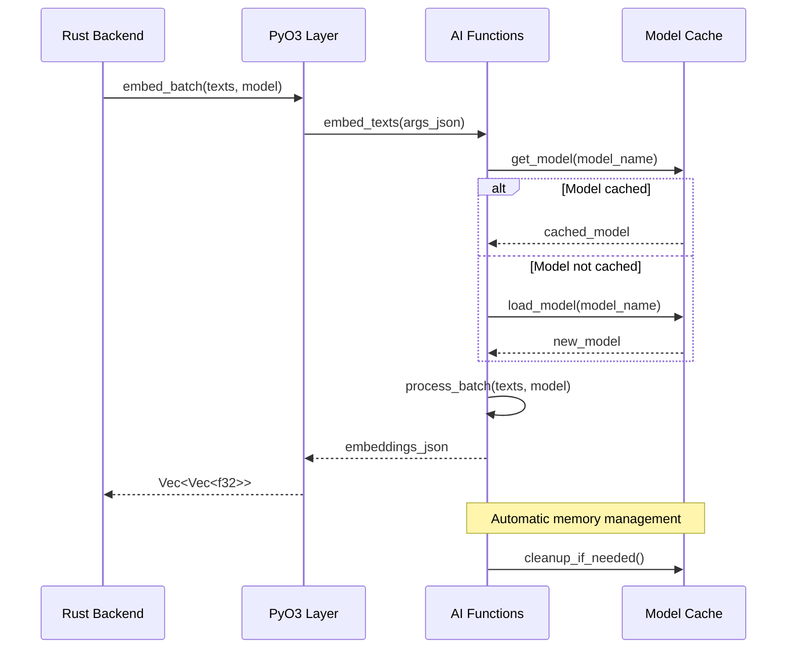

# Phase 1.3.3: AI Functions Specification

**Document Version:** 1.0
**Date:** September 17, 2025
**Status:** MVP Implementation Phase
**Priority:** CRITICAL

## Overview

This specification defines the core AI functions for RAG Studio's MVP, providing essential embedding, reranking, and model management capabilities through Sentence-Transformers. The implementation focuses on basic functionality with simple model loading and caching, preparing for more advanced features in future iterations.

## Scope

- Core embedding functionality using Sentence-Transformers
- Basic reranking capabilities with cross-encoders
- Simple model loading and caching strategies
- Python function implementations for AI operations
- Integration with PyO3 layer and Embedding Service
- Performance optimization for batch processing
- Clear upgrade path to advanced AI capabilities

## Architecture Overview

### AI Functions Architecture

```
Python AI Functions Layer
├── Embedding Functions
│   ├── Text Embedding (Sentence-Transformers)
│   ├── Batch Processing
│   └── Model Caching
├── Reranking Functions
│   ├── Cross-Encoder Reranking
│   ├── Score Calculation
│   └── Result Ranking
├── Model Management
│   ├── Model Loading/Unloading
│   ├── Memory Management
│   └── GPU Optimization
└── Utility Functions
    ├── Text Preprocessing
    ├── Performance Monitoring
    └── Health Checks
```

### Function Flow



## Core AI Functions

### 1. Embedding Functions

Core text embedding capabilities using Sentence-Transformers.

```python
# src-tauri/python/ai_functions.py
import json
import sys
import gc
import time
from typing import List, Dict, Any, Optional, Tuple
import numpy as np
import logging

# Configure logging
logging.basicConfig(level=logging.INFO)
logger = logging.getLogger(__name__)

# Global model cache with metadata
_model_cache: Dict[str, Dict[str, Any]] = {}
_cache_stats = {
    "hits": 0,
    "misses": 0,
    "memory_usage": 0,
    "last_cleanup": time.time()
}

def embed_texts(args_json: str) -> str:
    """
    Generate embeddings for a list of texts using Sentence-Transformers.

    Args:
        args_json: JSON string containing:
            - texts: List[str] - texts to embed
            - model: str - model name (default: all-MiniLM-L6-v2)
            - batch_size: int - batch size for processing (default: 32)
            - normalize: bool - normalize embeddings (default: True)

    Returns:
        JSON string with embeddings and metadata
    """
    try:
        args = json.loads(args_json)
        texts = args.get("texts", [])
        model_name = args.get("model", "all-MiniLM-L6-v2")
        batch_size = args.get("batch_size", 32)
        normalize = args.get("normalize", True)

        if not texts:
            return json.dumps({"error": "No texts provided", "error_type": "ValueError"})

        # Load or get cached model
        model_info = _get_or_load_model(model_name, "embedding")
        model = model_info["model"]

        start_time = time.time()

        # Generate embeddings with batch processing
        embeddings = model.encode(
            texts,
            batch_size=batch_size,
            convert_to_tensor=False,
            normalize_embeddings=normalize,
            show_progress_bar=False
        )

        # Convert to list for JSON serialization
        embeddings_list = embeddings.tolist()

        processing_time = time.time() - start_time

        result = {
            "embeddings": embeddings_list,
            "model": model_name,
            "dimensions": len(embeddings_list[0]) if embeddings_list else 0,
            "count": len(embeddings_list),
            "processing_time": processing_time,
            "normalized": normalize,
            "batch_size": batch_size,
            "cache_hit": model_info["was_cached"]
        }

        # Update cache statistics
        _update_cache_stats(model_info["was_cached"])

        return json.dumps(result)

    except Exception as e:
        logger.error(f"Error in embed_texts: {str(e)}")
        error_result = {
            "error": str(e),
            "error_type": type(e).__name__,
            "model": args.get("model", "unknown") if 'args' in locals() else "unknown"
        }
        return json.dumps(error_result)

def embed_single_text(args_json: str) -> str:
    """
    Generate embedding for a single text (optimized path).

    Args:
        args_json: JSON string containing:
            - text: str - text to embed
            - model: str - model name
            - normalize: bool - normalize embedding

    Returns:
        JSON string with embedding and metadata
    """
    try:
        args = json.loads(args_json)
        text = args.get("text", "")
        model_name = args.get("model", "all-MiniLM-L6-v2")
        normalize = args.get("normalize", True)

        if not text:
            return json.dumps({"error": "No text provided", "error_type": "ValueError"})

        # Use batch function with single text for consistency
        batch_args = {
            "texts": [text],
            "model": model_name,
            "normalize": normalize,
            "batch_size": 1
        }

        result_json = embed_texts(json.dumps(batch_args))
        result = json.loads(result_json)

        if "error" in result:
            return result_json

        # Extract single embedding
        embedding = result["embeddings"][0]

        single_result = {
            "embedding": embedding,
            "model": model_name,
            "dimensions": len(embedding),
            "processing_time": result["processing_time"],
            "normalized": normalize,
            "cache_hit": result["cache_hit"]
        }

        return json.dumps(single_result)

    except Exception as e:
        logger.error(f"Error in embed_single_text: {str(e)}")
        error_result = {
            "error": str(e),
            "error_type": type(e).__name__
        }
        return json.dumps(error_result)
```

### 2. Reranking Functions

Cross-encoder based reranking for improved search relevance.

```python
def rerank_texts(args_json: str) -> str:
    """
    Rerank texts based on query relevance using cross-encoder models.

    Args:
        args_json: JSON string containing:
            - query: str - search query
            - texts: List[str] - texts to rerank
            - model: str - cross-encoder model name
            - top_k: int - number of top results to return
            - batch_size: int - batch size for processing

    Returns:
        JSON string with ranked results and scores
    """
    try:
        args = json.loads(args_json)
        query = args.get("query", "")
        texts = args.get("texts", [])
        model_name = args.get("model", "cross-encoder/ms-marco-MiniLM-L-2-v2")
        top_k = args.get("top_k", len(texts))
        batch_size = args.get("batch_size", 16)

        if not query or not texts:
            return json.dumps({
                "error": "Query and texts are required",
                "error_type": "ValueError"
            })

        # Load or get cached cross-encoder model
        model_info = _get_or_load_model(model_name, "cross-encoder")
        model = model_info["model"]

        start_time = time.time()

        # Create query-text pairs
        pairs = [(query, text) for text in texts]

        # Get relevance scores in batches
        all_scores = []
        for i in range(0, len(pairs), batch_size):
            batch_pairs = pairs[i:i + batch_size]
            batch_scores = model.predict(batch_pairs)
            all_scores.extend(batch_scores)

        # Create ranked results with original indices
        ranked_results = []
        for i, (text, score) in enumerate(zip(texts, all_scores)):
            ranked_results.append({
                "index": i,
                "text": text,
                "score": float(score),
                "rank": 0  # Will be updated after sorting
            })

        # Sort by score (descending)
        ranked_results.sort(key=lambda x: x["score"], reverse=True)

        # Update ranks and apply top_k limit
        for rank, result in enumerate(ranked_results[:top_k]):
            result["rank"] = rank + 1

        processing_time = time.time() - start_time

        result = {
            "ranked_results": ranked_results[:top_k],
            "model": model_name,
            "query": query,
            "total_texts": len(texts),
            "returned_count": min(top_k, len(texts)),
            "processing_time": processing_time,
            "cache_hit": model_info["was_cached"]
        }

        _update_cache_stats(model_info["was_cached"])

        return json.dumps(result)

    except Exception as e:
        logger.error(f"Error in rerank_texts: {str(e)}")
        error_result = {
            "error": str(e),
            "error_type": type(e).__name__,
            "query": args.get("query", "") if 'args' in locals() else ""
        }
        return json.dumps(error_result)

def compute_similarity_scores(args_json: str) -> str:
    """
    Compute similarity scores between query and texts without full reranking.

    Args:
        args_json: JSON string containing:
            - query: str - search query
            - texts: List[str] - texts to score
            - model: str - cross-encoder model name

    Returns:
        JSON string with similarity scores
    """
    try:
        args = json.loads(args_json)
        query = args.get("query", "")
        texts = args.get("texts", [])
        model_name = args.get("model", "cross-encoder/ms-marco-MiniLM-L-2-v2")

        if not query or not texts:
            return json.dumps({
                "error": "Query and texts are required",
                "error_type": "ValueError"
            })

        model_info = _get_or_load_model(model_name, "cross-encoder")
        model = model_info["model"]

        start_time = time.time()

        # Create pairs and get scores
        pairs = [(query, text) for text in texts]
        scores = model.predict(pairs)

        processing_time = time.time() - start_time

        result = {
            "scores": [float(score) for score in scores],
            "model": model_name,
            "query": query,
            "count": len(scores),
            "processing_time": processing_time,
            "cache_hit": model_info["was_cached"]
        }

        _update_cache_stats(model_info["was_cached"])

        return json.dumps(result)

    except Exception as e:
        logger.error(f"Error in compute_similarity_scores: {str(e)}")
        error_result = {
            "error": str(e),
            "error_type": type(e).__name__
        }
        return json.dumps(error_result)
```

### 3. Model Management Functions

Model loading, caching, and memory management.

```python
def _get_or_load_model(model_name: str, model_type: str) -> Dict[str, Any]:
    """
    Get model from cache or load it if not cached.

    Args:
        model_name: Name/path of the model
        model_type: Type of model ('embedding' or 'cross-encoder')

    Returns:
        Dictionary with model object and metadata
    """
    cache_key = f"{model_type}:{model_name}"

    # Check cache first
    if cache_key in _model_cache:
        cache_entry = _model_cache[cache_key]
        cache_entry["last_accessed"] = time.time()
        cache_entry["access_count"] += 1
        return {
            "model": cache_entry["model"],
            "was_cached": True,
            "cache_key": cache_key
        }

    # Load model
    try:
        if model_type == "embedding":
            from sentence_transformers import SentenceTransformer
            model = SentenceTransformer(model_name)
            dimensions = model.get_sentence_embedding_dimension()
        elif model_type == "cross-encoder":
            from sentence_transformers import CrossEncoder
            model = CrossEncoder(model_name)
            dimensions = None
        else:
            raise ValueError(f"Unknown model type: {model_type}")

        # Cache the model with metadata
        _model_cache[cache_key] = {
            "model": model,
            "model_name": model_name,
            "model_type": model_type,
            "dimensions": dimensions,
            "loaded_at": time.time(),
            "last_accessed": time.time(),
            "access_count": 1,
            "memory_size": _estimate_model_memory(model)
        }

        # Update total memory usage
        _update_memory_usage()

        logger.info(f"Loaded model: {cache_key}")

        return {
            "model": model,
            "was_cached": False,
            "cache_key": cache_key
        }

    except Exception as e:
        logger.error(f"Failed to load model {cache_key}: {str(e)}")
        raise

def load_model(args_json: str) -> str:
    """
    Explicitly load and cache a model.

    Args:
        args_json: JSON string containing:
            - model_name: str - model name/path
            - model_type: str - 'embedding' or 'cross-encoder'
            - force_reload: bool - force reload even if cached

    Returns:
        JSON string with load status and model info
    """
    try:
        args = json.loads(args_json)
        model_name = args.get("model_name", "")
        model_type = args.get("model_type", "embedding")
        force_reload = args.get("force_reload", False)

        if not model_name:
            return json.dumps({
                "error": "model_name is required",
                "error_type": "ValueError"
            })

        cache_key = f"{model_type}:{model_name}"

        # Check if already loaded and not forcing reload
        if cache_key in _model_cache and not force_reload:
            cache_entry = _model_cache[cache_key]
            return json.dumps({
                "status": "already_loaded",
                "model_name": model_name,
                "model_type": model_type,
                "dimensions": cache_entry["dimensions"],
                "cache_key": cache_key,
                "loaded_at": cache_entry["loaded_at"],
                "access_count": cache_entry["access_count"]
            })

        # Force reload if requested
        if force_reload and cache_key in _model_cache:
            del _model_cache[cache_key]
            _update_memory_usage()

        # Load the model
        model_info = _get_or_load_model(model_name, model_type)
        cache_entry = _model_cache[cache_key]

        result = {
            "status": "loaded",
            "model_name": model_name,
            "model_type": model_type,
            "dimensions": cache_entry["dimensions"],
            "cache_key": cache_key,
            "memory_size": cache_entry["memory_size"],
            "total_cached_models": len(_model_cache)
        }

        return json.dumps(result)

    except Exception as e:
        logger.error(f"Error in load_model: {str(e)}")
        error_result = {
            "error": str(e),
            "error_type": type(e).__name__
        }
        return json.dumps(error_result)

def list_models(args_json: str) -> str:
    """
    List all cached models with their metadata.

    Returns:
        JSON string with model information
    """
    try:
        models_info = []

        for cache_key, cache_entry in _model_cache.items():
            model_info = {
                "cache_key": cache_key,
                "model_name": cache_entry["model_name"],
                "model_type": cache_entry["model_type"],
                "dimensions": cache_entry["dimensions"],
                "loaded_at": cache_entry["loaded_at"],
                "last_accessed": cache_entry["last_accessed"],
                "access_count": cache_entry["access_count"],
                "memory_size": cache_entry["memory_size"]
            }
            models_info.append(model_info)

        # Sort by last accessed (most recent first)
        models_info.sort(key=lambda x: x["last_accessed"], reverse=True)

        result = {
            "models": models_info,
            "total_count": len(models_info),
            "total_memory": _cache_stats["memory_usage"],
            "cache_stats": _cache_stats.copy()
        }

        return json.dumps(result)

    except Exception as e:
        logger.error(f"Error in list_models: {str(e)}")
        error_result = {
            "error": str(e),
            "error_type": type(e).__name__
        }
        return json.dumps(error_result)

def clear_cache(args_json: str) -> str:
    """
    Clear model cache to free memory.

    Args:
        args_json: JSON string containing:
            - model: str (optional) - specific model to clear
            - model_type: str (optional) - clear all models of this type
            - keep_recent: int (optional) - keep N most recently accessed models

    Returns:
        JSON string with cleanup results
    """
    try:
        args = json.loads(args_json)
        specific_model = args.get("model")
        model_type_filter = args.get("model_type")
        keep_recent = args.get("keep_recent", 0)

        cleared_models = []
        initial_count = len(_model_cache)

        if specific_model:
            # Clear specific model
            cache_key = next((k for k in _model_cache.keys()
                            if _model_cache[k]["model_name"] == specific_model), None)
            if cache_key:
                cleared_models.append(cache_key)
                del _model_cache[cache_key]

        elif model_type_filter:
            # Clear all models of specific type
            keys_to_remove = [k for k in _model_cache.keys()
                            if _model_cache[k]["model_type"] == model_type_filter]
            for key in keys_to_remove:
                cleared_models.append(key)
                del _model_cache[key]

        elif keep_recent > 0:
            # Keep only N most recently accessed models
            sorted_models = sorted(
                _model_cache.items(),
                key=lambda x: x[1]["last_accessed"],
                reverse=True
            )

            if len(sorted_models) > keep_recent:
                to_remove = sorted_models[keep_recent:]
                for cache_key, _ in to_remove:
                    cleared_models.append(cache_key)
                    del _model_cache[cache_key]

        else:
            # Clear all models
            cleared_models = list(_model_cache.keys())
            _model_cache.clear()

        # Update memory usage
        _update_memory_usage()

        # Force garbage collection
        gc.collect()

        result = {
            "status": "cleared",
            "cleared_models": cleared_models,
            "cleared_count": len(cleared_models),
            "remaining_count": len(_model_cache),
            "initial_count": initial_count,
            "memory_freed": True
        }

        _cache_stats["last_cleanup"] = time.time()

        logger.info(f"Cache cleanup: cleared {len(cleared_models)} models")

        return json.dumps(result)

    except Exception as e:
        logger.error(f"Error in clear_cache: {str(e)}")
        error_result = {
            "error": str(e),
            "error_type": type(e).__name__
        }
        return json.dumps(error_result)
```

### 4. Utility Functions

Support functions for text processing and performance monitoring.

```python
def _estimate_model_memory(model) -> int:
    """Estimate memory usage of a model in bytes."""
    try:
        # Try to get actual memory usage if possible
        import torch
        if hasattr(model, 'get_sentence_embedding_dimension'):
            # Rough estimation based on model parameters
            return 400 * 1024 * 1024  # ~400MB default for sentence transformers
        else:
            return 200 * 1024 * 1024  # ~200MB for cross-encoders
    except:
        return 300 * 1024 * 1024  # Default estimation

def _update_memory_usage():
    """Update total memory usage in cache stats."""
    total_memory = sum(entry["memory_size"] for entry in _model_cache.values())
    _cache_stats["memory_usage"] = total_memory

def _update_cache_stats(was_hit: bool):
    """Update cache hit/miss statistics."""
    if was_hit:
        _cache_stats["hits"] += 1
    else:
        _cache_stats["misses"] += 1

def get_health_status(args_json: str) -> str:
    """
    Get health status of AI functions and models.

    Returns:
        JSON string with health information
    """
    try:
        current_time = time.time()

        # Check if we need cleanup based on memory usage
        needs_cleanup = _cache_stats["memory_usage"] > 2 * 1024 * 1024 * 1024  # 2GB

        # Calculate cache hit rate
        total_requests = _cache_stats["hits"] + _cache_stats["misses"]
        hit_rate = _cache_stats["hits"] / total_requests if total_requests > 0 else 0

        health_info = {
            "status": "healthy",
            "timestamp": current_time,
            "models": {
                "total_loaded": len(_model_cache),
                "memory_usage_mb": _cache_stats["memory_usage"] / (1024 * 1024),
                "needs_cleanup": needs_cleanup
            },
            "cache": {
                "hit_rate": hit_rate,
                "total_hits": _cache_stats["hits"],
                "total_misses": _cache_stats["misses"],
                "last_cleanup": _cache_stats["last_cleanup"]
            },
            "system": {
                "python_version": sys.version,
                "available_memory": _get_available_memory()
            }
        }

        # Add warnings if needed
        warnings = []
        if needs_cleanup:
            warnings.append("High memory usage - cleanup recommended")
        if hit_rate < 0.5 and total_requests > 10:
            warnings.append("Low cache hit rate - consider model preloading")

        if warnings:
            health_info["warnings"] = warnings

        return json.dumps(health_info)

    except Exception as e:
        logger.error(f"Error in get_health_status: {str(e)}")
        error_result = {
            "status": "error",
            "error": str(e),
            "error_type": type(e).__name__
        }
        return json.dumps(error_result)

def _get_available_memory() -> int:
    """Get available system memory in bytes."""
    try:
        import psutil
        return psutil.virtual_memory().available
    except ImportError:
        return -1  # Unknown

def preprocess_text(args_json: str) -> str:
    """
    Basic text preprocessing for embedding/reranking.

    Args:
        args_json: JSON string containing:
            - text: str - text to preprocess
            - lowercase: bool - convert to lowercase
            - strip_whitespace: bool - strip whitespace
            - max_length: int - maximum text length

    Returns:
        JSON string with preprocessed text
    """
    try:
        args = json.loads(args_json)
        text = args.get("text", "")
        lowercase = args.get("lowercase", False)
        strip_whitespace = args.get("strip_whitespace", True)
        max_length = args.get("max_length", None)

        processed_text = text

        if strip_whitespace:
            processed_text = processed_text.strip()

        if lowercase:
            processed_text = processed_text.lower()

        if max_length and len(processed_text) > max_length:
            processed_text = processed_text[:max_length].rstrip()

        result = {
            "original_text": text,
            "processed_text": processed_text,
            "original_length": len(text),
            "processed_length": len(processed_text),
            "truncated": max_length and len(text) > max_length
        }

        return json.dumps(result)

    except Exception as e:
        logger.error(f"Error in preprocess_text: {str(e)}")
        error_result = {
            "error": str(e),
            "error_type": type(e).__name__
        }
        return json.dumps(error_result)
```

## Integration with Rust

### 1. Rust Function Wrappers

```rust
// src-tauri/src/ai_functions.rs
use crate::python_integration::*;
use serde_json::Value;
use std::time::Duration;

pub struct AIFunctions {
    handler: AsyncPythonHandler,
    model_manager: PythonModelManager,
}

impl AIFunctions {
    pub fn new() -> Self {
        Self {
            handler: AsyncPythonHandler::new(Duration::from_secs(30)),
            model_manager: PythonModelManager::new(),
        }
    }

    pub async fn embed_texts(
        &self,
        texts: Vec<String>,
        model: &str,
        batch_size: Option<usize>,
        normalize: Option<bool>,
    ) -> Result<EmbeddingResult, PyO3Error> {
        // Ensure model is loaded
        self.model_manager.ensure_model_loaded(model, "embedding").await?;

        let args = serde_json::json!({
            "texts": texts,
            "model": model,
            "batch_size": batch_size.unwrap_or(32),
            "normalize": normalize.unwrap_or(true)
        });

        let result = self.handler.call_python_function(
            "ai_functions",
            "embed_texts",
            args
        ).await?;

        // Parse result
        let embeddings: Vec<Vec<f32>> = result
            .get("embeddings")
            .and_then(|v| serde_json::from_value(v.clone()).ok())
            .ok_or_else(|| PyO3Error::TypeConversion("Failed to parse embeddings".to_string()))?;

        Ok(EmbeddingResult {
            embeddings,
            model: model.to_string(),
            dimensions: result.get("dimensions").and_then(|v| v.as_u64()).unwrap_or(0) as usize,
            processing_time: result.get("processing_time").and_then(|v| v.as_f64()).unwrap_or(0.0),
            cache_hit: result.get("cache_hit").and_then(|v| v.as_bool()).unwrap_or(false),
        })
    }

    pub async fn rerank_texts(
        &self,
        query: &str,
        texts: Vec<String>,
        model: &str,
        top_k: Option<usize>,
    ) -> Result<RerankResult, PyO3Error> {
        // Ensure model is loaded
        self.model_manager.ensure_model_loaded(model, "cross-encoder").await?;

        let args = serde_json::json!({
            "query": query,
            "texts": texts,
            "model": model,
            "top_k": top_k.unwrap_or(texts.len())
        });

        let result = self.handler.call_python_function(
            "ai_functions",
            "rerank_texts",
            args
        ).await?;

        // Parse ranked results
        let ranked_results: Vec<RankedText> = result
            .get("ranked_results")
            .and_then(|v| serde_json::from_value(v.clone()).ok())
            .ok_or_else(|| PyO3Error::TypeConversion("Failed to parse ranked results".to_string()))?;

        Ok(RerankResult {
            ranked_results,
            query: query.to_string(),
            model: model.to_string(),
            total_texts: result.get("total_texts").and_then(|v| v.as_u64()).unwrap_or(0) as usize,
            processing_time: result.get("processing_time").and_then(|v| v.as_f64()).unwrap_or(0.0),
        })
    }

    pub async fn get_health_status(&self) -> Result<HealthInfo, PyO3Error> {
        let args = serde_json::json!({});

        let result = self.handler.call_python_function(
            "ai_functions",
            "get_health_status",
            args
        ).await?;

        let health_info: HealthInfo = serde_json::from_value(result)
            .map_err(|e| PyO3Error::TypeConversion(e.to_string()))?;

        Ok(health_info)
    }
}

#[derive(Debug, Clone, serde::Serialize, serde::Deserialize)]
pub struct EmbeddingResult {
    pub embeddings: Vec<Vec<f32>>,
    pub model: String,
    pub dimensions: usize,
    pub processing_time: f64,
    pub cache_hit: bool,
}

#[derive(Debug, Clone, serde::Serialize, serde::Deserialize)]
pub struct RankedText {
    pub index: usize,
    pub text: String,
    pub score: f64,
    pub rank: usize,
}

#[derive(Debug, Clone, serde::Serialize, serde::Deserialize)]
pub struct RerankResult {
    pub ranked_results: Vec<RankedText>,
    pub query: String,
    pub model: String,
    pub total_texts: usize,
    pub processing_time: f64,
}

#[derive(Debug, Clone, serde::Serialize, serde::Deserialize)]
pub struct HealthInfo {
    pub status: String,
    pub timestamp: f64,
    pub models: ModelStats,
    pub cache: CacheStats,
    pub warnings: Option<Vec<String>>,
}

#[derive(Debug, Clone, serde::Serialize, serde::Deserialize)]
pub struct ModelStats {
    pub total_loaded: usize,
    pub memory_usage_mb: f64,
    pub needs_cleanup: bool,
}

#[derive(Debug, Clone, serde::Serialize, serde::Deserialize)]
pub struct CacheStats {
    pub hit_rate: f64,
    pub total_hits: u64,
    pub total_misses: u64,
    pub last_cleanup: f64,
}
```

## Performance Optimization

### 1. Batch Processing Strategy

```python
def optimize_batch_processing(texts: List[str], model, max_batch_size: int = 32) -> List[np.ndarray]:
    """
    Optimize batch processing based on text length and memory constraints.
    """
    # Calculate optimal batch size based on text lengths
    avg_length = sum(len(text) for text in texts) / len(texts)

    if avg_length < 100:
        # Short texts - can use larger batches
        batch_size = min(max_batch_size * 2, 64)
    elif avg_length > 500:
        # Long texts - use smaller batches
        batch_size = max(max_batch_size // 2, 8)
    else:
        # Medium texts - use default
        batch_size = max_batch_size

    # Process in optimized batches
    embeddings = []
    for i in range(0, len(texts), batch_size):
        batch = texts[i:i + batch_size]
        batch_embeddings = model.encode(batch, convert_to_tensor=False)
        embeddings.extend(batch_embeddings)

    return embeddings
```

### 2. Memory Management

```python
def cleanup_models_by_policy(memory_threshold_mb: int = 1024):
    """
    Cleanup models based on memory usage and access patterns.
    """
    current_memory = _cache_stats["memory_usage"] / (1024 * 1024)

    if current_memory > memory_threshold_mb:
        # Sort by last accessed time (oldest first)
        sorted_models = sorted(
            _model_cache.items(),
            key=lambda x: x[1]["last_accessed"]
        )

        # Remove oldest models until under threshold
        for cache_key, cache_entry in sorted_models:
            del _model_cache[cache_key]
            current_memory -= cache_entry["memory_size"] / (1024 * 1024)

            if current_memory <= memory_threshold_mb * 0.8:  # 20% buffer
                break

        _update_memory_usage()
        gc.collect()
```

## Testing Strategy

### 1. Unit Tests

```python
# test_ai_functions.py
import json
import unittest
from ai_functions import embed_texts, rerank_texts, load_model

class TestAIFunctions(unittest.TestCase):

    def test_embed_single_text(self):
        args = json.dumps({
            "texts": ["Hello world"],
            "model": "all-MiniLM-L6-v2"
        })

        result_json = embed_texts(args)
        result = json.loads(result_json)

        self.assertNotIn("error", result)
        self.assertEqual(len(result["embeddings"]), 1)
        self.assertEqual(result["dimensions"], 384)

    def test_batch_embedding(self):
        texts = [f"Text {i}" for i in range(10)]
        args = json.dumps({
            "texts": texts,
            "model": "all-MiniLM-L6-v2",
            "batch_size": 5
        })

        result_json = embed_texts(args)
        result = json.loads(result_json)

        self.assertNotIn("error", result)
        self.assertEqual(len(result["embeddings"]), 10)
        self.assertEqual(result["count"], 10)

    def test_reranking(self):
        args = json.dumps({
            "query": "machine learning",
            "texts": ["AI is fascinating", "I like cooking", "Deep learning models"],
            "model": "cross-encoder/ms-marco-MiniLM-L-2-v2",
            "top_k": 2
        })

        result_json = rerank_texts(args)
        result = json.loads(result_json)

        self.assertNotIn("error", result)
        self.assertEqual(len(result["ranked_results"]), 2)
        self.assertTrue(all("score" in r for r in result["ranked_results"]))

    def test_model_loading(self):
        args = json.dumps({
            "model_name": "all-MiniLM-L6-v2",
            "model_type": "embedding"
        })

        result_json = load_model(args)
        result = json.loads(result_json)

        self.assertNotIn("error", result)
        self.assertIn(result["status"], ["loaded", "already_loaded"])
```

### 2. Integration Tests

```rust
#[cfg(test)]
mod tests {
    use super::*;
    use tokio::test;

    #[test]
    async fn test_ai_functions_integration() {
        let ai_functions = AIFunctions::new();

        // Test embedding
        let texts = vec!["Hello world".to_string(), "Test embedding".to_string()];
        let result = ai_functions.embed_texts(
            texts.clone(),
            "all-MiniLM-L6-v2",
            Some(32),
            Some(true)
        ).await;

        assert!(result.is_ok());
        let embedding_result = result.unwrap();
        assert_eq!(embedding_result.embeddings.len(), texts.len());
        assert_eq!(embedding_result.dimensions, 384);

        // Test reranking
        let rerank_result = ai_functions.rerank_texts(
            "machine learning",
            vec!["AI is cool".to_string(), "I like food".to_string()],
            "cross-encoder/ms-marco-MiniLM-L-2-v2",
            Some(2)
        ).await;

        assert!(rerank_result.is_ok());
        let rerank_data = rerank_result.unwrap();
        assert_eq!(rerank_data.ranked_results.len(), 2);

        // Test health status
        let health_result = ai_functions.get_health_status().await;
        assert!(health_result.is_ok());
    }
}
```

## Success Criteria

### MVP Requirements
1. ✅ Text embedding using Sentence-Transformers
2. ✅ Cross-encoder reranking capabilities
3. ✅ Model loading and caching system
4. ✅ Batch processing optimization
5. ✅ Memory management and cleanup
6. ✅ Health monitoring and status reporting
7. ✅ Error handling for all operations

### Performance Targets
- **Embedding Speed**: <100ms for 10 texts, <2s for 100 texts
- **Reranking Speed**: <500ms for 20 text pairs
- **Model Loading**: <10s for new models, <1s for cached models
- **Memory Usage**: <1GB total for 3 cached models
- **Cache Hit Rate**: >80% for repeated operations

### Quality Gates
- Unit test coverage >90% for Python functions
- Integration test coverage >85% for Rust wrappers
- Memory leak detection and prevention
- Performance benchmarks meet targets
- Error handling for all failure scenarios

## Upgrade Path

Future enhancements include:
- Advanced model optimization (quantization, ONNX)
- GPU acceleration with CUDA/Metal support
- Streaming embedding for large datasets
- Custom fine-tuned models
- Multi-modal embedding support (text + images)

This specification provides comprehensive AI functions that meet MVP requirements while establishing a solid foundation for future advanced capabilities.