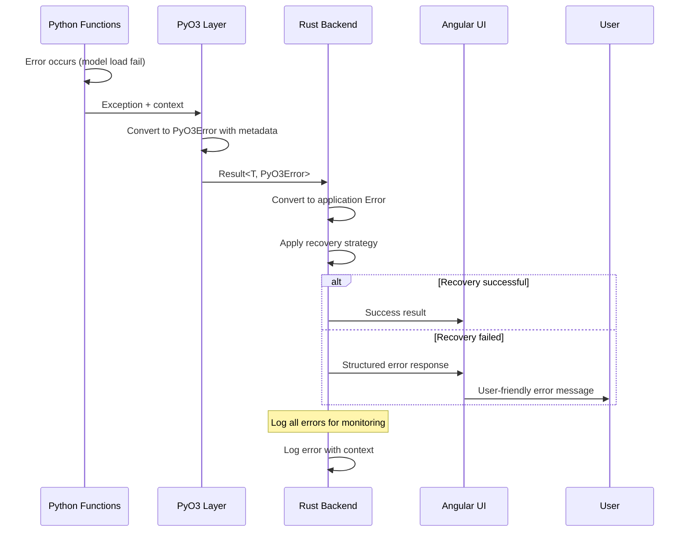

# Phase 1.3.4: Error Handling Specification

**Document Version:** 1.0
**Date:** September 17, 2025
**Status:** MVP Implementation Phase
**Priority:** CRITICAL

## Overview

This specification defines comprehensive error handling for RAG Studio's Python integration layer, providing clear error propagation from Python through Rust to Angular, structured error types with context, user-friendly error messages, and basic recovery mechanisms for robust operation.

## Scope

- Error type definitions and hierarchies
- Error propagation patterns across Python→Rust→Angular boundary
- Structured error context and metadata
- User-friendly error message generation
- Recovery mechanisms and retry strategies
- Logging and monitoring integration
- Testing strategies for error scenarios

## Architecture Overview

### Error Flow Architecture

```
Error Sources → Error Processing → Error Propagation → Error Handling
     ↓              ↓                    ↓               ↓
Python AI     → PyO3 Error        → Rust Error     → Angular UI
Functions       Conversion           Types            Error Display

Models/IO     → Context            → Manager        → User
Failures        Enrichment           Recovery         Notification
```

### Error Propagation Flow



## Core Error Types

### 1. Python Error Categories

Structured error types for Python AI function failures.

```python
# src-tauri/python/error_types.py
import json
import traceback
import sys
from typing import Dict, Any, Optional, List
from enum import Enum

class ErrorCategory(Enum):
    """Categories of errors that can occur in AI functions."""
    MODEL_ERROR = "model_error"
    PROCESSING_ERROR = "processing_error"
    VALIDATION_ERROR = "validation_error"
    RESOURCE_ERROR = "resource_error"
    SYSTEM_ERROR = "system_error"
    TIMEOUT_ERROR = "timeout_error"

class ErrorSeverity(Enum):
    """Severity levels for errors."""
    LOW = "low"
    MEDIUM = "medium"
    HIGH = "high"
    CRITICAL = "critical"

class AIFunctionError:
    """Structured error information for AI functions."""

    def __init__(
        self,
        category: ErrorCategory,
        message: str,
        severity: ErrorSeverity = ErrorSeverity.MEDIUM,
        error_code: Optional[str] = None,
        context: Optional[Dict[str, Any]] = None,
        recoverable: bool = True,
        suggested_action: Optional[str] = None,
        original_exception: Optional[Exception] = None
    ):
        self.category = category
        self.message = message
        self.severity = severity
        self.error_code = error_code or self._generate_error_code()
        self.context = context or {}
        self.recoverable = recoverable
        self.suggested_action = suggested_action
        self.original_exception = original_exception
        self.traceback = traceback.format_exc() if original_exception else None

    def _generate_error_code(self) -> str:
        """Generate a unique error code."""
        import time
        import hashlib

        # Create hash from category, message, and timestamp
        content = f"{self.category.value}:{self.message}:{int(time.time())}"
        return hashlib.md5(content.encode()).hexdigest()[:8].upper()

    def to_dict(self) -> Dict[str, Any]:
        """Convert error to dictionary for JSON serialization."""
        return {
            "error": True,
            "category": self.category.value,
            "message": self.message,
            "severity": self.severity.value,
            "error_code": self.error_code,
            "context": self.context,
            "recoverable": self.recoverable,
            "suggested_action": self.suggested_action,
            "traceback": self.traceback,
            "timestamp": time.time(),
            "python_version": sys.version
        }

    def to_json(self) -> str:
        """Convert error to JSON string."""
        return json.dumps(self.to_dict())

def handle_ai_function_error(func_name: str, args: Dict[str, Any]):
    """Decorator for AI function error handling."""
    def decorator(func):
        def wrapper(*wrapper_args, **wrapper_kwargs):
            try:
                return func(*wrapper_args, **wrapper_kwargs)
            except Exception as e:
                error = create_error_from_exception(func_name, e, args)
                return error.to_json()
        return wrapper
    return decorator

def create_error_from_exception(
    func_name: str,
    exception: Exception,
    context: Dict[str, Any]
) -> AIFunctionError:
    """Create structured error from Python exception."""

    # Determine error category based on exception type
    if isinstance(exception, (ImportError, ModuleNotFoundError)):
        category = ErrorCategory.MODEL_ERROR
        message = f"Model or dependency not available: {str(exception)}"
        suggested_action = "Check model installation and dependencies"

    elif isinstance(exception, (ValueError, TypeError)):
        category = ErrorCategory.VALIDATION_ERROR
        message = f"Invalid input parameters: {str(exception)}"
        suggested_action = "Check input parameters and data types"

    elif isinstance(exception, (MemoryError, OSError)):
        category = ErrorCategory.RESOURCE_ERROR
        message = f"Resource limitation: {str(exception)}"
        suggested_action = "Reduce batch size or clear model cache"

    elif isinstance(exception, TimeoutError):
        category = ErrorCategory.TIMEOUT_ERROR
        message = f"Operation timed out: {str(exception)}"
        suggested_action = "Increase timeout or reduce workload"

    elif "CUDA" in str(exception) or "GPU" in str(exception):
        category = ErrorCategory.SYSTEM_ERROR
        message = f"GPU/CUDA error: {str(exception)}"
        suggested_action = "Check GPU availability or use CPU mode"

    else:
        category = ErrorCategory.PROCESSING_ERROR
        message = f"Processing failed in {func_name}: {str(exception)}"
        suggested_action = "Check input data and retry"

    # Determine severity
    if isinstance(exception, (MemoryError, SystemError)):
        severity = ErrorSeverity.CRITICAL
    elif isinstance(exception, (ImportError, ModuleNotFoundError)):
        severity = ErrorSeverity.HIGH
    else:
        severity = ErrorSeverity.MEDIUM

    # Enhanced context
    enhanced_context = {
        "function": func_name,
        "exception_type": type(exception).__name__,
        "args": context,
        **context
    }

    return AIFunctionError(
        category=category,
        message=message,
        severity=severity,
        context=enhanced_context,
        suggested_action=suggested_action,
        original_exception=exception
    )
```

### 2. Rust Error Types

Comprehensive error types for the Rust backend with conversion from Python errors.

```rust
// src-tauri/src/errors.rs
use serde::{Deserialize, Serialize};
use std::fmt;
use std::time::Duration;

#[derive(Debug, thiserror::Error, Serialize, Deserialize)]
#[serde(tag = "type", content = "data")]
pub enum Error {
    // Python Integration Errors
    #[error("Python integration error: {message}")]
    PythonIntegration {
        message: String,
        category: ErrorCategory,
        error_code: String,
        context: serde_json::Value,
        recoverable: bool,
        suggested_action: Option<String>,
    },

    // PyO3 Specific Errors
    #[error("PyO3 error: {0}")]
    PyO3(#[from] PyO3Error),

    // Embedding Service Errors
    #[error("Embedding service error: {0}")]
    EmbeddingService(#[from] EmbeddingError),

    // Model Management Errors
    #[error("Model management error: {message}")]
    ModelManagement {
        message: String,
        model_name: String,
        operation: String,
    },

    // Validation Errors
    #[error("Validation error: {field} - {message}")]
    Validation {
        field: String,
        message: String,
        value: Option<String>,
    },

    // Resource Errors
    #[error("Resource error: {message}")]
    Resource {
        message: String,
        resource_type: String,
        available: Option<u64>,
        required: Option<u64>,
    },

    // Timeout Errors
    #[error("Timeout error: {operation} timed out after {duration:?}")]
    Timeout {
        operation: String,
        duration: Duration,
    },

    // System Errors
    #[error("System error: {0}")]
    System(String),

    // Network/IO Errors
    #[error("IO error: {0}")]
    Io(#[from] std::io::Error),

    // Serialization Errors
    #[error("Serialization error: {0}")]
    Serialization(#[from] serde_json::Error),

    // Generic errors
    #[error("Internal error: {0}")]
    Internal(String),
}

#[derive(Debug, Clone, Serialize, Deserialize)]
pub enum ErrorCategory {
    ModelError,
    ProcessingError,
    ValidationError,
    ResourceError,
    SystemError,
    TimeoutError,
    NetworkError,
    InternalError,
}

#[derive(Debug, Clone, Serialize, Deserialize)]
pub enum ErrorSeverity {
    Low,
    Medium,
    High,
    Critical,
}

impl Error {
    pub fn category(&self) -> ErrorCategory {
        match self {
            Error::PythonIntegration { category, .. } => category.clone(),
            Error::PyO3(_) => ErrorCategory::SystemError,
            Error::EmbeddingService(_) => ErrorCategory::ProcessingError,
            Error::ModelManagement { .. } => ErrorCategory::ModelError,
            Error::Validation { .. } => ErrorCategory::ValidationError,
            Error::Resource { .. } => ErrorCategory::ResourceError,
            Error::Timeout { .. } => ErrorCategory::TimeoutError,
            Error::Io(_) => ErrorCategory::NetworkError,
            Error::Serialization(_) => ErrorCategory::ValidationError,
            _ => ErrorCategory::InternalError,
        }
    }

    pub fn severity(&self) -> ErrorSeverity {
        match self {
            Error::PythonIntegration { .. } => ErrorSeverity::Medium,
            Error::PyO3(pyo3_err) => match pyo3_err {
                PyO3Error::WorkerCrashed => ErrorSeverity::Critical,
                PyO3Error::MemoryLimitExceeded { .. } => ErrorSeverity::High,
                PyO3Error::Timeout(_) => ErrorSeverity::Medium,
                _ => ErrorSeverity::Low,
            },
            Error::Resource { .. } => ErrorSeverity::High,
            Error::Timeout { .. } => ErrorSeverity::Medium,
            Error::System(_) => ErrorSeverity::High,
            _ => ErrorSeverity::Low,
        }
    }

    pub fn is_recoverable(&self) -> bool {
        match self {
            Error::PythonIntegration { recoverable, .. } => *recoverable,
            Error::PyO3(pyo3_err) => pyo3_err.is_recoverable(),
            Error::EmbeddingService(embed_err) => embed_err.is_recoverable(),
            Error::Validation { .. } => false,
            Error::Timeout { .. } => true,
            Error::Resource { .. } => true,
            _ => false,
        }
    }

    pub fn error_code(&self) -> String {
        match self {
            Error::PythonIntegration { error_code, .. } => error_code.clone(),
            _ => format!("{:?}", self.category()).to_uppercase(),
        }
    }

    pub fn user_message(&self) -> String {
        match self {
            Error::PythonIntegration { message, suggested_action, .. } => {
                if let Some(action) = suggested_action {
                    format!("{}\n\nSuggested action: {}", message, action)
                } else {
                    message.clone()
                }
            },
            Error::ModelManagement { message, model_name, .. } => {
                format!("Model '{}' error: {}", model_name, message)
            },
            Error::Validation { field, message, .. } => {
                format!("Invalid {}: {}", field, message)
            },
            Error::Resource { message, resource_type, .. } => {
                format!("{} resource error: {}", resource_type, message)
            },
            Error::Timeout { operation, duration } => {
                format!("Operation '{}' timed out after {:?}. Try reducing the workload or increasing timeout.", operation, duration)
            },
            _ => format!("An error occurred: {}", self),
        }
    }

    pub fn context(&self) -> serde_json::Value {
        match self {
            Error::PythonIntegration { context, .. } => context.clone(),
            Error::ModelManagement { model_name, operation, .. } => {
                serde_json::json!({
                    "model_name": model_name,
                    "operation": operation
                })
            },
            Error::Validation { field, value, .. } => {
                serde_json::json!({
                    "field": field,
                    "value": value
                })
            },
            Error::Timeout { operation, duration } => {
                serde_json::json!({
                    "operation": operation,
                    "duration_ms": duration.as_millis()
                })
            },
            _ => serde_json::json!({}),
        }
    }
}

// Error conversion from Python JSON
impl Error {
    pub fn from_python_json(json_str: &str, function_name: &str) -> Self {
        match serde_json::from_str::<serde_json::Value>(json_str) {
            Ok(value) if value.get("error").and_then(|v| v.as_bool()).unwrap_or(false) => {
                Error::PythonIntegration {
                    message: value.get("message").and_then(|v| v.as_str()).unwrap_or("Unknown error").to_string(),
                    category: parse_error_category(value.get("category").and_then(|v| v.as_str()).unwrap_or("processing_error")),
                    error_code: value.get("error_code").and_then(|v| v.as_str()).unwrap_or("UNKNOWN").to_string(),
                    context: value.get("context").cloned().unwrap_or(serde_json::json!({})),
                    recoverable: value.get("recoverable").and_then(|v| v.as_bool()).unwrap_or(true),
                    suggested_action: value.get("suggested_action").and_then(|v| v.as_str()).map(|s| s.to_string()),
                }
            },
            Ok(_) => Error::Internal(format!("Unexpected response format from {}", function_name)),
            Err(e) => Error::Serialization(e),
        }
    }
}

fn parse_error_category(category_str: &str) -> ErrorCategory {
    match category_str {
        "model_error" => ErrorCategory::ModelError,
        "processing_error" => ErrorCategory::ProcessingError,
        "validation_error" => ErrorCategory::ValidationError,
        "resource_error" => ErrorCategory::ResourceError,
        "system_error" => ErrorCategory::SystemError,
        "timeout_error" => ErrorCategory::TimeoutError,
        _ => ErrorCategory::InternalError,
    }
}

// Re-export PyO3Error from previous specs
#[derive(Debug, thiserror::Error)]
pub enum PyO3Error {
    #[error("Worker process not available")]
    WorkerNotAvailable,
    #[error("Request timeout after {0:?}")]
    Timeout(Duration),
    #[error("Communication error: {0}")]
    Communication(#[from] std::io::Error),
    #[error("Python error: {0}")]
    Python(String),
    #[error("Worker memory limit exceeded: {usage}MB > {limit}MB")]
    MemoryLimitExceeded { usage: u64, limit: u64 },
    #[error("Worker process crashed")]
    WorkerCrashed,
    #[error("Type conversion error: {0}")]
    TypeConversion(String),
}

impl PyO3Error {
    pub fn is_recoverable(&self) -> bool {
        match self {
            PyO3Error::WorkerNotAvailable | PyO3Error::WorkerCrashed => true,
            PyO3Error::MemoryLimitExceeded { .. } => true,
            PyO3Error::Timeout(_) => true,
            PyO3Error::Communication(_) => true,
            PyO3Error::TypeConversion(_) => false,
            _ => false,
        }
    }
}

// Re-export EmbeddingError from previous specs
#[derive(Debug, thiserror::Error)]
pub enum EmbeddingError {
    #[error("Model not found: {0}")]
    ModelNotFound(String),
    #[error("Batch too large: {actual} > {max}")]
    BatchTooLarge { actual: usize, max: usize },
    #[error("Processing failed: {0}")]
    ProcessingFailed(String),
}

impl EmbeddingError {
    pub fn is_recoverable(&self) -> bool {
        match self {
            EmbeddingError::ModelNotFound(_) => false,
            EmbeddingError::BatchTooLarge { .. } => true,
            EmbeddingError::ProcessingFailed(_) => true,
        }
    }
}
```

### 3. Recovery Mechanisms

Automated recovery strategies for different error categories.

```rust
// src-tauri/src/error_recovery.rs
use crate::errors::*;
use std::time::Duration;
use tokio::time::sleep;

#[derive(Debug, Clone)]
pub enum RecoveryStrategy {
    None,
    Retry { max_attempts: u32, backoff: Duration },
    RestartService { service_name: String },
    ClearCache,
    ReduceBatchSize { factor: f32 },
    SwitchToFallback { fallback_option: String },
}

pub struct ErrorRecoveryManager {
    max_retry_attempts: u32,
    base_backoff: Duration,
}

impl ErrorRecoveryManager {
    pub fn new() -> Self {
        Self {
            max_retry_attempts: 3,
            base_backoff: Duration::from_millis(100),
        }
    }

    pub fn determine_recovery_strategy(&self, error: &Error) -> RecoveryStrategy {
        match error {
            Error::PythonIntegration { category, recoverable, .. } => {
                if !recoverable {
                    return RecoveryStrategy::None;
                }

                match category {
                    ErrorCategory::ModelError => RecoveryStrategy::RestartService {
                        service_name: "embedding_service".to_string(),
                    },
                    ErrorCategory::ResourceError => RecoveryStrategy::ClearCache,
                    ErrorCategory::TimeoutError => RecoveryStrategy::Retry {
                        max_attempts: 2,
                        backoff: Duration::from_secs(1),
                    },
                    _ => RecoveryStrategy::Retry {
                        max_attempts: self.max_retry_attempts,
                        backoff: self.base_backoff,
                    },
                }
            },
            Error::PyO3(pyo3_error) => match pyo3_error {
                PyO3Error::WorkerNotAvailable | PyO3Error::WorkerCrashed => {
                    RecoveryStrategy::RestartService {
                        service_name: "embedding_worker".to_string(),
                    }
                },
                PyO3Error::MemoryLimitExceeded { .. } => RecoveryStrategy::ClearCache,
                PyO3Error::Timeout(_) => RecoveryStrategy::Retry {
                    max_attempts: 2,
                    backoff: Duration::from_secs(1),
                },
                _ => RecoveryStrategy::None,
            },
            Error::EmbeddingService(embed_error) => match embed_error {
                EmbeddingError::BatchTooLarge { .. } => RecoveryStrategy::ReduceBatchSize {
                    factor: 0.5,
                },
                EmbeddingError::ProcessingFailed(_) => RecoveryStrategy::Retry {
                    max_attempts: 2,
                    backoff: self.base_backoff,
                },
                _ => RecoveryStrategy::None,
            },
            Error::Timeout { .. } => RecoveryStrategy::Retry {
                max_attempts: 2,
                backoff: Duration::from_secs(1),
            },
            Error::Resource { .. } => RecoveryStrategy::ClearCache,
            _ => RecoveryStrategy::None,
        }
    }

    pub async fn execute_recovery<T, F, Fut>(
        &self,
        strategy: RecoveryStrategy,
        operation: F,
    ) -> Result<T, Error>
    where
        F: Fn() -> Fut + Clone,
        Fut: std::future::Future<Output = Result<T, Error>>,
    {
        match strategy {
            RecoveryStrategy::None => {
                operation().await
            },
            RecoveryStrategy::Retry { max_attempts, backoff } => {
                self.retry_with_backoff(operation, max_attempts, backoff).await
            },
            RecoveryStrategy::RestartService { service_name } => {
                // Service restart would be handled by the service manager
                tracing::warn!("Service restart requested for: {}", service_name);
                sleep(Duration::from_millis(500)).await; // Give time for restart
                operation().await
            },
            RecoveryStrategy::ClearCache => {
                // Cache clearing would be handled by the cache service
                tracing::info!("Cache clear requested for recovery");
                sleep(Duration::from_millis(100)).await;
                operation().await
            },
            RecoveryStrategy::ReduceBatchSize { factor: _ } => {
                // Batch size reduction would be handled at the calling level
                tracing::info!("Batch size reduction requested");
                operation().await
            },
            RecoveryStrategy::SwitchToFallback { fallback_option } => {
                tracing::info!("Switching to fallback: {}", fallback_option);
                operation().await
            },
        }
    }

    async fn retry_with_backoff<T, F, Fut>(
        &self,
        operation: F,
        max_attempts: u32,
        base_backoff: Duration,
    ) -> Result<T, Error>
    where
        F: Fn() -> Fut + Clone,
        Fut: std::future::Future<Output = Result<T, Error>>,
    {
        let mut last_error = Error::Internal("No attempts made".to_string());

        for attempt in 1..=max_attempts {
            match operation().await {
                Ok(result) => return Ok(result),
                Err(error) => {
                    last_error = error;

                    if attempt < max_attempts {
                        let backoff_duration = base_backoff * attempt;
                        tracing::warn!(
                            "Attempt {} failed, retrying in {:?}: {}",
                            attempt,
                            backoff_duration,
                            last_error
                        );
                        sleep(backoff_duration).await;
                    }
                }
            }
        }

        Err(last_error)
    }
}

// Integration with Manager
impl crate::Manager {
    pub async fn execute_with_recovery<T, F, Fut>(
        &self,
        operation: F,
    ) -> Result<T, Error>
    where
        F: Fn() -> Fut + Clone,
        Fut: std::future::Future<Output = Result<T, Error>>,
    {
        let recovery_manager = ErrorRecoveryManager::new();

        match operation().await {
            Ok(result) => Ok(result),
            Err(error) => {
                tracing::warn!("Operation failed, attempting recovery: {}", error);

                let strategy = recovery_manager.determine_recovery_strategy(&error);
                recovery_manager.execute_recovery(strategy, operation).await
            }
        }
    }
}
```

### 4. Error Context Enrichment

Enhanced error context for better debugging and user experience.

```rust
// src-tauri/src/error_context.rs
use crate::errors::*;
use serde_json::{json, Value};
use std::collections::HashMap;

pub struct ErrorContext {
    operation: String,
    user_id: Option<String>,
    session_id: String,
    request_id: String,
    timestamp: chrono::DateTime<chrono::Utc>,
    environment: String,
    additional_data: HashMap<String, Value>,
}

impl ErrorContext {
    pub fn new(operation: &str) -> Self {
        Self {
            operation: operation.to_string(),
            user_id: None,
            session_id: uuid::Uuid::new_v4().to_string(),
            request_id: uuid::Uuid::new_v4().to_string(),
            timestamp: chrono::Utc::now(),
            environment: "development".to_string(), // Could be config-driven
            additional_data: HashMap::new(),
        }
    }

    pub fn with_user_id(mut self, user_id: &str) -> Self {
        self.user_id = Some(user_id.to_string());
        self
    }

    pub fn with_data(mut self, key: &str, value: Value) -> Self {
        self.additional_data.insert(key.to_string(), value);
        self
    }

    pub fn enrich_error(self, mut error: Error) -> Error {
        let context_data = json!({
            "operation": self.operation,
            "user_id": self.user_id,
            "session_id": self.session_id,
            "request_id": self.request_id,
            "timestamp": self.timestamp.to_rfc3339(),
            "environment": self.environment,
            "additional_data": self.additional_data
        });

        // Merge with existing context
        match &mut error {
            Error::PythonIntegration { context, .. } => {
                if let Value::Object(ref mut map) = context {
                    if let Value::Object(context_map) = context_data {
                        map.extend(context_map);
                    }
                }
            },
            _ => {
                // For other error types, we might want to add context differently
                // This could be expanded based on specific needs
            }
        }

        error
    }
}

// Convenience macro for creating enriched errors
#[macro_export]
macro_rules! enriched_error {
    ($operation:expr, $error:expr) => {{
        let context = ErrorContext::new($operation);
        context.enrich_error($error)
    }};
    ($operation:expr, $error:expr, $($key:expr => $value:expr),*) => {{
        let mut context = ErrorContext::new($operation);
        $(
            context = context.with_data($key, serde_json::json!($value));
        )*
        context.enrich_error($error)
    }};
}
```

## Angular Error Handling

### 1. Error Service

Centralized error handling service for the Angular frontend.

```typescript
// src/app/shared/services/error.service.ts
import { Injectable } from '@angular/core';
import { BehaviorSubject, Observable } from 'rxjs';

export interface ErrorInfo {
  id: string;
  message: string;
  category: ErrorCategory;
  severity: ErrorSeverity;
  timestamp: Date;
  context: any;
  userMessage: string;
  suggestedAction?: string;
  recoverable: boolean;
  errorCode: string;
}

export enum ErrorCategory {
  ModelError = 'model_error',
  ProcessingError = 'processing_error',
  ValidationError = 'validation_error',
  ResourceError = 'resource_error',
  SystemError = 'system_error',
  TimeoutError = 'timeout_error',
  NetworkError = 'network_error',
  InternalError = 'internal_error'
}

export enum ErrorSeverity {
  Low = 'low',
  Medium = 'medium',
  High = 'high',
  Critical = 'critical'
}

@Injectable({
  providedIn: 'root'
})
export class ErrorService {
  private errorsSubject = new BehaviorSubject<ErrorInfo[]>([]);
  public errors$ = this.errorsSubject.asObservable();

  constructor() {}

  handleError(error: any, context?: any): ErrorInfo {
    const errorInfo = this.parseError(error, context);

    // Add to error list
    const currentErrors = this.errorsSubject.value;
    this.errorsSubject.next([errorInfo, ...currentErrors.slice(0, 49)]); // Keep last 50 errors

    // Log error for debugging
    console.error('Error handled:', errorInfo);

    // Show user notification based on severity
    this.showUserNotification(errorInfo);

    return errorInfo;
  }

  private parseError(error: any, context?: any): ErrorInfo {
    // Handle Tauri command errors
    if (error && typeof error === 'object' && error.type) {
      return {
        id: this.generateId(),
        message: error.message || 'Unknown error occurred',
        category: this.mapCategory(error.type),
        severity: this.mapSeverity(error.severity || 'medium'),
        timestamp: new Date(),
        context: error.context || context || {},
        userMessage: error.user_message || this.generateUserMessage(error),
        suggestedAction: error.suggested_action,
        recoverable: error.recoverable !== false,
        errorCode: error.error_code || 'UNKNOWN'
      };
    }

    // Handle generic errors
    return {
      id: this.generateId(),
      message: error.message || error.toString() || 'Unknown error',
      category: ErrorCategory.InternalError,
      severity: ErrorSeverity.Medium,
      timestamp: new Date(),
      context: context || {},
      userMessage: 'An unexpected error occurred. Please try again.',
      recoverable: true,
      errorCode: 'GENERIC'
    };
  }

  private mapCategory(categoryStr: string): ErrorCategory {
    const mapping: Record<string, ErrorCategory> = {
      'PythonIntegration': ErrorCategory.ProcessingError,
      'PyO3': ErrorCategory.SystemError,
      'EmbeddingService': ErrorCategory.ProcessingError,
      'ModelManagement': ErrorCategory.ModelError,
      'Validation': ErrorCategory.ValidationError,
      'Resource': ErrorCategory.ResourceError,
      'Timeout': ErrorCategory.TimeoutError,
      'Io': ErrorCategory.NetworkError,
      'Serialization': ErrorCategory.ValidationError,
      'Internal': ErrorCategory.InternalError
    };

    return mapping[categoryStr] || ErrorCategory.InternalError;
  }

  private mapSeverity(severityStr: string): ErrorSeverity {
    const mapping: Record<string, ErrorSeverity> = {
      'low': ErrorSeverity.Low,
      'medium': ErrorSeverity.Medium,
      'high': ErrorSeverity.High,
      'critical': ErrorSeverity.Critical
    };

    return mapping[severityStr.toLowerCase()] || ErrorSeverity.Medium;
  }

  private generateUserMessage(error: any): string {
    // Generate user-friendly messages based on error category
    switch (error.type) {
      case 'ModelManagement':
        return `There was an issue with the AI model. ${error.suggested_action || 'Please try again.'}`;
      case 'PythonIntegration':
        return `AI processing encountered an error. ${error.suggested_action || 'Please check your input and try again.'}`;
      case 'Validation':
        return `Invalid input detected. ${error.message}`;
      case 'Timeout':
        return `The operation took too long to complete. Try reducing the workload or check your system resources.`;
      case 'Resource':
        return `System resources are limited. Try clearing cache or reducing batch size.`;
      default:
        return error.message || 'An unexpected error occurred. Please try again.';
    }
  }

  private showUserNotification(errorInfo: ErrorInfo): void {
    // Import and use your notification service
    // Example: this.notificationService.show(errorInfo.userMessage, errorInfo.severity);
  }

  private generateId(): string {
    return Date.now().toString(36) + Math.random().toString(36).substr(2);
  }

  clearErrors(): void {
    this.errorsSubject.next([]);
  }

  removeError(id: string): void {
    const currentErrors = this.errorsSubject.value;
    this.errorsSubject.next(currentErrors.filter(error => error.id !== id));
  }

  getErrorsByCategory(category: ErrorCategory): ErrorInfo[] {
    return this.errorsSubject.value.filter(error => error.category === category);
  }

  getErrorsBySeverity(severity: ErrorSeverity): ErrorInfo[] {
    return this.errorsSubject.value.filter(error => error.severity === severity);
  }
}
```

### 2. Error Display Component

Reusable component for displaying errors to users.

```typescript
// src/app/shared/components/semantic/error-display/error-display.component.ts
import { Component, Input, Output, EventEmitter } from '@angular/core';
import { ErrorInfo, ErrorSeverity } from '../../../services/error.service';

@Component({
  selector: 'rag-error-display',
  standalone: true,
  template: `
    <div class="error-display" [attr.data-severity]="error.severity">
      <div class="error-header">
        <rag-icon [name]="getIconName()" [size]="20"></rag-icon>
        <span class="error-title">{{ getErrorTitle() }}</span>
        <button class="close-button" (click)="onDismiss()" *ngIf="dismissible">
          <rag-icon name="x" [size]="16"></rag-icon>
        </button>
      </div>

      <div class="error-content">
        <p class="error-message">{{ error.userMessage }}</p>

        <div class="error-actions" *ngIf="error.suggestedAction || error.recoverable">
          <p class="suggested-action" *ngIf="error.suggestedAction">
            <strong>Suggested action:</strong> {{ error.suggestedAction }}
          </p>

          <div class="action-buttons" *ngIf="error.recoverable">
            <rag-button
              variant="outline"
              size="sm"
              (click)="onRetry()"
              *ngIf="showRetryButton">
              Retry
            </rag-button>

            <rag-button
              variant="ghost"
              size="sm"
              (click)="onShowDetails()"
              *ngIf="showDetailsButton">
              Show Details
            </rag-button>
          </div>
        </div>

        <div class="error-details" *ngIf="showDetails">
          <div class="error-metadata">
            <div class="metadata-item">
              <strong>Error Code:</strong> {{ error.errorCode }}
            </div>
            <div class="metadata-item">
              <strong>Time:</strong> {{ error.timestamp | date:'medium' }}
            </div>
            <div class="metadata-item" *ngIf="error.context && hasContext()">
              <strong>Context:</strong>
              <pre>{{ formatContext() }}</pre>
            </div>
          </div>
        </div>
      </div>
    </div>
  `,
  styleUrls: ['./error-display.component.scss']
})
export class ErrorDisplayComponent {
  @Input() error!: ErrorInfo;
  @Input() dismissible = true;
  @Input() showRetryButton = true;
  @Input() showDetailsButton = true;

  @Output() dismiss = new EventEmitter<void>();
  @Output() retry = new EventEmitter<void>();

  showDetails = false;

  getIconName(): string {
    switch (this.error.severity) {
      case ErrorSeverity.Critical:
        return 'alert-circle';
      case ErrorSeverity.High:
        return 'alert-triangle';
      case ErrorSeverity.Medium:
        return 'info';
      case ErrorSeverity.Low:
        return 'check-circle';
      default:
        return 'alert-circle';
    }
  }

  getErrorTitle(): string {
    switch (this.error.severity) {
      case ErrorSeverity.Critical:
        return 'Critical Error';
      case ErrorSeverity.High:
        return 'Error';
      case ErrorSeverity.Medium:
        return 'Warning';
      case ErrorSeverity.Low:
        return 'Notice';
      default:
        return 'Error';
    }
  }

  onDismiss(): void {
    this.dismiss.emit();
  }

  onRetry(): void {
    this.retry.emit();
  }

  onShowDetails(): void {
    this.showDetails = !this.showDetails;
  }

  hasContext(): boolean {
    return this.error.context && Object.keys(this.error.context).length > 0;
  }

  formatContext(): string {
    return JSON.stringify(this.error.context, null, 2);
  }
}
```

## Testing Strategy

### 1. Python Error Testing

```python
# test_error_handling.py
import json
import unittest
from unittest.mock import patch, MagicMock
from ai_functions import embed_texts, rerank_texts
from error_types import AIFunctionError, ErrorCategory, ErrorSeverity

class TestErrorHandling(unittest.TestCase):

    def test_model_not_found_error(self):
        """Test handling of model not found errors."""
        args = json.dumps({
            "texts": ["test"],
            "model": "nonexistent-model"
        })

        result_json = embed_texts(args)
        result = json.loads(result_json)

        self.assertIn("error", result)
        self.assertEqual(result["category"], "model_error")
        self.assertIn("suggested_action", result)

    def test_validation_error(self):
        """Test handling of validation errors."""
        args = json.dumps({
            "texts": [],  # Empty texts should cause validation error
            "model": "all-MiniLM-L6-v2"
        })

        result_json = embed_texts(args)
        result = json.loads(result_json)

        self.assertIn("error", result)
        self.assertEqual(result["error_type"], "ValueError")

    def test_memory_error_simulation(self):
        """Test handling of memory errors."""
        with patch('ai_functions.SentenceTransformer') as mock_transformer:
            mock_model = MagicMock()
            mock_model.encode.side_effect = MemoryError("Out of memory")
            mock_transformer.return_value = mock_model

            args = json.dumps({
                "texts": ["test"] * 1000,
                "model": "all-MiniLM-L6-v2"
            })

            result_json = embed_texts(args)
            result = json.loads(result_json)

            self.assertIn("error", result)
            self.assertEqual(result["category"], "resource_error")
            self.assertEqual(result["severity"], "critical")

    def test_timeout_error(self):
        """Test handling of timeout errors."""
        with patch('ai_functions.SentenceTransformer') as mock_transformer:
            mock_model = MagicMock()
            mock_model.encode.side_effect = TimeoutError("Operation timed out")
            mock_transformer.return_value = mock_model

            args = json.dumps({
                "texts": ["test"],
                "model": "all-MiniLM-L6-v2"
            })

            result_json = embed_texts(args)
            result = json.loads(result_json)

            self.assertIn("error", result)
            self.assertEqual(result["category"], "timeout_error")
            self.assertIn("timeout", result["message"].lower())

    def test_error_context_enrichment(self):
        """Test that errors include proper context."""
        args = json.dumps({
            "texts": ["test"],
            "model": "invalid-model"
        })

        result_json = embed_texts(args)
        result = json.loads(result_json)

        self.assertIn("context", result)
        self.assertIn("function", result["context"])
        self.assertEqual(result["context"]["function"], "embed_texts")
```

### 2. Rust Error Testing

```rust
#[cfg(test)]
mod tests {
    use super::*;
    use tokio::test;

    #[test]
    async fn test_error_recovery_retry() {
        let recovery_manager = ErrorRecoveryManager::new();
        let mut attempt_count = 0;

        let operation = || {
            attempt_count += 1;
            async move {
                if attempt_count < 3 {
                    Err(Error::Timeout {
                        operation: "test".to_string(),
                        duration: Duration::from_secs(1),
                    })
                } else {
                    Ok("success")
                }
            }
        };

        let strategy = RecoveryStrategy::Retry {
            max_attempts: 3,
            backoff: Duration::from_millis(10),
        };

        let result = recovery_manager.execute_recovery(strategy, operation).await;
        assert!(result.is_ok());
        assert_eq!(attempt_count, 3);
    }

    #[test]
    fn test_error_categorization() {
        let python_error = Error::PythonIntegration {
            message: "Model not found".to_string(),
            category: ErrorCategory::ModelError,
            error_code: "MODEL001".to_string(),
            context: serde_json::json!({}),
            recoverable: false,
            suggested_action: Some("Check model name".to_string()),
        };

        assert_eq!(python_error.category(), ErrorCategory::ModelError);
        assert_eq!(python_error.severity(), ErrorSeverity::Medium);
        assert!(!python_error.is_recoverable());
    }

    #[test]
    fn test_error_context_enrichment() {
        let context = ErrorContext::new("test_operation")
            .with_user_id("user123")
            .with_data("test_key", serde_json::json!("test_value"));

        let error = Error::Internal("test error".to_string());
        let enriched_error = context.enrich_error(error);

        // Verify context was added (implementation dependent)
        assert!(matches!(enriched_error, Error::Internal(_)));
    }

    #[test]
    fn test_python_error_parsing() {
        let python_json = r#"{
            "error": true,
            "message": "Model not found",
            "category": "model_error",
            "error_code": "MODEL001",
            "recoverable": false,
            "suggested_action": "Check model installation"
        }"#;

        let error = Error::from_python_json(python_json, "embed_texts");

        match error {
            Error::PythonIntegration { message, category, .. } => {
                assert_eq!(message, "Model not found");
                assert!(matches!(category, ErrorCategory::ModelError));
            },
            _ => panic!("Expected PythonIntegration error"),
        }
    }
}
```

### 3. Integration Error Testing

```rust
#[tokio::test]
async fn test_end_to_end_error_handling() {
    // Test complete error flow from Python through Rust to Angular response

    let manager = Manager::new().await.unwrap();

    // Simulate Python function that returns an error
    let result = manager.ai_functions.embed_texts(
        vec!["test".to_string()],
        "nonexistent-model",
        None,
        None
    ).await;

    // Verify error was properly propagated and categorized
    assert!(result.is_err());

    let error = result.unwrap_err();
    assert!(error.is_recoverable() || !error.is_recoverable()); // Either is valid depending on error type
    assert!(!error.error_code().is_empty());
    assert!(!error.user_message().is_empty());
}
```

## Success Criteria

### MVP Requirements
1. ✅ Clear error propagation Python→Rust→Angular
2. ✅ Structured error types with context
3. ✅ User-friendly error messages
4. ✅ Basic recovery mechanisms with retry logic
5. ✅ Error categorization and severity levels
6. ✅ Logging integration for monitoring
7. ✅ Testing coverage for error scenarios

### Quality Targets
- **Error Handling Coverage**: >95% of error paths tested
- **Recovery Success Rate**: >80% for recoverable errors
- **Error Response Time**: <100ms for error processing
- **User Message Quality**: Clear, actionable messages for all error types

### Monitoring Metrics
- Error frequency by category and severity
- Recovery attempt success rates
- User error resolution times
- Most common error patterns

This comprehensive error handling specification ensures robust operation of the Python integration layer with clear error propagation, user-friendly messaging, and effective recovery mechanisms for the MVP implementation.